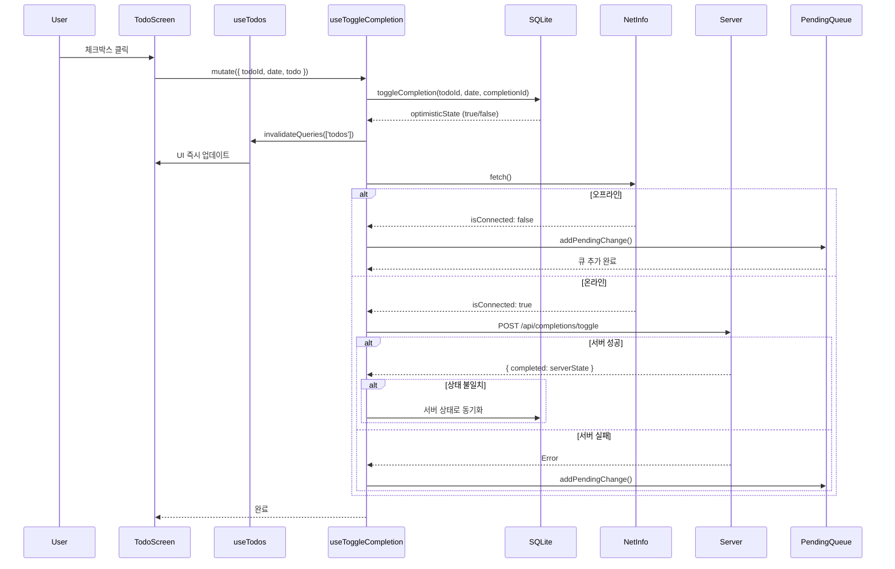

# 일정 완료/취소 흐름 분석

> **작성일**: 2026-02-12  
> **목적**: TodoScreen에서 체크박스 클릭 시 완료/취소 처리 흐름 이해

## 📋 목차

1. [개요](#개요)
2. [전체 흐름 다이어그램](#전체-흐름-다이어그램)
3. [계층별 상세 분석](#계층별-상세-분석)
4. [핵심 로직](#핵심-로직)
5. [오프라인 처리](#오프라인-처리)
6. [성능 최적화](#성능-최적화)

---

## 개요

**일정 완료/취소는 Optimistic Update 방식으로 동작합니다.**

- ✅ **SQLite 즉시 반영** (UI 즉시 업데이트)
- ✅ **서버 동기화** (온라인 시)
- ✅ **Pending Queue** (오프라인 시)
- ✅ **서버 응답으로 최종 동기화**

---

## 전체 흐름 다이어그램

```
┌─────────────────────────────────────────────────────────────┐
│ 1. 사용자 액션 (TodoScreen)                                 │
│    - 체크박스 클릭                                           │
│    - handleToggleComplete(todoId) 호출                      │
└────────────────────┬────────────────────────────────────────┘
                     │
                     ▼
┌─────────────────────────────────────────────────────────────┐
│ 2. Mutation 실행 (useToggleCompletion)                     │
│    - mutate({ todoId, date, currentCompleted, todo })      │
└────────────────────┬────────────────────────────────────────┘
                     │
                     ▼
┌─────────────────────────────────────────────────────────────┐
│ 3. SQLite 즉시 토글 (Optimistic Update)                    │
│                                                             │
│  ┌─────────────────────────────────────────────────────┐   │
│  │ toggleCompletion(todoId, date, completionId)        │   │
│  │                                                     │   │
│  │  1. key 생성: "todoId_date" or "todoId_null"       │   │
│  │  2. 기존 completion 조회                            │   │
│  │  3. 있으면 DELETE (완료 → 미완료)                   │   │
│  │     없으면 INSERT (미완료 → 완료)                   │   │
│  │  4. 새 상태 반환 (true/false)                       │   │
│  └─────────────────────────────────────────────────────┘   │
│                                                             │
│  → UI 즉시 업데이트 (React Query 캐시 무효화)              │
└────────────────────┬────────────────────────────────────────┘
                     │
                     ▼
┌─────────────────────────────────────────────────────────────┐
│ 4. 네트워크 상태 확인                                       │
└────────────────────┬────────────────────────────────────────┘
                     │
         ┌───────────┴───────────┐
         │                       │
    [오프라인]              [온라인]
         │                       │
         ▼                       ▼
┌──────────────────┐    ┌──────────────────────────────────┐
│ 5-A. Pending     │    │ 5-B. 서버 동기화                 │
│      Queue 추가  │    │                                  │
│                  │    │  POST /api/completions/toggle    │
│  - type:         │    │  Body: {                         │
│    create/delete │    │    todoId,                       │
│  - entityId      │    │    date,                         │
│  - data          │    │    _id: completionId             │
│                  │    │  }                               │
│  → 나중에 동기화 │    │                                  │
└──────────────────┘    └────────────┬─────────────────────┘
                                     │
                         ┌───────────┴───────────┐
                         │                       │
                    [성공]                   [실패]
                         │                       │
                         ▼                       ▼
            ┌────────────────────┐    ┌──────────────────┐
            │ 6-A. 서버 응답으로 │    │ 6-B. Pending     │
            │      SQLite 동기화 │    │      Queue 추가  │
            │                    │    │                  │
            │  - 서버 상태 확인  │    │  → 나중에 재시도 │
            │  - SQLite 강제 동기│    └──────────────────┘
            │  - 불일치 방지     │
            └────────────────────┘
                         │
                         ▼
            ┌────────────────────────────────────┐
            │ 7. React Query 캐시 무효화         │
            │    - invalidateQueries(['todos'])  │
            │    → 모든 날짜 캐시 갱신            │
            └────────────────────────────────────┘
```

---

## 계층별 상세 분석

### 1️⃣ TodoScreen.js (UI Layer)

**파일**: `client/src/screens/TodoScreen.js`

```javascript
export default function TodoScreen({ navigation }) {
  const { currentDate } = useDateStore();
  const { data: todos } = useTodos(currentDate);
  const { mutate: toggleCompletion } = useToggleCompletion();

  // 🔧 Stale closure 방지: currentDate를 ref로 관리
  const currentDateRef = useRef(currentDate);
  currentDateRef.current = currentDate;

  const handleToggleComplete = useCallback((todoId) => {
    const actualDate = currentDateRef.current;  // 항상 최신 날짜

    const todo = todos.find(t => t._id === todoId);
    if (!todo) {
      console.error('❌ Todo를 찾을 수 없음:', todoId);
      return;
    }

    console.log('🎯 [TodoScreen] 토글 요청:', {
      todoId: todoId.slice(-8),
      title: todo.title,
      isRecurring: !!todo.recurrence,
      전달할date: actualDate
    });

    // Mutation 실행
    toggleCompletion({
      todoId,
      date: actualDate,
      currentCompleted: todo.completed,
      todo
    });
  }, [todos, toggleCompletion]);

  return (
    <DailyTodoList
      todos={todos}
      onToggleComplete={handleToggleComplete}
    />
  );
}
```

**역할**:
- 체크박스 클릭 이벤트 처리
- 현재 날짜와 Todo 정보 전달
- Mutation 트리거

---

### 2️⃣ useToggleCompletion Hook (Mutation Layer)

**파일**: `client/src/hooks/queries/useToggleCompletion.js`

```javascript
export const useToggleCompletion = () => {
  const queryClient = useQueryClient();

  return useMutation({
    mutationFn: async ({ todoId, date, currentCompleted, todo }) => {
      // 반복 vs 비반복 구분
      const isRecurring = todo && !!todo.recurrence;
      const completionDate = isRecurring ? date : null;

      // UUID 생성 (완료 생성 시 사용)
      const completionId = generateId();

      // 1. SQLite 즉시 토글 (Optimistic Update)
      await ensureDatabase();
      const optimisticState = await sqliteToggleCompletion(
        todoId, 
        completionDate, 
        completionId
      );
      // → true: 완료됨, false: 취소됨

      // 2. 네트워크 확인
      const netInfo = await NetInfo.fetch();

      if (!netInfo.isConnected) {
        // 오프라인: Pending Queue 추가
        await addPendingChange({
          type: optimisticState ? 'createCompletion' : 'deleteCompletion',
          entityId: completionId,
          data: { todoId, date: completionDate },
        });
        return { completed: optimisticState, offline: true, isRecurring };
      }

      // 3. 온라인: 서버 요청
      try {
        const res = await completionAPI.toggleCompletion(
          todoId, 
          completionDate, 
          completionId
        );

        // 서버 응답으로 SQLite 동기화
        const serverState = res.data.completed;
        if (serverState !== optimisticState) {
          // SQLite를 서버 상태로 강제 동기화
          if (serverState) {
            await createCompletion(todoId, completionDate, completionId);
          } else {
            await deleteCompletion(todoId, completionDate);
          }
        }

        return { ...res.data, isRecurring };
      } catch (error) {
        // 서버 실패: Pending Queue 추가
        console.error('❌ 서버 요청 실패:', error.message);
        await addPendingChange({
          type: optimisticState ? 'createCompletion' : 'deleteCompletion',
          entityId: completionId,
          data: { todoId, date: completionDate },
        });
        return { completed: optimisticState, offline: true, isRecurring };
      }
    },
    onSuccess: () => {
      // 모든 todos 캐시 무효화
      queryClient.invalidateQueries({ queryKey: ['todos'] });
    },
  });
};
```

**역할**:
- Optimistic Update 실행
- 네트워크 상태 확인
- 서버 동기화 또는 Pending Queue 추가
- 캐시 무효화

---

### 3️⃣ completionService.js (SQLite Layer)

**파일**: `client/src/services/db/completionService.js`

#### toggleCompletion (토글)

```javascript
async function toggleCompletion(todoId, date, completionId) {
  const db = getDatabase();
  const key = `${todoId}_${date || 'null'}`;

  console.log(`🔄 [toggleCompletion] 시작: key=${key}`);

  // 기존 completion 조회
  const existing = await db.getFirstAsync(
    'SELECT * FROM completions WHERE key = ?',
    [key]
  );

  if (existing) {
    // 완료 → 미완료 (삭제)
    await db.runAsync('DELETE FROM completions WHERE key = ?', [key]);
    console.log(`🔄 완료 취소 → 미완료 상태로 전환`);
    return false;
  } else {
    // 미완료 → 완료 (생성)
    await db.runAsync(
      'INSERT INTO completions (_id, key, todo_id, date, completed_at) VALUES (?, ?, ?, ?, ?)',
      [completionId, key, todoId, date, new Date().toISOString()]
    );
    console.log(`🔄 완료 처리 → 완료 상태로 전환`);
    return true;
  }
}
```

#### createCompletion (생성)

```javascript
async function createCompletion(todoId, date, completionId) {
  const db = getDatabase();
  const key = `${todoId}_${date || 'null'}`;

  await db.runAsync(
    'INSERT OR REPLACE INTO completions (_id, key, todo_id, date, completed_at) VALUES (?, ?, ?, ?, ?)',
    [completionId, key, todoId, date, new Date().toISOString()]
  );
}
```

#### deleteCompletion (삭제)

```javascript
async function deleteCompletion(todoId, date) {
  const db = getDatabase();
  const key = `${todoId}_${date || 'null'}`;

  await db.runAsync('DELETE FROM completions WHERE key = ?', [key]);
}
```

**역할**:
- SQLite에서 completion 생성/삭제
- key 기반 조회 (`todoId_date` or `todoId_null`)
- 즉시 반영 (Optimistic)

---

### 4️⃣ Server API (Sync Layer)

**파일**: `server/src/controllers/completionController.js`

```javascript
exports.toggleCompletion = async (req, res) => {
  try {
    const { todoId, date, _id } = req.body;
    const userId = req.userId;

    // key로 기존 완료 기록 확인
    const key = `${todoId}_${date || 'null'}`;
    const existingCompletion = await Completion.findOne({
      key,
      userId,
    });

    if (existingCompletion) {
      // 기록 있음 → deletedAt 상태에 따라 토글
      if (existingCompletion.deletedAt) {
        // Soft Delete 상태 → 복구 (완료)
        existingCompletion.deletedAt = null;
        existingCompletion.updatedAt = new Date();
        existingCompletion.completedAt = new Date();
        await existingCompletion.save();

        res.json({ 
          completed: true, 
          message: '완료 처리됨 (복구)', 
          completion: existingCompletion 
        });
      } else {
        // 활성 상태 → Soft Delete (완료 취소)
        existingCompletion.deletedAt = new Date();
        existingCompletion.updatedAt = new Date();
        await existingCompletion.save();

        res.json({ 
          completed: false, 
          message: '완료 취소됨' 
        });
      }
    } else {
      // 기록 없음 → 새로 생성 (클라이언트 UUID 사용)
      const completion = new Completion({
        _id,  // 클라이언트가 생성한 UUID
        key,
        todoId,
        userId,
        date: date || null,
        completedAt: new Date(),
      });
      await completion.save();

      res.json({ 
        completed: true, 
        message: '완료 처리됨', 
        completion 
      });
    }
  } catch (error) {
    console.error('❌ [toggleCompletion] 에러:', error);
    res.status(500).json({ message: error.message });
  }
};
```

**역할**:
- MongoDB에서 completion 토글
- Soft Delete 방식 (deletedAt 필드)
- 클라이언트 UUID 사용
- 최종 상태 반환

---

### 5️⃣ Pending Service (Offline Queue)

**파일**: `client/src/services/db/pendingService.js`

```javascript
export async function addPendingChange(change) {
  const db = getDatabase();
  const id = change.id || generateId();

  await db.runAsync(`
    INSERT INTO pending_changes 
    (id, type, entity_id, data, date, created_at)
    VALUES (?, ?, ?, ?, ?, ?)
  `, [
    id,
    change.type,  // 'createCompletion' or 'deleteCompletion'
    change.entityId,  // completionId
    change.data ? JSON.stringify(change.data) : null,
    change.date || null,
    new Date().toISOString(),
  ]);

  return id;
}
```

**역할**:
- 오프라인 시 변경사항 큐에 추가
- 나중에 동기화 서비스가 처리
- FIFO 순서 보장

---

## 핵심 로직

### 1️⃣ Completion Key 생성 규칙

```javascript
// 반복 일정 (매일/매주)
const isRecurring = !!todo.recurrence;
const completionDate = isRecurring ? date : null;
const key = `${todoId}_${completionDate || 'null'}`;

// 예시:
// - 반복 일정: "abc123_2026-02-12" (날짜별 완료)
// - 비반복 일정: "abc123_null" (한 번만 완료)
```

**이유**:
- 반복 일정: 매일/매주 다른 완료 상태 필요
- 비반복 일정: 한 번 완료하면 끝

### 2️⃣ Optimistic Update 흐름

```
1. SQLite 즉시 토글
   ↓
2. UI 즉시 업데이트 (캐시 무효화)
   ↓
3. 서버 요청 (백그라운드)
   ↓
4. 서버 응답으로 SQLite 동기화
   ↓
5. 최종 상태 확정
```

**장점**:
- 즉각적인 UI 반응
- 네트워크 지연 무관
- 오프라인 지원

### 3️⃣ 서버 동기화 로직

```javascript
// 서버 응답으로 SQLite 동기화
const serverState = res.data.completed;
if (serverState !== optimisticState) {
  // SQLite를 서버 상태로 강제 동기화
  if (serverState) {
    await createCompletion(todoId, completionDate, completionId);
  } else {
    await deleteCompletion(todoId, completionDate);
  }
}
```

**이유**:
- 서버가 Source of Truth
- 동시 편집 충돌 해결
- 데이터 일관성 보장

---

## 오프라인 처리

### 1️⃣ 오프라인 감지

```javascript
const netInfo = await NetInfo.fetch();

if (!netInfo.isConnected) {
  // Pending Queue 추가
  await addPendingChange({
    type: optimisticState ? 'createCompletion' : 'deleteCompletion',
    entityId: completionId,
    data: { todoId, date: completionDate },
  });
  return { completed: optimisticState, offline: true };
}
```

### 2️⃣ Pending Queue 구조

```sql
CREATE TABLE pending_changes (
  id TEXT PRIMARY KEY,
  type TEXT NOT NULL,  -- 'createCompletion' or 'deleteCompletion'
  entity_id TEXT,      -- completionId
  data TEXT,           -- JSON: { todoId, date }
  date TEXT,
  created_at TEXT NOT NULL
);
```

### 3️⃣ 동기화 순서

```
Category → Todo → Completion
```

**이유**:
- Category: Todo가 참조
- Todo: Completion이 참조
- 의존성 순서 보장

---

## 성능 최적화

### 1️⃣ SQLite 인덱스

```sql
CREATE INDEX idx_completions_key ON completions(key);
CREATE INDEX idx_completions_date ON completions(date);
CREATE INDEX idx_completions_todo_id ON completions(todo_id);
```

### 2️⃣ 캐시 무효화 전략

```javascript
// ✅ 단순화: 모든 todos 캐시 무효화
queryClient.invalidateQueries({ queryKey: ['todos'] });

// ❌ 복잡한 선택적 무효화 (불필요)
// - 날짜별 무효화
// - 카테고리별 무효화
// - 반복 일정 범위 무효화
```

**이유**:
- 완료 상태는 여러 날짜에 영향 (반복 일정)
- 단순한 전체 무효화가 더 안전
- React Query가 필요한 것만 재조회

### 3️⃣ 성능 측정 결과

```
⚡ [useToggleCompletion] mutationFn 완료 (온라인): 45.23ms
  - SQLite 토글: 3.12ms
  - 서버 요청: 38.45ms
  - 동기화: 3.66ms

⚡ [useToggleCompletion] onSuccess 완료: 2.15ms
  - 캐시 무효화: 2.15ms
```

**특징**:
- SQLite 토글 < 5ms (즉시 반응)
- 서버 요청은 백그라운드
- 전체 < 50ms (대부분)

---

## 시퀀스 다이어그램



---

## 에러 처리

### 1️⃣ SQLite 실패

```javascript
try {
  await ensureDatabase();
  optimisticState = await sqliteToggleCompletion(todoId, completionDate, completionId);
} catch (error) {
  console.error('❌ SQLite 토글 실패:', error.message);
  throw error;  // Mutation 실패
}
```

**결과**: UI에 에러 표시, 상태 롤백

### 2️⃣ 서버 실패

```javascript
try {
  const res = await completionAPI.toggleCompletion(todoId, completionDate, completionId);
  // 성공 처리
} catch (error) {
  console.error('❌ 서버 요청 실패:', error.message);
  await addPendingChange({
    type: optimisticState ? 'createCompletion' : 'deleteCompletion',
    entityId: completionId,
    data: { todoId, date: completionDate },
  });
  return { completed: optimisticState, offline: true };
}
```

**결과**: Pending Queue 추가, 나중에 재시도

### 3️⃣ 동기화 불일치

```javascript
const serverState = res.data.completed;
if (serverState !== optimisticState) {
  // SQLite를 서버 상태로 강제 동기화
  if (serverState) {
    await createCompletion(todoId, completionDate, completionId);
  } else {
    await deleteCompletion(todoId, completionDate);
  }
}
```

**결과**: 서버 상태가 최종 진실

---

## 관련 파일

### UI Layer
- `client/src/screens/TodoScreen.js` - 체크박스 클릭 처리
- `client/src/features/todo/list/DailyTodoList.js` - Todo 리스트 렌더링

### Mutation Layer
- `client/src/hooks/queries/useToggleCompletion.js` - 완료 토글 Mutation

### SQLite Layer
- `client/src/services/db/completionService.js` - Completion CRUD
- `client/src/services/db/pendingService.js` - Pending Queue 관리

### Server Layer
- `server/src/controllers/completionController.js` - 서버 API
- `server/src/models/Completion.js` - MongoDB 모델

### Utilities
- `client/src/utils/idGenerator.js` - UUID 생성

---

## 참고 문서

- [TODOSCREEN_DATA_FLOW.md](./TODOSCREEN_DATA_FLOW.md) - Todo 데이터 조회 흐름
- [OPTIMISTIC_UPDATE_COMPLETED.md](./archive/OPTIMISTIC_UPDATE_COMPLETED.md) - Optimistic Update 구현
- [SQLITE_MIGRATION_COMPLETE.md](./archive/SQLITE_MIGRATION_COMPLETE.md) - SQLite 마이그레이션
- [README.md](../../README.md) - 전체 아키텍처 개요

---

**작성자**: Kiro AI  
**최종 수정**: 2026-02-12
