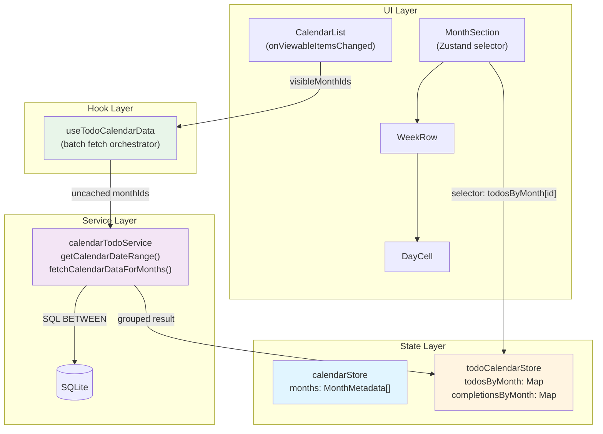

# Design Document: Calendar Data Integration

## Overview

Calendar Data Integration은 Phase 1의 무한 스크롤 캘린더 UI에 SQLite Todo/Completion 데이터를 연동하는 시스템입니다. 핵심 설계 원칙은 다음과 같습니다:

1. **6주 패딩 인식**: 캘린더 그리드의 실제 날짜 범위를 정확히 계산하여 누락 없이 조회
2. **Batch Fetch**: 여러 월을 1회 SQL로 조회하여 쿼리 횟수 최소화
3. **별도 캐시**: 기존 Todo 캐시와 분리된 캘린더 전용 Zustand Store
4. **Selector 패턴**: 각 MonthSection이 자기 월 데이터만 구독하여 리렌더링 최소화
5. **경량 객체**: 캘린더에 불필요한 필드 제외하여 메모리 절약

### Architecture Diagram



### Data Flow

```
사용자 스크롤 
→ CalendarList가 visible 월 감지 
→ Hook이 캐시 미스월만 필터 
→ Service가 1회 SQL로 batch fetch 
→ Store에 월별로 저장 
→ MonthSection이 selector로 읽음
→ DayCell에 Todo dot 표시
```

---

## Architecture

### Directory Structure

```
client/src/features/todo-calendar/
├── store/
│   ├── calendarStore.js          # 기존 (변경 없음)
│   └── todoCalendarStore.js      # [NEW] Todo/Completion 캐시
├── hooks/
│   ├── useInfiniteCalendar.js    # 기존 (변경 없음)
│   └── useTodoCalendarData.js    # [NEW] Batch fetch orchestrator
├── services/
│   └── calendarTodoService.js    # [NEW] SQLite 쿼리 (6주 패딩 인식)
├── ui/
│   ├── CalendarList.js           # [MODIFY] Hook 연동
│   ├── MonthSection.js           # [MODIFY] Store selector 추가
│   ├── WeekRow.js                # [MODIFY] todosByDate props 전달
│   └── DayCell.js                # [MODIFY] Todo dot 표시
└── utils/
    └── calendarHelpers.js        # [MODIFY] getCalendarDateRange 추가
```

### Component Hierarchy

```
TodoCalendarScreen
└── CalendarList (FlashList)
    └── MonthSection (renderItem)
        ├── MonthTitle
        └── WeekRow × 6
            └── DayCell × 7
                └── Todo Dot (conditional)
```

---

## Components and Interfaces

### 1. calendarHelpers.js (Utility Module)

**책임**: 6주 패딩 범위 계산 함수 추가

**New Function**:

```javascript
/**
 * 특정 월의 6주 그리드가 커버하는 실제 날짜 범위 계산
 * 
 * @param {number} year - 연도 (예: 2026)
 * @param {number} month - 월 (1~12)
 * @param {number} startDayOfWeek - 0 (Sunday) or 1 (Monday)
 * @returns {{ startDate: string, endDate: string }} - 'YYYY-MM-DD' 형식
 * 
 * @example
 * getCalendarDateRange(2026, 2, 0)
 * // → { startDate: '2026-01-25', endDate: '2026-03-07' }
 */
export function getCalendarDateRange(year, month, startDayOfWeek = 0) {
  const firstDay = dayjs(`${year}-${String(month).padStart(2, '0')}-01`);
  
  // generateWeeks()와 동일한 로직으로 그리드 시작일 계산
  let gridStart;
  if (startDayOfWeek === 1) {
    const dayOfWeek = firstDay.day();
    const daysToSubtract = dayOfWeek === 0 ? 6 : dayOfWeek - 1;
    gridStart = firstDay.subtract(daysToSubtract, 'day');
  } else {
    gridStart = firstDay.day(0);  // Previous Sunday
  }
  
  // 6주 × 7일 = 42일, 마지막 날은 41일 후
  const gridEnd = gridStart.add(41, 'day');
  
  return {
    startDate: gridStart.format('YYYY-MM-DD'),
    endDate: gridEnd.format('YYYY-MM-DD'),
  };
}
```

**Critical Constraint**: 이 함수의 `gridStart` 계산은 반드시 `generateWeeks()`의 `startDay` 계산과 **동일**해야 합니다. 로직이 분기되면 쿼리된 데이터와 렌더링된 셀이 어긋납니다.

**Refactoring Note**: `generateWeeks` 함수는 내부적으로 `getCalendarDateRange`를 호출하여 시작일을 받아오도록 리팩토링해야 합니다. 로직 중복은 버그의 원인이 됩니다.

---

### 2. todoCalendarStore.js (Zustand Store)

**책임**: 캘린더 전용 Todo/Completion 데이터 캐시 관리

**State Schema**:

```javascript
{
  // { '2026-01': [...todos], '2026-02': [...todos] }
  todosByMonth: Record<string, Array<LightweightTodo>>,
  
  // { '2026-01': { 'todoId:2026-01-15': {...}, ... }, '2026-02': {...} }
  completionsByMonth: Record<string, Record<string, Completion>>
}
```

**Actions**:

```javascript
/**
 * 특정 월의 Todo + Completion 데이터 설정
 * 
 * @param {string} monthId - 'YYYY-MM'
 * @param {Array} todos - Todo 배열
 * @param {Object} completions - Completion 맵 { key: completion }
 */
setMonthData: (monthId, todos, completions) => void

/**
 * 여러 월의 데이터를 한번에 설정 (batch fetch 후)
 * 
 * @param {Object} todosMap - { 'YYYY-MM': [...todos] }
 * @param {Object} completionsMap - { 'YYYY-MM': { key: completion } }
 */
setBatchMonthData: (todosMap, completionsMap) => void

/**
 * 특정 월 캐시 무효화 (재조회 필요 표시)
 * 
 * @param {string} monthId - 'YYYY-MM'
 */
invalidateMonth: (monthId) => void

/**
 * 특정 월 + 인접 월 캐시 무효화
 * Todo CRUD 후 호출 (6주 패딩으로 인접 월 데이터 영향)
 * 
 * @param {number} year
 * @param {number} month - 1~12
 */
invalidateAdjacentMonths: (year, month) => void

/**
 * 전체 캐시 클리어 (로그아웃, sync 완료 시)
 */
clearAll: () => void

/**
 * 캐시에 해당 월 데이터가 있는지 확인
 * 
 * @param {string} monthId - 'YYYY-MM'
 * @returns {boolean}
 */
hasMonth: (monthId) => boolean
```

**Implementation**:

```javascript
// client/src/features/todo-calendar/store/todoCalendarStore.js

import { create } from 'zustand';

export const useTodoCalendarStore = create((set, get) => ({
  todosByMonth: {},
  completionsByMonth: {},

  setMonthData: (monthId, todos, completions) => {
    set(state => ({
      todosByMonth: { ...state.todosByMonth, [monthId]: todos },
      completionsByMonth: { ...state.completionsByMonth, [monthId]: completions },
    }));
  },

  setBatchMonthData: (todosMap, completionsMap) => {
    set(state => ({
      todosByMonth: { ...state.todosByMonth, ...todosMap },
      completionsByMonth: { ...state.completionsByMonth, ...completionsMap },
    }));
  },

  invalidateMonth: (monthId) => {
    set(state => {
      const updatedTodos = { ...state.todosByMonth };
      const updatedCompletions = { ...state.completionsByMonth };
      delete updatedTodos[monthId];
      delete updatedCompletions[monthId];
      return { todosByMonth: updatedTodos, completionsByMonth: updatedCompletions };
    });
  },

  invalidateAdjacentMonths: (year, month) => {
    const getMonthId = (y, m) => {
      // 월 경계 처리 (0→12월 이전해, 13→1월 다음해)
      if (m <= 0) { y -= 1; m = 12 + m; }
      if (m > 12) { y += 1; m = m - 12; }
      return `${y}-${String(m).padStart(2, '0')}`;
    };

    const idsToInvalidate = [
      getMonthId(year, month - 1),
      getMonthId(year, month),
      getMonthId(year, month + 1),
    ];

    set(state => {
      const updatedTodos = { ...state.todosByMonth };
      const updatedCompletions = { ...state.completionsByMonth };
      
      idsToInvalidate.forEach(id => {
        delete updatedTodos[id];
        delete updatedCompletions[id];
      });

      return { todosByMonth: updatedTodos, completionsByMonth: updatedCompletions };
    });
  },

  clearAll: () => {
    set({ todosByMonth: {}, completionsByMonth: {} });
  },

  hasMonth: (monthId) => {
    return get().todosByMonth[monthId] !== undefined;
  },
}));
```

---

### 3. calendarTodoService.js (Service Layer)

**책임**: SQLite 쿼리 및 월별 그룹핑

**Functions**:

```javascript
/**
 * 여러 월의 캘린더 데이터를 한번에 조회 (Batch Fetch)
 * 
 * 핵심: 개별 월이 아닌 전체 date range로 1회 쿼리 후 월별 그룹핑
 * 
 * @param {Array<{year: number, month: number, id: string}>} monthMetadatas
 * @param {number} startDayOfWeek - 0 (Sunday) or 1 (Monday)
 * @returns {Promise<{ todosMap: Object, completionsMap: Object }>}
 */
export async function fetchCalendarDataForMonths(monthMetadatas, startDayOfWeek = 0)

/**
 * Todo DB row → 캘린더용 경량 객체
 * 캘린더에서는 title, date, category 정보만 필요
 * 
 * @param {Object} row - DB row
 * @returns {Object} - 경량 Todo 객체
 */
function deserializeTodoLight(row)
```

**Implementation**:

```javascript
// client/src/features/todo-calendar/services/calendarTodoService.js

import { getDatabase } from '../../../services/db/database';
import { getCalendarDateRange } from '../utils/calendarHelpers';

export async function fetchCalendarDataForMonths(monthMetadatas, startDayOfWeek = 0) {
  if (monthMetadatas.length === 0) return { todosMap: {}, completionsMap: {} };

  const db = getDatabase();

  // 1. 각 월의 6주 그리드 범위 계산
  const ranges = monthMetadatas.map(m => ({
    ...m,
    ...getCalendarDateRange(m.year, m.month, startDayOfWeek),
  }));

  // 2. 전체 범위의 최소~최대 날짜 (1회 쿼리용)
  const globalStart = ranges[0].startDate;
  const globalEnd = ranges[ranges.length - 1].endDate;

  // 3. Todos 조회 (1회 SQL)
  const todos = await db.getAllAsync(`
    SELECT 
      t.*,
      c.name as category_name, 
      c.color as category_color,
      c.icon as category_icon
    FROM todos t
    LEFT JOIN categories c ON t.category_id = c._id
    WHERE (
      (t.date >= ? AND t.date <= ?)
      OR (t.start_date <= ? AND t.end_date >= ?)
      OR (t.recurrence IS NOT NULL AND t.start_date <= ?)
    )
    AND t.deleted_at IS NULL
    ORDER BY t.date ASC, t.is_all_day DESC, t.start_time ASC
  `, [globalStart, globalEnd, globalEnd, globalStart, globalEnd]);

  // 4. Completions 조회 (1회 SQL)
  const completions = await db.getAllAsync(
    'SELECT * FROM completions WHERE date >= ? AND date <= ?',
    [globalStart, globalEnd]
  );

  // 5. 월별로 그룹핑
  const todosMap = {};
  const completionsMap = {};

  // 빈 배열/맵으로 초기화 (데이터 없는 월도 "조회 완료" 표시)
  for (const m of monthMetadatas) {
    todosMap[m.id] = [];
    completionsMap[m.id] = {};
  }

  // Todo를 해당 월 그리드 범위에 매칭
  for (const todo of todos) {
    // 기간 일정 Overlap 검사 (Critical Fix)
    // 단일 일정: date 사용
    // 기간 일정: startDate ~ endDate 범위 사용
    const todoStart = todo.start_date || todo.date;
    const todoEnd = todo.end_date || todo.date;
    
    if (!todoStart) continue;

    for (const range of ranges) {
      // Overlap 검사: todo.startDate <= range.endDate && todo.endDate >= range.startDate
      // 이렇게 해야 1월~2월 걸치는 일정이 2월 달력에서 사라지지 않음
      if (todoStart <= range.endDate && todoEnd >= range.startDate) {
        todosMap[range.id].push(deserializeTodoLight(todo));
        // 하나의 Todo가 여러 월 그리드에 걸칠 수 있음 (기간 일정)
        // break 하지 않음
      }
    }
  }

  // Completion을 해당 월에 매칭
  for (const comp of completions) {
    if (!comp.date) continue;
    
    for (const range of ranges) {
      if (comp.date >= range.startDate && comp.date <= range.endDate) {
        completionsMap[range.id][comp.key] = {
          _id: comp._id,
          todoId: comp.todo_id,
          date: comp.date,
          completedAt: comp.completed_at,
        };
      }
    }
  }

  return { todosMap, completionsMap };
}

function deserializeTodoLight(row) {
  return {
    _id: row._id,
    title: row.title,
    date: row.date,
    startDate: row.start_date,
    endDate: row.end_date,
    categoryColor: row.category_color || row.color || '#333',
    isAllDay: row.is_all_day === 1,
    recurrence: row.recurrence ? JSON.parse(row.recurrence) : null,
  };
}
```

**Performance Note**: `deserializeTodoLight`는 기존 `deserializeTodo`의 경량 버전입니다. 캘린더에서 불필요한 필드(memo, startTime, endTime 등)를 제외하여 메모리를 절약합니다.

---

### 4. useTodoCalendarData.js (Custom Hook)

**책임**: Visible 월 감지 및 prefetch orchestration

**Interface**:

```javascript
/**
 * useTodoCalendarData Hook
 * 
 * CalendarList의 onViewableItemsChanged와 연동하여
 * 보이는 월 + buffer의 Todo 데이터를 batch fetch합니다.
 * 
 * @param {number} startDayOfWeek - 0 (Sunday) or 1 (Monday)
 * @returns {{ onVisibleMonthsChange: (visibleItems: Array) => void }}
 */
export function useTodoCalendarData(startDayOfWeek = 0)
```

**Implementation**:

```javascript
// client/src/features/todo-calendar/hooks/useTodoCalendarData.js

import { useCallback, useRef } from 'react';
import { useTodoCalendarStore } from '../store/todoCalendarStore';
import { fetchCalendarDataForMonths } from '../services/calendarTodoService';
import { createMonthMetadata } from '../utils/calendarHelpers';
import dayjs from 'dayjs';

export function useTodoCalendarData(startDayOfWeek = 0) {
  const isFetchingRef = useRef(false);
  const hasMonth = useTodoCalendarStore(state => state.hasMonth);
  const setBatchMonthData = useTodoCalendarStore(state => state.setBatchMonthData);

  const onVisibleMonthsChange = useCallback(async (viewableItems) => {
    if (viewableItems.length === 0) return;
    if (isFetchingRef.current) return;

    // 1. 보이는 월의 범위 계산
    const firstVisible = viewableItems[0].item;
    const lastVisible = viewableItems[viewableItems.length - 1].item;

    // 2. buffer ±2개월 확장
    const bufferStart = dayjs(`${firstVisible.year}-${String(firstVisible.month).padStart(2, '0')}-01`)
      .subtract(2, 'month');
    const bufferEnd = dayjs(`${lastVisible.year}-${String(lastVisible.month).padStart(2, '0')}-01`)
      .add(2, 'month');

    // 3. 범위 내 모든 월 메타데이터 생성
    const allMonths = [];
    let cursor = bufferStart;
    while (cursor.isBefore(bufferEnd) || cursor.isSame(bufferEnd, 'month')) {
      allMonths.push(createMonthMetadata(cursor.year(), cursor.month() + 1));
      cursor = cursor.add(1, 'month');
    }

    // 4. 캐시 미스 월만 필터
    const uncachedMonths = allMonths.filter(m => !hasMonth(m.id));

    if (uncachedMonths.length === 0) return;

    // 5. Batch fetch
    isFetchingRef.current = true;
    try {
      const startTime = performance.now();
      const { todosMap, completionsMap } = await fetchCalendarDataForMonths(
        uncachedMonths,
        startDayOfWeek
      );
      const endTime = performance.now();
      
      console.log(`[useTodoCalendarData] Fetched ${uncachedMonths.length} months in ${(endTime - startTime).toFixed(2)}ms`);
      
      setBatchMonthData(todosMap, completionsMap);
    } catch (error) {
      console.error('[useTodoCalendarData] Batch fetch failed:', error);
    } finally {
      isFetchingRef.current = false;
    }
  }, [startDayOfWeek, hasMonth, setBatchMonthData]);

  return { onVisibleMonthsChange };
}
```

**Critical Note**: `hasMonth`을 Zustand selector로 가져오는데, 이는 **함수 참조**이므로 `useCallback`의 dependency에 넣어도 무한 루프가 발생하지 않습니다.

---

### 5. CalendarList.js (Container Component)

**책임**: Hook 연동 (최소 수정)

**Changes**:

```diff
 import { useInfiniteCalendar } from '../hooks/useInfiniteCalendar';
+import { useTodoCalendarData } from '../hooks/useTodoCalendarData';
 import { getWeekdayNames, formatMonthTitle } from '../utils/calendarHelpers';

 export default function CalendarList() {
   const {
     months,
     handleEndReached,
     handleStartReached,
     initialScrollIndex,
   } = useInfiniteCalendar();

+  // Phase 2: Todo 데이터 batch fetch
+  const { onVisibleMonthsChange } = useTodoCalendarData(startDayOfWeek);

   // ... 기존 코드 ...

   const onViewableItemsChanged = useCallback(({ viewableItems }) => {
     if (months.length === 0 || viewableItems.length === 0) return;

     const firstIdx = viewableItems[0].index;

     if (viewableItems[0]?.item) {
       setCurrentMonth(viewableItems[0].item);
     }

     if (firstIdx !== undefined && firstIdx <= 3) {
       handleStartReached();
     }

+    // Phase 2: visible 월 변경 시 Todo 데이터 fetch
+    onVisibleMonthsChange(viewableItems);
-  }, [months, handleStartReached]);
+  }, [months, handleStartReached, onVisibleMonthsChange]);
```

---

### 6. MonthSection.js (Presentation Component)

**책임**: Selector 패턴으로 자기 월 데이터만 구독

**Changes**:

```diff
 import React, { useMemo } from 'react';
 import { View, Text, StyleSheet } from 'react-native';
 import WeekRow from './WeekRow';
 import { generateWeeks, formatMonthTitle } from '../utils/calendarHelpers';
+import { useTodoCalendarStore } from '../store/todoCalendarStore';
+import dayjs from 'dayjs';

 function MonthSection({ monthMetadata, startDayOfWeek = 0, language = 'ko' }) {
+  // ✅ Selector: 이 월의 데이터만 구독 (다른 월 변경 시 리렌더 안 함)
+  const todos = useTodoCalendarStore(
+    state => state.todosByMonth[monthMetadata.id]
+  );
+  const completions = useTodoCalendarStore(
+    state => state.completionsByMonth[monthMetadata.id]
+  );

   const weeks = useMemo(() => {
     return generateWeeks(monthMetadata.year, monthMetadata.month, startDayOfWeek);
   }, [monthMetadata.year, monthMetadata.month, startDayOfWeek]);

+  // Todo를 날짜별로 그룹핑 (DayCell에 전달용)
+  // Critical Fix: 기간 일정은 startDate ~ endDate 사이의 모든 날짜에 매핑
+  const todosByDate = useMemo(() => {
+    if (!todos || todos.length === 0) return {};
+    
+    const map = {};
+    for (const todo of todos) {
+      if (todo.startDate && todo.endDate) {
+        // 기간 일정: startDate ~ endDate 사이의 모든 날짜에 추가
+        let current = dayjs(todo.startDate);
+        const end = dayjs(todo.endDate);
+        
+        while (current.isBefore(end) || current.isSame(end, 'day')) {
+          const dateKey = current.format('YYYY-MM-DD');
+          if (!map[dateKey]) map[dateKey] = [];
+          map[dateKey].push(todo);
+          current = current.add(1, 'day');
+        }
+      } else {
+        // 단일 일정: date 하나에만 추가
+        const dateKey = todo.date || todo.startDate;
+        if (!dateKey) continue;
+        if (!map[dateKey]) map[dateKey] = [];
+        map[dateKey].push(todo);
+      }
+    }
+    return map;
+  }, [todos]);

   return (
     <View style={styles.container}>
       <Text style={styles.title}>{monthTitle}</Text>
       {weeks.map((week, idx) => (
-        <WeekRow key={idx} week={week} />
+        <WeekRow
+          key={idx}
+          week={week}
+          todosByDate={todosByDate}
+          completions={completions}
+        />
       ))}
     </View>
   );
 }
```

**Selector Equality**: Zustand는 기본적으로 `Object.is` 비교를 합니다. `todosByMonth[monthMetadata.id]`가 처음 캐시에 없으면 `undefined`를 반환하고, 데이터가 로드되면 배열을 반환합니다. `undefined → Array` 변경은 정상적으로 리렌더링을 트리거합니다.

---

### 7. WeekRow.js (Presentation Component)

**책임**: Props 전달

**Changes**:

```diff
-export default function WeekRow({ week }) {
+export default function WeekRow({ week, todosByDate, completions }) {
   return (
     <View style={styles.row}>
       {week.map((day) => (
-        <DayCell key={day.dateString} day={day} />
+        <DayCell
+          key={day.dateString}
+          day={day}
+          todos={todosByDate?.[day.dateString] || []}
+          completions={completions}
+        />
       ))}
     </View>
   );
 }
```

---

### 8. DayCell.js (Presentation Component)

**책임**: Todo Dot 표시

**Changes**:

```diff
-export default function DayCell({ day }) {
+export default function DayCell({ day, todos, completions }) {
   // Phase 1.5: 다른 월 날짜는 빈 공간으로 표시
   if (!day.isCurrentMonth) {
     return <View style={styles.cell} />;
   }

+  // Phase 2: Todo dot 표시
+  const hasTodos = todos && todos.length > 0;
+  const dotColor = todos?.length === 1 ? todos[0].categoryColor : '#333';

   return (
     <View style={styles.cell}>
       <Text style={styles.dateText}>{day.date}</Text>
+      {hasTodos && (
+        <View style={[styles.todoDot, { backgroundColor: dotColor }]} />
+      )}
     </View>
   );
 }

+const styles = StyleSheet.create({
+  // ... 기존 스타일 ...
+  todoDot: {
+    width: 4,
+    height: 4,
+    borderRadius: 2,
+    marginTop: 2,
+  },
+});
```

---

## Data Models

### LightweightTodo (Computed State)

```javascript
{
  _id: string,              // UUID
  title: string,
  date: string | null,      // 'YYYY-MM-DD' (단일 일정)
  startDate: string | null, // 'YYYY-MM-DD' (기간 일정 시작)
  endDate: string | null,   // 'YYYY-MM-DD' (기간 일정 종료)
  categoryColor: string,    // '#RRGGBB'
  isAllDay: boolean,
  recurrence: object | null // 반복 규칙
}
```

**특징**:
- 기존 `deserializeTodo`의 경량 버전
- 캘린더에서 불필요한 필드 제외 (memo, startTime, endTime, categoryId, createdAt, updatedAt)
- 메모리 절약: ~50% 크기 감소

---

### Completion (Cached State)

```javascript
{
  _id: string,         // UUID
  todoId: string,      // Todo UUID
  date: string | null, // 'YYYY-MM-DD' (반복 일정) or null (비반복)
  completedAt: string  // ISO 8601
}
```

---

### TodosByMonth (Store State)

```javascript
{
  '2026-01': [LightweightTodo, ...],
  '2026-02': [LightweightTodo, ...],
  ...
}
```

**특징**:
- Key는 `'YYYY-MM'` 형식 (calendarStore의 `monthMetadata.id`와 동일)
- 6주 패딩 범위의 모든 Todo 포함
- 예: `'2026-02'` 키에는 1/26 ~ 3/8 범위의 Todo가 포함됨

---

### CompletionsByMonth (Store State)

```javascript
{
  '2026-01': {
    'todoId_2026-01-15': Completion,
    'todoId_null': Completion,
    ...
  },
  '2026-02': { ... },
  ...
}
```

**특징**:
- 반복 일정: `${todoId}_${date}` 형식
- 비반복 일정: `${todoId}_null` 형식

---

## Correctness Properties

*A property is a characteristic or behavior that should hold true across all valid executions of a system—essentially, a formal statement about what the system should do. Properties serve as the bridge between human-readable specifications and machine-verifiable correctness guarantees.*

이제 Prework 분석을 수행하겠습니다.


### Property 1: Date Range Consistency

*For any* year, month, and startDayOfWeek combination, the startDate returned by `getCalendarDateRange` should match the first day's dateString in the first week returned by `generateWeeks`.

**Validates: Requirements 1.3, 14.1, 14.2, 14.3**

---

### Property 2: Week Start Day Correctness

*For any* year and month, when startDayOfWeek is 0, the startDate should be a Sunday, and when startDayOfWeek is 1, the startDate should be a Monday.

**Validates: Requirements 1.4, 1.5, 14.4**

---

### Property 3: Date Range Span

*For any* year, month, and startDayOfWeek, the date range returned by `getCalendarDateRange` should span exactly 42 days (6 weeks).

**Validates: Requirements 1.1**

---

### Property 4: Batch Fetch Query Efficiency

*For any* array of month metadatas, `fetchCalendarDataForMonths` should execute exactly 1 SQL query for todos and exactly 1 SQL query for completions, regardless of the number of months.

**Validates: Requirements 3.2, 3.3**

---

### Property 5: Month Grouping Completeness

*For any* fetched todos and month ranges, each todo should be assigned to all months whose date range contains the todo's date (or startDate for period todos).

**Validates: Requirements 3.5, 15.1, 15.2, 15.3, 15.4**

---

### Property 6: Empty Month Handling

*For any* month with no todos in the database, `fetchCalendarDataForMonths` should return an empty array for that month's key in todosMap.

**Validates: Requirements 3.7**

---

### Property 7: SQL Query Coverage

*For any* date range, the SQL query should return all todos where: (1) single-day todos have date within range, (2) period todos have overlap with range, (3) recurring todos have start_date before range end.

**Validates: Requirements 4.1, 4.2, 4.3, 4.4**

---

### Property 8: Lightweight Todo Fields

*For any* todo returned by `deserializeTodoLight`, the object should contain only `_id, title, date, startDate, endDate, categoryColor, isAllDay, recurrence` fields and should NOT contain `memo, startTime, endTime, categoryId, createdAt, updatedAt` fields.

**Validates: Requirements 5.1, 5.2, 5.3**

---

### Property 9: Cache Hit Prevention

*For any* set of visible months, if all months are already cached (hasMonth returns true), then `onVisibleMonthsChange` should NOT call `fetchCalendarDataForMonths`.

**Validates: Requirements 6.4, 12.2**

---

### Property 10: Adjacent Month Invalidation

*For any* year and month, calling `invalidateAdjacentMonths(year, month)` should invalidate exactly 3 months: the current month, previous month, and next month, with correct year boundary handling.

**Validates: Requirements 10.4, 10.5**

---

### Property 11: Selector Isolation

*For any* MonthSection component, when data for a different month changes in todoCalendarStore, the component should NOT re-render (verified by render count).

**Validates: Requirements 8.4**

---

### Property 12: Todo Dot Display Logic

*For any* DayCell with todos array, if the array is empty, no dot should be displayed; if the array has one todo, the dot color should match the todo's categoryColor; if the array has multiple todos, the dot color should be '#333'.

**Validates: Requirements 9.2, 9.4, 9.5**

---

### Property 13: Error Handling Graceful Degradation

*For any* SQL query failure in `fetchCalendarDataForMonths`, the function should return empty todosMap and completionsMap without throwing an error.

**Validates: Requirements 13.1, 13.2, 13.3**

---

### Property 14: Period Todo Multi-Month Assignment

*For any* period todo spanning multiple months (e.g., startDate in month A, endDate in month B), the todo should appear in todosMap for both month A and month B.

**Validates: Requirements 15.1, 15.4**

---

## Error Handling

### 1. SQL Query Failure

**Scenario**: Database query fails due to connection error or invalid SQL

**Handling**:
```javascript
export async function fetchCalendarDataForMonths(monthMetadatas, startDayOfWeek = 0) {
  try {
    // ... SQL queries
  } catch (error) {
    console.error('[calendarTodoService] SQL query failed:', error);
    
    // Return empty maps (graceful degradation)
    const todosMap = {};
    const completionsMap = {};
    
    for (const m of monthMetadatas) {
      todosMap[m.id] = [];
      completionsMap[m.id] = {};
    }
    
    return { todosMap, completionsMap };
  }
}
```

**Validates: Requirements 13.1, 13.2, 13.3**

---

### 2. Invalid Date Range

**Scenario**: `getCalendarDateRange` receives invalid year/month

**Handling**:
```javascript
export function getCalendarDateRange(year, month, startDayOfWeek = 0) {
  try {
    const firstDay = dayjs(`${year}-${String(month).padStart(2, '0')}-01`);
    
    if (!firstDay.isValid()) {
      console.error(`[calendarHelpers] Invalid date: ${year}-${month}`);
      // Return current month range as fallback
      const now = dayjs();
      return getCalendarDateRange(now.year(), now.month() + 1, startDayOfWeek);
    }
    
    // ... normal logic
  } catch (error) {
    console.error('[calendarHelpers] getCalendarDateRange error:', error);
    // Return current month range as fallback
    const now = dayjs();
    return getCalendarDateRange(now.year(), now.month() + 1, startDayOfWeek);
  }
}
```

---

### 3. Store Selector Returns Undefined

**Scenario**: MonthSection tries to access data for uncached month

**Handling**:
```javascript
// MonthSection.js
const todos = useTodoCalendarStore(
  state => state.todosByMonth[monthMetadata.id]
);

// todos가 undefined일 수 있음 → useMemo에서 처리
const todosByDate = useMemo(() => {
  if (!todos || todos.length === 0) return {};
  // ... grouping logic
}, [todos]);
```

**Result**: Component renders with empty data, no crash. Data will be fetched on next visible change.

---

### 4. Duplicate Fetch Prevention

**Scenario**: Rapid scrolling triggers multiple `onVisibleMonthsChange` calls

**Handling**:
```javascript
// useTodoCalendarData.js
const isFetchingRef = useRef(false);

const onVisibleMonthsChange = useCallback(async (viewableItems) => {
  if (isFetchingRef.current) {
    console.log('[useTodoCalendarData] Already fetching, skipping');
    return;
  }
  
  isFetchingRef.current = true;
  try {
    // ... fetch logic
  } finally {
    isFetchingRef.current = false;
  }
}, []);
```

---

## Testing Strategy

### Unit Tests

Phase 2에서는 자동화된 테스트 프레임워크가 없으므로, 수동 테스트 화면을 통해 검증합니다.

**테스트 항목**:

1. **`getCalendarDateRange()` 정확성**
   - 2026-02 with startDayOfWeek=0 → `{startDate: '2026-01-25', endDate: '2026-03-07'}`
   - 2026-02 with startDayOfWeek=1 → startDate는 월요일
   - 모든 월에서 42일 범위 반환 확인

2. **`fetchCalendarDataForMonths()` 배치 조회**
   - 5개월 조회 시 SQL 쿼리 2회만 실행 (todos 1회, completions 1회)
   - 빈 월은 빈 배열 반환
   - 기간 일정은 여러 월에 중복 할당

3. **`todoCalendarStore` 액션**
   - `setMonthData` → 데이터 저장 확인
   - `invalidateAdjacentMonths` → 3개월 무효화 확인
   - `hasMonth` → 캐시 존재 여부 확인

4. **`useTodoCalendarData` Hook**
   - 캐시 미스 월만 fetch
   - 중복 fetch 방지 (isFetchingRef)
   - visible ±2개월 prefetch

**수동 테스트 방법**:
```javascript
// client/src/test/CalendarDataIntegrationTest.js
import { getCalendarDateRange } from '../features/todo-calendar/utils/calendarHelpers';
import { fetchCalendarDataForMonths } from '../features/todo-calendar/services/calendarTodoService';

export default function CalendarDataIntegrationTest() {
  const testDateRange = () => {
    const range = getCalendarDateRange(2026, 2, 0);
    console.log('2026-02 range:', range);
    console.assert(range.startDate === '2026-01-25', 'Start date mismatch');
    console.assert(range.endDate === '2026-03-07', 'End date mismatch');
  };

  const testBatchFetch = async () => {
    const months = [
      { year: 2026, month: 1, id: '2026-01' },
      { year: 2026, month: 2, id: '2026-02' },
    ];
    
    const startTime = performance.now();
    const { todosMap, completionsMap } = await fetchCalendarDataForMonths(months, 0);
    const endTime = performance.now();
    
    console.log(`Fetched 2 months in ${(endTime - startTime).toFixed(2)}ms`);
    console.log('Todos by month:', Object.keys(todosMap));
    console.log('Completions by month:', Object.keys(completionsMap));
  };

  return (
    <View>
      <Button title="Test Date Range" onPress={testDateRange} />
      <Button title="Test Batch Fetch" onPress={testBatchFetch} />
    </View>
  );
}
```

---

### Integration Tests

**테스트 시나리오**:

1. **초기 캘린더 로딩**
   - CalendarScreen 진입
   - 현재 월 ±2개월 데이터 자동 fetch 확인
   - Todo dot 표시 확인

2. **스크롤 시 Prefetch**
   - 빠르게 3개월 스크롤
   - console에서 batch fetch 로그 확인
   - 캐시 히트 시 fetch 없음 확인

3. **Todo 생성 후 캐시 무효화**
   - 2026-02-15에 Todo 생성
   - 1월, 2월, 3월 캐시 무효화 확인
   - 캘린더 재방문 시 새 Todo 표시 확인

4. **Selector 격리**
   - React DevTools로 MonthSection 렌더링 추적
   - 2월 데이터 변경 시 1월 MonthSection 리렌더 없음 확인

5. **6주 패딩 범위**
   - 2026-01-28에 Todo 생성
   - 2월 그리드 첫째 주에도 표시 확인

6. **기간 일정 다중 월 표시**
   - 1/28 ~ 2/5 기간 일정 생성
   - 1월과 2월 그리드 모두에 표시 확인

**테스트 진입점**:
```javascript
// client/src/screens/SettingsScreen.js
<Button
  title="캘린더 데이터 연동 테스트"
  onPress={() => navigation.navigate('TodoCalendar')}
/>
```

---

### Property-Based Tests

**Property Test Configuration**:
- 최소 100회 반복 (randomization)
- 각 테스트는 design property 참조
- Tag 형식: `Feature: calendar-data-integration, Property {number}: {property_text}`

**Property Test 예시** (향후 Jest/Vitest 도입 시):

```javascript
// Property 1: Date Range Consistency
test('Property 1: Date Range Consistency', () => {
  fc.assert(
    fc.property(
      fc.integer({ min: 2020, max: 2030 }),  // year
      fc.integer({ min: 1, max: 12 }),       // month
      fc.constantFrom(0, 1),                 // startDayOfWeek
      (year, month, startDayOfWeek) => {
        const range = getCalendarDateRange(year, month, startDayOfWeek);
        const weeks = generateWeeks(year, month, startDayOfWeek);
        
        const firstDayInWeeks = weeks[0][0].dateString;
        
        return range.startDate === firstDayInWeeks;
      }
    ),
    { numRuns: 100 }
  );
});

// Property 4: Batch Fetch Query Efficiency
test('Property 4: Batch Fetch Query Efficiency', async () => {
  const mockDb = createMockDatabase();
  let todoQueryCount = 0;
  let completionQueryCount = 0;
  
  mockDb.getAllAsync = jest.fn(async (query) => {
    if (query.includes('FROM todos')) todoQueryCount++;
    if (query.includes('FROM completions')) completionQueryCount++;
    return [];
  });
  
  const months = [
    { year: 2026, month: 1, id: '2026-01' },
    { year: 2026, month: 2, id: '2026-02' },
    { year: 2026, month: 3, id: '2026-03' },
  ];
  
  await fetchCalendarDataForMonths(months, 0);
  
  expect(todoQueryCount).toBe(1);
  expect(completionQueryCount).toBe(1);
});
```

---

### Performance Benchmarks

**측정 방법**:
```javascript
// useTodoCalendarData.js
const onVisibleMonthsChange = useCallback(async (viewableItems) => {
  // ... 캐시 미스 필터링 ...
  
  if (uncachedMonths.length === 0) {
    console.log('[Performance] Cache hit - no fetch needed');
    return;
  }
  
  const startTime = performance.now();
  const { todosMap, completionsMap } = await fetchCalendarDataForMonths(
    uncachedMonths,
    startDayOfWeek
  );
  const endTime = performance.now();
  
  console.log(`[Performance] Fetched ${uncachedMonths.length} months in ${(endTime - startTime).toFixed(2)}ms`);
  console.log(`[Performance] Todos: ${Object.values(todosMap).flat().length} items`);
  console.log(`[Performance] Completions: ${Object.values(completionsMap).flat().length} items`);
}, []);
```

**목표 수치**:
| Metric | Target | Measurement Method |
|--------|--------|-------------------|
| Batch Fetch (5개월) | < 50ms | console.time() |
| MonthSection Render | < 16ms | React DevTools Profiler |
| 스크롤 FPS | 60fps | Expo Performance Monitor |
| 캐시 히트율 | > 90% | console.log 카운터 |
| SQL 쿼리 횟수 (12개월 스크롤) | < 3회 | console.log 카운터 |

---

## Implementation Notes

### Phase 2 Scope

이 디자인 문서는 Phase 2 범위를 다룹니다:
- ✅ SQLite Todo/Completion 데이터 조회
- ✅ 6주 패딩 범위 계산
- ✅ Batch Fetch 최적화
- ✅ 별도 캐시 관리 (todoCalendarStore)
- ✅ Selector 패턴으로 리렌더링 최적화
- ✅ CRUD 후 캐시 무효화
- ✅ Todo Dot 표시

Phase 3 (향후):
- ❌ 날짜 클릭 이벤트 (Todo 목록 모달)
- ❌ 오늘 날짜 시각적 하이라이트 (배경색, 테두리)
- ❌ Todo 개수 표시 (숫자 뱃지)
- ❌ 완료율 표시 (프로그레스 바)

---

### Critical Implementation Warnings

#### 1. Date Calculation Synchronization

**Danger**: `getCalendarDateRange`와 `generateWeeks`의 `gridStart` 계산이 다르면 쿼리된 데이터와 렌더링된 셀이 어긋남

**Solution**: 두 함수의 로직을 항상 동기화. 수정 시 양쪽 모두 변경.

**Better Solution** (향후 리팩토링):
```javascript
// generateWeeks 내부에서 getCalendarDateRange 호출
export function generateWeeks(year, month, startDayOfWeek = 0) {
  const { startDate } = getCalendarDateRange(year, month, startDayOfWeek);
  let currentDay = dayjs(startDate);
  
  // ... 나머지 로직
}
```

---

#### 2. Period Todo Multi-Month Assignment

**Danger**: 기간 일정을 첫 번째 매칭 월에만 할당하면 다른 월 그리드에서 누락

**Solution**: 그룹핑 루프에서 `break` 하지 않음

```javascript
// ❌ 잘못된 구현
for (const range of ranges) {
  if (todoDate >= range.startDate && todoDate <= range.endDate) {
    todosMap[range.id].push(todo);
    break;  // ← 첫 번째 매칭 후 중단 (잘못됨)
  }
}

// ✅ 올바른 구현
for (const range of ranges) {
  if (todoDate >= range.startDate && todoDate <= range.endDate) {
    todosMap[range.id].push(todo);
    // break 없음 - 모든 매칭 월에 할당
  }
}
```

---

#### 3. Recurring Todo Query Range

**Danger**: 반복 일정의 종료일이 있는 경우 추가 조건 필요

**Current Implementation**:
```sql
OR (t.recurrence IS NOT NULL AND t.start_date <= ?)
```

**Issue**: 반복 종료일(`recurrence.until`)이 쿼리 범위 시작일보다 이전이면 불필요한 조회

**Future Enhancement**:
```sql
OR (
  t.recurrence IS NOT NULL 
  AND t.start_date <= ?
  AND (
    JSON_EXTRACT(t.recurrence, '$.until') IS NULL
    OR JSON_EXTRACT(t.recurrence, '$.until') >= ?
  )
)
```

---

#### 4. Sync Completion Cache Clear

**Danger**: 서버 동기화 완료 후 캘린더 캐시를 클리어하지 않으면 서버 데이터가 반영되지 않음

**Solution**: Sync 완료 핸들러에 추가
```javascript
// client/src/hooks/useSyncService.js
const handleSyncComplete = () => {
  // 기존: React Query 캐시 무효화
  queryClient.invalidateQueries({ queryKey: ['todos'] });
  
  // Phase 2: 캘린더 캐시 클리어
  useTodoCalendarStore.getState().clearAll();
};
```

---

### CRUD Integration Points

**Todo 생성/수정/삭제 후 캐시 무효화**:

```javascript
// client/src/hooks/mutations/useCreateTodo.js
import { useTodoCalendarStore } from '../../features/todo-calendar/store/todoCalendarStore';

export function useCreateTodo() {
  const invalidateAdjacentMonths = useTodoCalendarStore(
    state => state.invalidateAdjacentMonths
  );

  return useMutation({
    mutationFn: createTodo,
    onSuccess: (data) => {
      // 기존: React Query 캐시 무효화
      queryClient.invalidateQueries({ queryKey: ['todos'] });
      
      // Phase 2: 캘린더 캐시 무효화
      if (data?.date) {
        const [year, month] = data.date.split('-').map(Number);
        invalidateAdjacentMonths(year, month);
      }
    },
  });
}
```

**날짜 변경 시 이전/새 날짜 모두 무효화**:

```javascript
// client/src/hooks/mutations/useUpdateTodo.js
export function useUpdateTodo() {
  const invalidateAdjacentMonths = useTodoCalendarStore(
    state => state.invalidateAdjacentMonths
  );

  return useMutation({
    mutationFn: updateTodo,
    onSuccess: (data, variables) => {
      // 기존: React Query 캐시 무효화
      queryClient.invalidateQueries({ queryKey: ['todos'] });
      
      // Phase 2: 캘린더 캐시 무효화
      // 새 날짜 무효화
      if (data?.date) {
        const [year, month] = data.date.split('-').map(Number);
        invalidateAdjacentMonths(year, month);
      }
      
      // 날짜 변경 시: 이전 날짜도 무효화 (이전 달력에서 dot 제거)
      if (variables?.date && variables.date !== data?.date) {
        const [oldYear, oldMonth] = variables.date.split('-').map(Number);
        invalidateAdjacentMonths(oldYear, oldMonth);
      }
    },
  });
}
```

**동일하게 적용**:
- `useCreateTodo.js`
- `useUpdateTodo.js` (날짜 변경 시 이전/새 날짜 모두 무효화)
- `useDeleteTodo.js`
- `useToggleCompletion.js` (완료 상태 변경 시)

---

## References

- [Phase 1 Design: Infinite Scroll Calendar](../infinite-scroll-calendar/design.md)
- [Phase 2 Implementation Guide](./../phase2_implementation_guide.md)
- [SQLite Documentation](https://docs.expo.dev/versions/latest/sdk/sqlite/)
- [Zustand Documentation](https://github.com/pmndrs/zustand)
- [Day.js Documentation](https://day.js.org/)
- [React Query Documentation](https://tanstack.com/query/latest)
