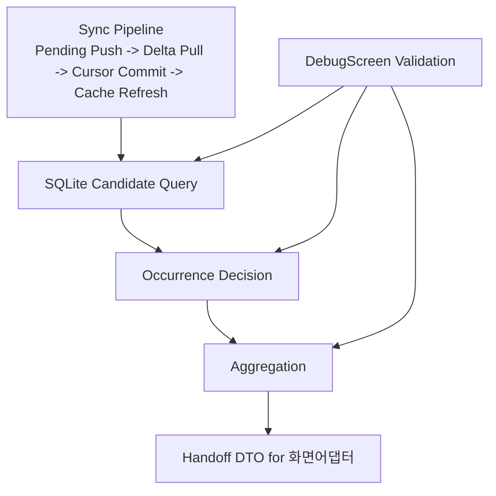

# Design Document: 공통 조회/집계 레이어

## Overview

본 설계는 `requirements.md`의 공통 조회/집계 레이어 요구사항(R1~R12)을 구현하기 위한 구조를 정의한다.

설계 목표:

1. 조회/판정/병합 경로를 공통 계층으로 통합한다.
2. 반복 판정 최종 경로를 `recurrenceEngine` 단일 경로로 고정한다.
3. 화면어댑터에 넘길 handoff DTO 계약을 고정한다.
4. DebugScreen 기반 검증을 구조적으로 지원한다.

중요 경계:

1. 본 문서는 `공통 조회/집계 레이어`까지만 다룬다.
2. 화면어댑터 구현/표시 규칙은 `.kiro/specs/screen-adapter-layer/`에서 다룬다.

## Current State (AS-IS 요약)

1. `useTodos`가 `todoService.getTodosByDate` + `completionService.getCompletionsByDate`를 호출하고 훅 내부에서 completion 병합을 수행한다.
2. `todo-calendar`는 `calendarTodoService.fetchCalendarDataForMonths`의 별도 쿼리/그룹핑 경로를 사용한다.
3. `strip-calendar`는 별도 summary 경로와 독립 recurrence 판정(`matchesRecurringDate`)을 사용한다.
4. `useTodos`에는 SQLite 실패 시 서버 직접 폴백이 남아 있다.

## Design Principles

1. **TO-BE First**: 기존 코드 보존보다 목표 계약 충족을 우선한다.
2. **SQLite-only Read Path**: 공통 레이어는 서버 직접 조회를 수행하지 않는다.
3. **Single Recurrence Predicate**: 최종 반복 판정은 `recurrenceEngine`만 사용한다.
4. **Fail-soft Core, Explicit Boundary**: 공통 레이어는 구조화된 실패를 반환하고 UI 경계에서 fallback을 결정한다.
5. **화면어댑터 경계 우선**: 공통 레이어는 DTO handoff까지만 책임진다.

## Target Architecture



## Module Structure

제안 경로:

1. `client/src/services/query-aggregation/candidateQueryService.js`
2. `client/src/services/query-aggregation/occurrenceDecisionService.js`
3. `client/src/services/query-aggregation/aggregationService.js`
4. `client/src/services/query-aggregation/types.js`

참고:

- 화면어댑터 경로(`adapters/*`)는 별도 스펙(`screen-adapter-layer`)에서 정의한다.

## Data Contracts

### 1) Candidate Bundle

```js
{
  // Todo 후보 row (category LEFT JOIN 포함)
  todos: TodoCandidateRow[],
  // completion 후보 row
  completions: CompletionRow[],
  range: { startDate: string, endDate: string }
}
```

### 2) Decision Result

```js
// 단일 날짜 판정
{
  mode: 'date',
  targetDate: string,
  passedTodoIds: string[],
  reasonsByTodoId: Record<string, 'single'|'period'|'recurrence'|'excluded'>,
  metrics: { candidateCount: number, decidedCount: number }
}

// 범위 판정
{
  mode: 'range',
  range: { startDate: string, endDate: string },
  occurrencesByTodoId: Record<string, string[]>,
  metrics: { candidateCount: number, decidedCount: number }
}
```

### 3) Aggregated Item (Handoff DTO)

```js
{
  todoId: string,
  title: string,
  date: string | null,
  startDate: string | null,
  endDate: string | null,
  isAllDay: boolean,
  startTime: string | null,
  endTime: string | null,
  isRecurring: boolean,
  completionKey: string,
  completed: boolean,
  completionId: string | null,
  category: {
    id: string | null,
    name: string | null,
    color: string | null,
    icon: string | null
  }
}
```

## Component Design

### 1) Candidate Query Layer (`candidateQueryService.js`)

역할:

1. SQLite에서 Todo 후보를 category LEFT JOIN 방식으로 조회
2. SQLite에서 completion 후보를 조회
3. soft-delete 제외를 일관 적용
4. 화면 타입별로 필요한 최소 범위 계산

정책:

1. 쿼리는 후보를 넓게 가져오고 최종 포함 판단은 decision layer가 담당한다.
2. 서버 API 직접 호출 금지
3. Category 바인딩은 Todo SQL의 LEFT JOIN 고정
4. Completion range 조회는 `(date BETWEEN ? AND ?) OR date IS NULL` 고정

### 2) Occurrence Decision Layer (`occurrenceDecisionService.js`)

역할:

1. Todo 후보의 표시 대상 여부 최종 판정
2. 일반 일정(single/period)과 반복 일정(recurring)을 동일 인터페이스로 처리

인터페이스:

1. `decideForDate(candidates, targetDate)`
2. `decideForRange(candidates, rangeStart, rangeEnd)`

판정 규칙:

1. non-recurring:
   - single (`date` 존재): `date == targetDate`
   - single (`date` null): `startDate == targetDate`
   - period: `startDate <= targetDate <= endDate`
2. recurring:
   - Decision 진입 시 `normalizeRecurrence()`를 먼저 수행한다.
   - date mode: `normalizeRecurrence + occursOnDateNormalized`
   - range mode: `normalizeRecurrence + expandOccurrencesInRange`
   - `recurrenceUtils` 직접 판정 금지

오류 처리:

1. invalid recurrence는 `excluded` 처리 + fail-soft 로그

### 3) Aggregation Layer (`aggregationService.js`)

역할:

1. decision 통과 Todo에 Completion/Category를 병합
2. completion key 정책(`todoId + date|null`) 단일화
3. handoff DTO 생성

completion key 정책:

1. recurring todo: `${todoId}_${targetDate}`
2. non-recurring todo: `${todoId}_null`

## 화면어댑터 Handoff Boundary

1. 공통 레이어 출력은 `Handoff DTO`까지로 제한한다.
2. 화면별 정렬/요약/표시 제한 규칙은 수행하지 않는다.
3. 화면어댑터는 본 DTO를 입력으로 사용하며, 상세 규칙은 별도 스펙에서 정의한다.

## Error and Fallback Design

1. 공통 레이어는 에러를 구조화된 실패 결과로 반환할 수 있어야 한다.
2. 서버 폴백은 공통 레이어 내부가 아니라 훅/화면 경계에서만 허용 여부를 결정한다.

`useTodos` 폴백 전략:

1. Phase A: 서버 폴백 유지하되 공통 레이어 경계 밖으로 명시 격리
2. Phase B: 공통 레이어 안정화 후 서버 폴백 제거 여부 결정

## Sync and Cache Integration

1. Sync 파이프라인(`Pending Push -> Delta Pull -> Cursor Commit -> Cache Refresh`)은 유지한다.
2. 공통 레이어는 sync 이후 갱신된 SQLite를 소비한다.
3. sync 미완료/실패 상태에서도 조회는 차단하지 않고 마지막 SQLite 상태를 반환한다.
4. 이때 결과 메타에 `isStale: true`, `staleReason`을 포함한다.
5. sync 완료 후 첫 재조회에서 `isStale: false`로 전환한다.
6. stale 감지 소스는 sync 상태(`isSyncing`, `error`, `lastSyncTime`)이며, 공통 레이어 진입 시 파라미터로 주입한다.
7. 권장 staleReason 매핑:
   - `isSyncing === true` -> `sync_in_progress`
   - `error != null` -> `sync_failed`

## Legacy Disposition Matrix (공통 레이어 범위)

| 파일/함수 | 현재 역할 | 처분 | 사유 |
|---|---|---|---|
| `client/src/services/db/todoService.js#getTodosByDate` | 후보 조회 SQL | 재사용(부분) | Candidate Query로 흡수/랩핑 |
| `client/src/services/db/completionService.js#getCompletionsByDate` | completion 조회 | 재사용(부분) | 일자/범위 조회 통합 |
| `client/src/features/strip-calendar/services/stripCalendarSummaryService.js#matchesRecurringDate` | strip 전용 recurrence 판정 | 폐기(단계적) | 단일 판정 경로 위배 |
| `client/src/utils/recurrenceUtils.js` (predicate helpers) | 구버전 판정 helper | 축소/정리 | 공통 판정 경로 충돌 |
| `client/src/utils/recurrenceUtils.js#convertToApiFormat`, `client/src/utils/recurrenceUtils.js#convertFromApiFormat` | 폼/서버 DTO 변환 | 유지(스코프 밖) | 공통 조회/집계 범위 아님 |
| `client/src/utils/todoFilters.js` | dead util | 폐기 | 사용처 없음 |

## Validation Design (DebugScreen-first)

필수 버튼:

1. `공통 레이어 실행(date/range)`
2. `Sync 결합 스모크`
3. `PASS/FAIL 요약`

필수 로그:

1. `candidate/decided/aggregated` 카운터
2. `elapsed`
3. `isStale/staleReason`

보조 검증:

1. 웹 수동 검증
2. 터미널 로그 검증

## Rollout Plan (공통 조회/집계 레이어 한정)

### Phase 1

1. Candidate/Decision/Aggregation 구현
2. DTO handoff 계약 고정

### Phase 2

1. stale-state/sync 연동 확정
2. DebugScreen 검증 경로 확정

### Phase 3

1. 공통 레이어 범위 레거시 정리
2. 화면어댑터 스펙으로 handoff 인계

## Requirement Mapping

1. R1-R3: 구조/SQLite-only/Sync 의존성
2. R4-R6: 조회/판정/병합 + DTO
3. R7-R8: 레거시 정리 + fallback 경계
4. R9-R11: 성능/관측/DebugScreen 검증
5. R12: 화면어댑터 경계 및 분리
