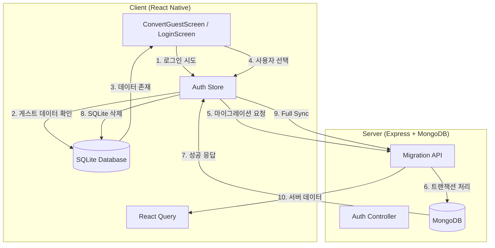

# Guest Data Migration Design Document

## Overview

게스트 데이터 마이그레이션 기능은 게스트 모드로 앱을 사용하던 사용자가 기존 정회원 계정으로 로그인할 때, 게스트로 생성한 데이터(일정, 카테고리, 완료 정보)를 기존 계정으로 이전하는 기능입니다.

### Key Design Principles

1. **Offline-First 아키텍처 유지**: 클라이언트 SQLite가 Source of Truth
2. **서버는 Insert만 수행**: 게스트 데이터를 기존 회원의 새 데이터로 삽입 (Update 아님)
3. **트랜잭션 보장**: 마이그레이션 중 실패 시 전체 롤백
4. **단일 카테고리 전략**: 모든 게스트 일정을 하나의 "마이그레이션된 카테고리"로 통합
5. **UUID 기반**: 클라이언트 생성 UUID를 그대로 서버에 전송

### Migration Flow

```
게스트 로그인 시도 (기존 회원 계정)
  ↓
SQLite에서 게스트 데이터 감지
  ↓
ActionSheet 표시 (가져오기/버리기/취소)
  ↓
[가져오기 선택]
  ↓
클라이언트: 모든 게스트 데이터 수집 (todos, categories, completions)
  ↓
서버: POST /auth/migrate-guest-data
  - 트랜잭션 시작
  - 새 카테고리 생성 ("마이그레이션된 카테고리")
  - 모든 todos Insert (userId = 기존 회원, categoryId = 새 카테고리)
  - 모든 completions Insert (userId = 기존 회원)
  - 트랜잭션 커밋
  ↓
클라이언트: SQLite 전체 삭제
  ↓
클라이언트: 서버에서 Full Sync
  ↓
완료
```

## Architecture

### System Components




### Data Flow Layers

1. **Presentation Layer**: ConvertGuestScreen, LoginScreen, ActionSheet
2. **State Management**: authStore (Zustand)
3. **Data Layer**: SQLite Services (todoService, categoryService, completionService)
4. **Network Layer**: Axios API Client
5. **Server Layer**: Express Controllers + MongoDB Models

## Components and Interfaces

### 1. Client Components

#### 1.1 ConvertGuestScreen (기존 확장)

**Purpose**: 게스트 → 정회원 전환 화면 (이메일/비밀번호 입력)

**New Functionality**: 
- 기존 회원 로그인 시 게스트 데이터 마이그레이션 처리는 LoginScreen에서 담당
- ConvertGuestScreen은 "새 계정 생성" 전환만 담당

**No Changes Required**: 현재 구현 그대로 유지

#### 1.2 LoginScreen (수정 필요)

**Purpose**: 로그인 화면

**New Functionality**:
- 로그인 전 SQLite에서 게스트 데이터 확인
- 게스트 데이터 존재 시 ActionSheet 표시
- 사용자 선택에 따라 마이그레이션 또는 삭제 처리

**Interface**:
```typescript
interface LoginScreenState {
  email: string;
  password: string;
  isLoading: boolean;
  guestDataCount: { todos: number; categories: number } | null;
}

interface LoginScreenMethods {
  handleLogin: () => Promise<void>;
  checkGuestData: () => Promise<{ todos: number; categories: number }>;
  showMigrationOptions: (count: { todos: number; categories: number }) => void;
  handleMigrate: () => Promise<void>;
  handleDiscard: () => Promise<void>;
}
```

#### 1.3 Auth Store (확장)

**New Methods**:

```typescript
interface AuthStore {
  // 기존 메서드들...
  
  // 게스트 데이터 마이그레이션
  migrateGuestData: (credentials: { email: string; password: string }) => Promise<void>;
  
  // 게스트 데이터 삭제
  discardGuestData: () => Promise<void>;
  
  // 게스트 데이터 확인
  checkGuestData: () => Promise<{ todos: number; categories: number }>;
}
```

### 2. Server Components

#### 2.1 Migration API Endpoint

**Route**: `POST /auth/migrate-guest-data`

**Request**:
```typescript
interface MigrateGuestDataRequest {
  email: string;
  password: string;
  guestData: {
    todos: Array<{
      _id: string;
      title: string;
      date: string | null;
      startDate: string | null;
      endDate: string | null;
      recurrence: object | null;
      categoryId: string;  // 게스트 카테고리 ID (무시됨)
      isAllDay: boolean;
      startTime: string | null;
      endTime: string | null;
      color: string | null;
      memo: string | null;
      createdAt: string;
      updatedAt: string;
    }>;
    categories: Array<{
      _id: string;
      name: string;
      color: string;
      icon: string | null;
      order: number;
      createdAt: string;
      updatedAt: string;
    }>;
    completions: Array<{
      key: string;
      todoId: string;
      date: string | null;
      completedAt: string;
    }>;
  };
}
```

**Response**:
```typescript
interface MigrateGuestDataResponse {
  success: boolean;
  message: string;
  token: string;  // JWT Access Token
  user: {
    id: string;
    email: string;
    name: string;
    accountType: string;
    provider: string;
    hasCalendarAccess: boolean;
    settings: object;
  };
  migratedCategoryId: string;  // 새로 생성된 카테고리 ID
  stats: {
    todosInserted: number;
    completionsInserted: number;
  };
}
```

#### 2.2 Auth Controller (확장)

**New Method**: `migrateGuestData`

```javascript
exports.migrateGuestData = async (req, res) => {
  const session = await mongoose.startSession();
  session.startTransaction();
  
  try {
    // 1. 사용자 인증
    const { email, password, guestData } = req.body;
    const user = await User.findOne({ email }).session(session);
    
    if (!user) {
      await session.abortTransaction();
      return res.status(404).json({ message: '사용자를 찾을 수 없습니다' });
    }
    
    const isMatch = await bcrypt.compare(password, user.password);
    if (!isMatch) {
      await session.abortTransaction();
      return res.status(401).json({ message: '비밀번호가 일치하지 않습니다' });
    }
    
    // 2. 마이그레이션된 카테고리 생성
    const migratedCategoryId = generateId();
    const categoryName = user.settings?.language === 'en' 
      ? 'Migrated Category' 
      : '마이그레이션된 카테고리';
    
    await Category.create([{
      _id: migratedCategoryId,
      userId: user._id,
      name: categoryName,
      color: '#9CA3AF',  // Gray-400
      order: 999,  // 맨 뒤로
      createdAt: new Date(),
      updatedAt: new Date(),
    }], { session });
    
    // 3. Todos 삽입
    const todosToInsert = guestData.todos.map(todo => ({
      ...todo,
      userId: user._id,
      categoryId: migratedCategoryId,  // 모두 새 카테고리로
      syncStatus: 'synced',
      googleCalendarEventId: null,  // 구글 연동 제거
    }));
    
    await Todo.insertMany(todosToInsert, { session });
    
    // 4. Completions 삽입
    const completionsToInsert = guestData.completions.map(comp => ({
      key: comp.key,
      todoId: comp.todoId,
      userId: user._id,
      date: comp.date,
      completedAt: comp.completedAt,
    }));
    
    await Completion.insertMany(completionsToInsert, { session });
    
    // 5. 트랜잭션 커밋
    await session.commitTransaction();
    
    // 6. JWT 토큰 생성
    const token = jwt.sign({ userId: user._id }, process.env.JWT_SECRET, {
      expiresIn: '7d',
    });
    
    res.json({
      success: true,
      message: '마이그레이션 완료',
      token,
      user: {
        id: user._id,
        email: user.email,
        name: user.name,
        accountType: user.accountType,
        provider: user.provider,
        hasCalendarAccess: !!user.googleAccessToken,
        settings: user.settings,
      },
      migratedCategoryId,
      stats: {
        todosInserted: todosToInsert.length,
        completionsInserted: completionsToInsert.length,
      },
    });
  } catch (error) {
    await session.abortTransaction();
    console.error('Migration error:', error);
    res.status(500).json({ 
      success: false,
      message: '마이그레이션 실패', 
      error: error.message 
    });
  } finally {
    session.endSession();
  }
};
```

## Data Models

### Client (SQLite)

**No Schema Changes Required**: 기존 스키마 그대로 사용

```sql
-- todos 테이블 (기존)
CREATE TABLE IF NOT EXISTS todos (
  _id TEXT PRIMARY KEY,
  title TEXT NOT NULL,
  date TEXT,
  start_date TEXT,
  end_date TEXT,
  recurrence TEXT,
  category_id TEXT,
  is_all_day INTEGER DEFAULT 1,
  start_time TEXT,
  end_time TEXT,
  color TEXT,
  memo TEXT,
  created_at TEXT,
  updated_at TEXT,
  deleted_at TEXT
);

-- categories 테이블 (기존)
CREATE TABLE IF NOT EXISTS categories (
  _id TEXT PRIMARY KEY,
  name TEXT NOT NULL,
  color TEXT,
  icon TEXT,
  order_index INTEGER DEFAULT 0,
  created_at TEXT,
  updated_at TEXT,
  deleted_at TEXT
);

-- completions 테이블 (기존)
CREATE TABLE IF NOT EXISTS completions (
  key TEXT PRIMARY KEY,
  todo_id TEXT NOT NULL,
  date TEXT,
  completed_at TEXT
);
```

### Server (MongoDB)

**New Model**: Completion

```javascript
const completionSchema = new mongoose.Schema({
  key: {
    type: String,
    required: true,
    unique: true,
  },
  todoId: {
    type: String,
    ref: 'Todo',
    required: true,
    index: true,
  },
  userId: {
    type: String,
    ref: 'User',
    required: true,
    index: true,
  },
  date: {
    type: String,  // YYYY-MM-DD or null
  },
  completedAt: {
    type: Date,
    required: true,
  },
}, { _id: false, timestamps: true });

// 복합 인덱스: 사용자별 날짜 조회
completionSchema.index({ userId: 1, date: 1 });

module.exports = mongoose.model('Completion', completionSchema);
```

**Existing Models**: User, Todo, Category (변경 없음)


## API Design

### Migration Endpoint

**Endpoint**: `POST /auth/migrate-guest-data`

**Authentication**: None (credentials in body)

**Request Headers**:
```
Content-Type: application/json
```

**Request Body**:
```json
{
  "email": "user@example.com",
  "password": "password123",
  "guestData": {
    "todos": [
      {
        "_id": "uuid-1",
        "title": "Buy groceries",
        "date": "2025-02-10",
        "startDate": "2025-02-10",
        "endDate": null,
        "recurrence": null,
        "categoryId": "guest-category-id",
        "isAllDay": true,
        "startTime": null,
        "endTime": null,
        "color": null,
        "memo": "Milk, eggs, bread",
        "createdAt": "2025-02-01T10:00:00Z",
        "updatedAt": "2025-02-01T10:00:00Z"
      }
    ],
    "categories": [
      {
        "_id": "guest-category-id",
        "name": "Personal",
        "color": "#FF5733",
        "icon": null,
        "order": 0,
        "createdAt": "2025-02-01T09:00:00Z",
        "updatedAt": "2025-02-01T09:00:00Z"
      }
    ],
    "completions": [
      {
        "key": "uuid-1_2025-02-10",
        "todoId": "uuid-1",
        "date": "2025-02-10",
        "completedAt": "2025-02-10T15:30:00Z"
      }
    ]
  }
}
```

**Success Response** (200 OK):
```json
{
  "success": true,
  "message": "마이그레이션 완료",
  "token": "jwt_access_token",
  "user": {
    "id": "user-uuid",
    "email": "user@example.com",
    "name": "John Doe",
    "accountType": "local",
    "provider": "local",
    "hasCalendarAccess": false,
    "settings": {
      "timeZone": "Asia/Seoul",
      "theme": "system",
      "language": "system"
    }
  },
  "migratedCategoryId": "new-category-uuid",
  "stats": {
    "todosInserted": 15,
    "completionsInserted": 8
  }
}
```

**Error Responses**:

404 Not Found (사용자 없음):
```json
{
  "success": false,
  "message": "사용자를 찾을 수 없습니다"
}
```

401 Unauthorized (비밀번호 불일치):
```json
{
  "success": false,
  "message": "비밀번호가 일치하지 않습니다"
}
```

500 Internal Server Error (마이그레이션 실패):
```json
{
  "success": false,
  "message": "마이그레이션 실패",
  "error": "Transaction aborted: Duplicate key error"
}
```

### Client API Methods

```typescript
// client/src/api/auth.js

export const authAPI = {
  // 게스트 데이터 마이그레이션
  migrateGuestData: async (credentials: {
    email: string;
    password: string;
    guestData: {
      todos: Todo[];
      categories: Category[];
      completions: Completion[];
    };
  }) => {
    return api.post('/auth/migrate-guest-data', credentials);
  },
};
```

## Error Handling

### Client-Side Error Handling

```typescript
enum MigrationError {
  NETWORK_ERROR = 'NETWORK_ERROR',
  AUTH_ERROR = 'AUTH_ERROR',
  SERVER_ERROR = 'SERVER_ERROR',
  UNKNOWN_ERROR = 'UNKNOWN_ERROR',
}

interface MigrationErrorHandler {
  handleError: (error: Error) => {
    type: MigrationError;
    message: string;
    retryable: boolean;
  };
}
```

**Error Mapping**:
- Network timeout/offline → `NETWORK_ERROR` (retryable)
- 401/404 response → `AUTH_ERROR` (not retryable, show login error)
- 500 response → `SERVER_ERROR` (retryable)
- Other errors → `UNKNOWN_ERROR` (retryable)

**Error Recovery**:
1. **Network Error**: 게스트 세션 유지, 재시도 가능
2. **Auth Error**: 로그인 화면으로 돌아가기, 에러 메시지 표시
3. **Server Error**: 게스트 세션 유지, 재시도 가능, 에러 로그 전송
4. **Unknown Error**: 게스트 세션 유지, 재시도 가능

### Server-Side Error Handling

```javascript
// Transaction Rollback on Any Error
try {
  await session.startTransaction();
  
  // Migration steps...
  
  await session.commitTransaction();
} catch (error) {
  await session.abortTransaction();
  
  // Log error for debugging
  console.error('[Migration Error]', {
    userId: user._id,
    email: user.email,
    error: error.message,
    stack: error.stack,
    guestDataSize: {
      todos: guestData.todos.length,
      categories: guestData.categories.length,
      completions: guestData.completions.length,
    },
  });
  
  // Return error response
  res.status(500).json({
    success: false,
    message: '마이그레이션 실패',
    error: error.message,
  });
} finally {
  session.endSession();
}
```

**Critical Error Scenarios**:
1. **Duplicate Key Error**: UUID 충돌 (매우 드묾, 롤백)
2. **Validation Error**: 잘못된 데이터 형식 (롤백)
3. **Network Error**: MongoDB 연결 실패 (롤백)
4. **Timeout Error**: 트랜잭션 타임아웃 (롤백)

## Correctness Properties

*A property is a characteristic or behavior that should hold true across all valid executions of a system—essentially, a formal statement about what the system should do. Properties serve as the bridge between human-readable specifications and machine-verifiable correctness guarantees.*

### Property 1: Guest Data Detection Accuracy

*For any* SQLite database state, the guest data detection function should return true if and only if there exists at least one non-deleted todo or category in the database.

**Validates: Requirements 1.1, 1.3**

### Property 2: Data Count Correctness

*For any* SQLite database with guest data, the count function should return the exact number of non-deleted todos and non-deleted categories.

**Validates: Requirements 1.2**

### Property 3: Migration Payload Completeness

*For any* guest data in SQLite, the migration payload should contain all non-deleted todos, all non-deleted categories, and all completions (including those for deleted todos).

**Validates: Requirements 3.1**

### Property 4: Server Data Insertion with Correct Ownership

*For any* migrated guest data, all inserted todos, categories, and completions in MongoDB should have the userId set to the target regular user's ID, and all todos should have the categoryId set to the newly created migrated category ID.

**Validates: Requirements 3.2, 3.3, 3.4, 3.5, 3.6, 9.1, 9.2, 9.3**

### Property 5: Transaction Atomicity

*For any* migration attempt, if any step fails (authentication, category creation, todo insertion, completion insertion), then no data should be persisted in MongoDB (complete rollback).

**Validates: Requirements 4.2, 4.3, 9.5**

### Property 6: Migration Response Completeness

*For any* successful migration, the server response should contain a valid JWT token, complete user object, the migrated category ID, and accurate statistics (todos inserted count, completions inserted count).

**Validates: Requirements 3.8, 4.5**

### Property 7: Client Data Cleanup After Migration

*For any* successful migration, the client SQLite database should be completely empty (no todos, no categories, no completions, no pending changes).

**Validates: Requirements 5.1**

### Property 8: Client State Update After Migration

*For any* successful migration, the client should have the new access token and user data saved in AsyncStorage, replacing any previous guest credentials.

**Validates: Requirements 5.2**

### Property 9: Guest Data Discard Completeness

*For any* guest data in SQLite, when the user selects "discard", all todos, categories, completions, and pending changes should be deleted from SQLite.

**Validates: Requirements 2.5, 6.1, 6.2, 6.3, 6.4**

### Property 10: Error Preservation of Guest Session

*For any* migration failure (network, authentication, server error), the guest user's session should remain active and unchanged (token, user data, SQLite data all preserved).

**Validates: Requirements 7.3**

### Property 11: Guest User Cleanup (Optional)

*For any* successful migration where a guest user account exists on the server, that guest user account should be deleted from MongoDB after migration completes.

**Validates: Requirements 3.9, 9.4**

### Property 12: Migrated Category UUID Validity

*For any* migrated category created by the server, the category ID should be a valid UUID v4 format.

**Validates: Requirements 3.3**

## Testing Strategy

### Dual Testing Approach

이 기능은 **Unit Tests**와 **Property-Based Tests**를 모두 사용하여 포괄적인 테스트 커버리지를 확보합니다.

#### Unit Tests

Unit tests는 다음을 검증합니다:
- 특정 시나리오 예제 (예: 5개 일정, 2개 카테고리 마이그레이션)
- UI 상호작용 (ActionSheet 표시, 버튼 클릭)
- 에러 처리 (네트워크 오류, 인증 실패)
- Edge cases (빈 데이터, 매우 큰 데이터)

**Unit Test Examples**:
```javascript
describe('Guest Data Migration', () => {
  it('should show ActionSheet when guest data exists', async () => {
    // Given: 게스트 데이터 존재
    await createGuestTodos(5);
    await createGuestCategories(2);
    
    // When: 로그인 시도
    const { getByText } = render(<LoginScreen />);
    fireEvent.changeText(getByTestId('email-input'), 'user@example.com');
    fireEvent.changeText(getByTestId('password-input'), 'password');
    fireEvent.press(getByText('로그인'));
    
    // Then: ActionSheet 표시
    await waitFor(() => {
      expect(getByText('5개의 일정과 2개의 카테고리를 가져오시겠습니까?')).toBeTruthy();
    });
  });
  
  it('should handle network error gracefully', async () => {
    // Given: 네트워크 오류 시뮬레이션
    mockAPI.post.mockRejectedValue(new Error('Network Error'));
    
    // When: 마이그레이션 시도
    await migrateGuestData(credentials, guestData);
    
    // Then: 에러 메시지 표시, 게스트 세션 유지
    expect(Toast.show).toHaveBeenCalledWith({
      type: 'error',
      text1: '네트워크 오류',
    });
    expect(authStore.user.accountType).toBe('anonymous');
  });
});
```

#### Property-Based Tests

Property-based tests는 correctness properties를 검증합니다. 각 테스트는 **최소 100회 반복** 실행되며, 랜덤 데이터를 생성하여 속성이 항상 성립하는지 확인합니다.

**Property Test Configuration**:
- Library: `fast-check` (JavaScript/TypeScript)
- Iterations: 100 per property
- Tag Format: `Feature: guest-data-migration, Property {N}: {property_text}`

**Property Test Examples**:
```javascript
import fc from 'fast-check';

describe('Property-Based Tests: Guest Data Migration', () => {
  /**
   * Feature: guest-data-migration, Property 2: Data Count Correctness
   * 
   * For any SQLite database with guest data, the count function should return
   * the exact number of non-deleted todos and non-deleted categories.
   */
  it('Property 2: Data count should match actual data', async () => {
    await fc.assert(
      fc.asyncProperty(
        fc.array(fc.record({
          _id: fc.uuid(),
          title: fc.string({ minLength: 1, maxLength: 100 }),
          date: fc.date().map(d => d.toISOString().split('T')[0]),
          categoryId: fc.uuid(),
        }), { minLength: 0, maxLength: 50 }),
        fc.array(fc.record({
          _id: fc.uuid(),
          name: fc.string({ minLength: 1, maxLength: 50 }),
          color: fc.hexaString({ minLength: 7, maxLength: 7 }),
        }), { minLength: 0, maxLength: 10 }),
        async (todos, categories) => {
          // Setup: Insert random data
          await clearAllData();
          for (const todo of todos) {
            await todoService.upsertTodo(todo);
          }
          for (const category of categories) {
            await categoryService.upsertCategory(category);
          }
          
          // Execute: Count data
          const count = await checkGuestData();
          
          // Verify: Count matches
          expect(count.todos).toBe(todos.length);
          expect(count.categories).toBe(categories.length);
        }
      ),
      { numRuns: 100 }
    );
  });
  
  /**
   * Feature: guest-data-migration, Property 4: Server Data Insertion with Correct Ownership
   * 
   * For any migrated guest data, all inserted todos should have the userId set to
   * the target user's ID and categoryId set to the migrated category ID.
   */
  it('Property 4: All migrated data should have correct ownership', async () => {
    await fc.assert(
      fc.asyncProperty(
        fc.array(fc.record({
          _id: fc.uuid(),
          title: fc.string({ minLength: 1, maxLength: 100 }),
          date: fc.date().map(d => d.toISOString().split('T')[0]),
          categoryId: fc.uuid(),  // Original guest category (will be replaced)
        }), { minLength: 1, maxLength: 20 }),
        async (guestTodos) => {
          // Setup: Create test user
          const testUser = await createTestUser();
          
          // Execute: Migrate data
          const response = await migrateGuestData({
            email: testUser.email,
            password: 'password',
            guestData: {
              todos: guestTodos,
              categories: [],
              completions: [],
            },
          });
          
          // Verify: All todos have correct userId and categoryId
          const migratedTodos = await Todo.find({ userId: testUser._id });
          expect(migratedTodos.length).toBe(guestTodos.length);
          
          for (const todo of migratedTodos) {
            expect(todo.userId).toBe(testUser._id);
            expect(todo.categoryId).toBe(response.data.migratedCategoryId);
          }
        }
      ),
      { numRuns: 100 }
    );
  });
  
  /**
   * Feature: guest-data-migration, Property 5: Transaction Atomicity
   * 
   * For any migration attempt, if any step fails, then no data should be
   * persisted in MongoDB (complete rollback).
   */
  it('Property 5: Failed migration should rollback all changes', async () => {
    await fc.assert(
      fc.asyncProperty(
        fc.array(fc.record({
          _id: fc.uuid(),
          title: fc.string({ minLength: 1, maxLength: 100 }),
        }), { minLength: 1, maxLength: 10 }),
        fc.integer({ min: 0, max: 3 }),  // Failure point (0=auth, 1=category, 2=todos, 3=completions)
        async (guestTodos, failurePoint) => {
          // Setup: Create test user and inject failure
          const testUser = await createTestUser();
          const initialTodoCount = await Todo.countDocuments({ userId: testUser._id });
          const initialCategoryCount = await Category.countDocuments({ userId: testUser._id });
          
          injectFailureAt(failurePoint);
          
          // Execute: Attempt migration (should fail)
          try {
            await migrateGuestData({
              email: testUser.email,
              password: 'password',
              guestData: {
                todos: guestTodos,
                categories: [],
                completions: [],
              },
            });
            // Should not reach here
            expect(true).toBe(false);
          } catch (error) {
            // Expected failure
          }
          
          // Verify: No data was persisted (rollback successful)
          const finalTodoCount = await Todo.countDocuments({ userId: testUser._id });
          const finalCategoryCount = await Category.countDocuments({ userId: testUser._id });
          
          expect(finalTodoCount).toBe(initialTodoCount);
          expect(finalCategoryCount).toBe(initialCategoryCount);
        }
      ),
      { numRuns: 100 }
    );
  });
});
```

### Test Coverage Goals

- **Unit Tests**: 80%+ code coverage
- **Property Tests**: 100% correctness properties coverage
- **Integration Tests**: End-to-end migration flow
- **Manual Tests**: UI/UX validation


## Implementation Details

### Client Implementation

#### 1. LoginScreen 수정

**파일**: `client/src/screens/LoginScreen.js`

**추가 기능**:
```javascript
import { ActionSheetIOS, Platform, Alert } from 'react-native';
import { getTodoCount, getCategoryCount } from '../db/todoService';
import { clearAllData } from '../db/database';

const LoginScreen = () => {
  const [isCheckingGuestData, setIsCheckingGuestData] = useState(false);
  
  // 게스트 데이터 확인
  const checkGuestData = async () => {
    const todoCount = await getTodoCount();
    const categoryCount = await getCategoryCount();
    
    if (todoCount === 0 && categoryCount === 0) {
      return null;  // 게스트 데이터 없음
    }
    
    return { todos: todoCount, categories: categoryCount };
  };
  
  // 마이그레이션 옵션 표시
  const showMigrationOptions = (count) => {
    const message = `${count.todos}개의 일정과 ${count.categories}개의 카테고리를 가져오시겠습니까?`;
    
    if (Platform.OS === 'ios') {
      ActionSheetIOS.showActionSheetWithOptions(
        {
          title: '게스트 데이터 발견',
          message,
          options: ['취소', '버리기', '가져오기'],
          destructiveButtonIndex: 1,
          cancelButtonIndex: 0,
        },
        (buttonIndex) => {
          if (buttonIndex === 0) {
            // 취소: 아무것도 안함
          } else if (buttonIndex === 1) {
            handleDiscard();
          } else if (buttonIndex === 2) {
            handleMigrate();
          }
        }
      );
    } else {
      Alert.alert(
        '게스트 데이터 발견',
        message,
        [
          { text: '취소', style: 'cancel' },
          { text: '버리기', style: 'destructive', onPress: handleDiscard },
          { text: '가져오기', onPress: handleMigrate },
        ]
      );
    }
  };
  
  // 로그인 처리
  const handleLogin = async () => {
    try {
      setIsCheckingGuestData(true);
      
      // 1. 게스트 데이터 확인
      const guestData = await checkGuestData();
      
      if (guestData) {
        // 게스트 데이터 있음 → 옵션 표시
        setIsCheckingGuestData(false);
        showMigrationOptions(guestData);
      } else {
        // 게스트 데이터 없음 → 바로 로그인
        await performLogin();
      }
    } catch (error) {
      setIsCheckingGuestData(false);
      Toast.show({
        type: 'error',
        text1: '로그인 실패',
        text2: error.message,
      });
    }
  };
  
  // 실제 로그인 수행
  const performLogin = async () => {
    setIsLoading(true);
    const response = await authAPI.login({ email, password });
    await authStore.setAuth(response.data.token, response.data.user);
    setIsLoading(false);
  };
  
  // 마이그레이션 처리
  const handleMigrate = async () => {
    try {
      setIsLoading(true);
      await authStore.migrateGuestData({ email, password });
      Toast.show({
        type: 'success',
        text1: '마이그레이션 완료',
        text2: '게스트 데이터를 가져왔습니다',
      });
    } catch (error) {
      setIsLoading(false);
      
      if (error.code === 'ERR_NETWORK') {
        Toast.show({
          type: 'error',
          text1: '네트워크 오류',
          text2: '인터넷 연결을 확인해주세요',
        });
      } else {
        Toast.show({
          type: 'error',
          text1: '마이그레이션 실패',
          text2: error.response?.data?.message || '다시 시도해주세요',
        });
      }
    }
  };
  
  // 게스트 데이터 버리기
  const handleDiscard = async () => {
    try {
      setIsLoading(true);
      await clearAllData();
      await performLogin();
    } catch (error) {
      setIsLoading(false);
      Toast.show({
        type: 'error',
        text1: '로그인 실패',
        text2: error.message,
      });
    }
  };
  
  // ... 기존 UI 코드
};
```

#### 2. Auth Store 확장

**파일**: `client/src/store/authStore.js`

**추가 메서드**:
```javascript
import { getAllTodos } from '../db/todoService';
import { getAllCategories } from '../db/categoryService';
import { getAllCompletions } from '../db/completionService';
import { clearAllData } from '../db/database';
import { authAPI } from '../api/auth';

export const useAuthStore = create((set, get) => ({
  // ... 기존 상태 및 메서드
  
  // 게스트 데이터 확인
  checkGuestData: async () => {
    const todoCount = await getTodoCount();
    const categoryCount = await getCategoryCount();
    
    return { todos: todoCount, categories: categoryCount };
  },
  
  // 게스트 데이터 마이그레이션
  migrateGuestData: async (credentials) => {
    try {
      // 1. SQLite에서 모든 게스트 데이터 수집
      const todos = await getAllTodos();
      const categories = await getAllCategories();
      const completions = await getAllCompletions();
      
      // 2. 서버에 마이그레이션 요청
      const response = await authAPI.migrateGuestData({
        email: credentials.email,
        password: credentials.password,
        guestData: {
          todos,
          categories,
          completions: Object.values(completions),  // Map → Array
        },
      });
      
      const { token, user } = response.data;
      
      // 3. SQLite 전체 삭제
      await clearAllData();
      
      // 4. 새 토큰 및 사용자 정보 저장
      await AsyncStorage.setItem('token', token);
      await AsyncStorage.setItem('user', JSON.stringify(user));
      
      set({ token, user, isLoading: false });
      
      // 5. React Query 캐시 무효화 (Full Sync 트리거)
      if (queryClientInstance) {
        queryClientInstance.invalidateQueries();
      }
      
      return user;
    } catch (error) {
      console.error('Migration error:', error);
      throw error;
    }
  },
  
  // 게스트 데이터 버리기
  discardGuestData: async () => {
    try {
      await clearAllData();
      console.log('✅ Guest data discarded');
    } catch (error) {
      console.error('Discard guest data error:', error);
      throw error;
    }
  },
}));
```

#### 3. API Client 확장

**파일**: `client/src/api/auth.js`

**추가 메서드**:
```javascript
export const authAPI = {
  // ... 기존 메서드들
  
  // 게스트 데이터 마이그레이션
  migrateGuestData: async (data) => {
    return api.post('/auth/migrate-guest-data', data);
  },
};
```

### Server Implementation

#### 1. Completion Model 생성

**파일**: `server/src/models/Completion.js`

```javascript
const mongoose = require('mongoose');

const completionSchema = new mongoose.Schema({
  key: {
    type: String,
    required: true,
    unique: true,
  },
  todoId: {
    type: String,
    ref: 'Todo',
    required: true,
    index: true,
  },
  userId: {
    type: String,
    ref: 'User',
    required: true,
    index: true,
  },
  date: {
    type: String,  // YYYY-MM-DD or null
  },
  completedAt: {
    type: Date,
    required: true,
  },
}, { _id: false, timestamps: true });

// 복합 인덱스: 사용자별 날짜 조회
completionSchema.index({ userId: 1, date: 1 });

module.exports = mongoose.model('Completion', completionSchema);
```

#### 2. Auth Controller 확장

**파일**: `server/src/controllers/authController.js`

**추가 메서드**:
```javascript
const mongoose = require('mongoose');
const bcrypt = require('bcryptjs');
const jwt = require('jsonwebtoken');
const User = require('../models/User');
const Todo = require('../models/Todo');
const Category = require('../models/Category');
const Completion = require('../models/Completion');
const { generateId } = require('../utils/idGenerator');

exports.migrateGuestData = async (req, res) => {
  const session = await mongoose.startSession();
  session.startTransaction();
  
  try {
    const { email, password, guestData } = req.body;
    
    // 1. 사용자 인증
    const user = await User.findOne({ email }).session(session);
    
    if (!user) {
      await session.abortTransaction();
      return res.status(404).json({ 
        success: false,
        message: '사용자를 찾을 수 없습니다' 
      });
    }
    
    const isMatch = await bcrypt.compare(password, user.password);
    if (!isMatch) {
      await session.abortTransaction();
      return res.status(401).json({ 
        success: false,
        message: '비밀번호가 일치하지 않습니다' 
      });
    }
    
    // 2. 마이그레이션된 카테고리 생성
    const migratedCategoryId = generateId();
    const categoryName = user.settings?.language === 'en' 
      ? 'Migrated Category' 
      : '마이그레이션된 카테고리';
    
    await Category.create([{
      _id: migratedCategoryId,
      userId: user._id,
      name: categoryName,
      color: '#9CA3AF',  // Gray-400
      order: 999,  // 맨 뒤로
      createdAt: new Date(),
      updatedAt: new Date(),
    }], { session });
    
    console.log(`✅ [Migration] Created migrated category: ${migratedCategoryId}`);
    
    // 3. Todos 삽입
    const todosToInsert = guestData.todos.map(todo => ({
      _id: todo._id,
      userId: user._id,
      title: todo.title,
      date: todo.date,
      startDate: todo.startDate,
      endDate: todo.endDate,
      recurrence: todo.recurrence,
      categoryId: migratedCategoryId,  // 모두 새 카테고리로
      isAllDay: todo.isAllDay,
      startTime: todo.startTime,
      endTime: todo.endTime,
      color: todo.color,
      memo: todo.memo,
      createdAt: todo.createdAt,
      updatedAt: todo.updatedAt,
      syncStatus: 'synced',
      googleCalendarEventId: null,
      deletedAt: null,
    }));
    
    if (todosToInsert.length > 0) {
      await Todo.insertMany(todosToInsert, { session });
      console.log(`✅ [Migration] Inserted ${todosToInsert.length} todos`);
    }
    
    // 4. Completions 삽입
    const completionsToInsert = guestData.completions.map(comp => ({
      key: comp.key,
      todoId: comp.todoId,
      userId: user._id,
      date: comp.date,
      completedAt: comp.completedAt,
    }));
    
    if (completionsToInsert.length > 0) {
      await Completion.insertMany(completionsToInsert, { session });
      console.log(`✅ [Migration] Inserted ${completionsToInsert.length} completions`);
    }
    
    // 5. 데이터 무결성 검증
    const verifyTodos = await Todo.find({ 
      userId: user._id,
      _id: { $in: todosToInsert.map(t => t._id) }
    }).session(session);
    
    if (verifyTodos.length !== todosToInsert.length) {
      throw new Error('Todo insertion verification failed');
    }
    
    const allHaveCorrectCategory = verifyTodos.every(
      t => t.categoryId === migratedCategoryId
    );
    
    if (!allHaveCorrectCategory) {
      throw new Error('Category assignment verification failed');
    }
    
    console.log('✅ [Migration] Data integrity verified');
    
    // 6. 트랜잭션 커밋
    await session.commitTransaction();
    
    // 7. JWT 토큰 생성
    const token = jwt.sign({ userId: user._id }, process.env.JWT_SECRET, {
      expiresIn: '7d',
    });
    
    console.log(`✅ [Migration] Completed for user: ${user.email}`);
    
    res.json({
      success: true,
      message: '마이그레이션 완료',
      token,
      user: {
        id: user._id,
        email: user.email,
        name: user.name,
        accountType: user.accountType,
        provider: user.provider,
        hasCalendarAccess: !!user.googleAccessToken,
        settings: user.settings,
      },
      migratedCategoryId,
      stats: {
        todosInserted: todosToInsert.length,
        completionsInserted: completionsToInsert.length,
      },
    });
  } catch (error) {
    await session.abortTransaction();
    console.error('❌ [Migration] Error:', error);
    
    res.status(500).json({ 
      success: false,
      message: '마이그레이션 실패', 
      error: error.message 
    });
  } finally {
    session.endSession();
  }
};
```

#### 3. Routes 추가

**파일**: `server/src/routes/auth.js`

```javascript
const express = require('express');
const router = express.Router();
const authController = require('../controllers/authController');
const auth = require('../middleware/auth');

// ... 기존 라우트들

// 게스트 데이터 마이그레이션
router.post('/migrate-guest-data', authController.migrateGuestData);

module.exports = router;
```

## Performance Considerations

### Client Performance

1. **데이터 수집 최적화**:
   - SQLite 쿼리 병렬 실행 (`Promise.all`)
   - 인덱스 활용 (기존 인덱스 그대로 사용)

2. **네트워크 최적화**:
   - 단일 API 호출 (Bulk Insert)
   - Gzip 압축 (Express 기본 설정)

3. **UI 반응성**:
   - 로딩 인디케이터 표시
   - 사용자 인터랙션 비활성화

### Server Performance

1. **트랜잭션 최적화**:
   - `insertMany` 사용 (단일 쿼리)
   - 인덱스 활용 (userId, categoryId)

2. **메모리 관리**:
   - 스트리밍 없이 전체 데이터 처리 (일반적으로 < 1MB)
   - 트랜잭션 타임아웃: 30초

3. **동시성 처리**:
   - 동일 사용자의 중복 마이그레이션 방지 (트랜잭션 격리)

### Expected Performance

**일반적인 케이스** (50개 일정, 5개 카테고리, 30개 완료):
- 클라이언트 데이터 수집: < 100ms
- 네트워크 전송: < 500ms
- 서버 처리 (트랜잭션): < 1초
- 클라이언트 동기화: < 2초
- **총 소요 시간: < 4초**

**대용량 케이스** (500개 일정, 20개 카테고리, 300개 완료):
- 클라이언트 데이터 수집: < 500ms
- 네트워크 전송: < 2초
- 서버 처리 (트랜잭션): < 5초
- 클라이언트 동기화: < 10초
- **총 소요 시간: < 18초**

## Security Considerations

### Authentication

- 마이그레이션 API는 인증 미들웨어 없이 credentials를 body에서 받음
- 비밀번호는 bcrypt로 검증
- 성공 시 새 JWT 토큰 발급

### Data Validation

```javascript
// 서버 측 데이터 검증
const validateMigrationData = (guestData) => {
  // Todos 검증
  if (!Array.isArray(guestData.todos)) {
    throw new Error('Invalid todos format');
  }
  
  for (const todo of guestData.todos) {
    if (!todo._id || !todo.title) {
      throw new Error('Invalid todo data');
    }
  }
  
  // Categories 검증
  if (!Array.isArray(guestData.categories)) {
    throw new Error('Invalid categories format');
  }
  
  // Completions 검증
  if (!Array.isArray(guestData.completions)) {
    throw new Error('Invalid completions format');
  }
  
  return true;
};
```

### Rate Limiting

```javascript
// 마이그레이션 API Rate Limiting (선택사항)
const rateLimit = require('express-rate-limit');

const migrationLimiter = rateLimit({
  windowMs: 15 * 60 * 1000,  // 15분
  max: 3,  // 최대 3회 시도
  message: '너무 많은 마이그레이션 시도입니다. 잠시 후 다시 시도해주세요.',
});

router.post('/migrate-guest-data', migrationLimiter, authController.migrateGuestData);
```

## Edge Cases and Limitations

### Edge Cases

1. **빈 게스트 데이터**: 
   - 0개 일정, 0개 카테고리 → 마이그레이션 옵션 표시 안함
   - 정상 로그인 진행

2. **매우 큰 데이터**:
   - 1000개 이상 일정 → 서버 타임아웃 가능
   - 해결: 클라이언트에서 경고 메시지 표시

3. **UUID 충돌**:
   - 매우 드묾 (확률: 1/2^122)
   - 발생 시 트랜잭션 롤백, 에러 반환

4. **네트워크 중단**:
   - 마이그레이션 중 네트워크 끊김 → 게스트 세션 유지
   - 재시도 가능

5. **서버 게스트 계정 존재**:
   - 현재 구현: 삭제 안함 (Optional)
   - 향후 구현: Cron Job으로 정리

### Limitations

1. **카테고리 병합 불가**:
   - 모든 게스트 일정이 하나의 "마이그레이션된 카테고리"로 통합
   - 사용자가 수동으로 재분류 필요

2. **반복 일정 검증 없음**:
   - 게스트가 생성한 반복 일정을 그대로 삽입
   - 잘못된 RRULE은 서버에서 검증 안함

3. **구글 캘린더 연동 제거**:
   - 게스트 일정은 구글 캘린더 연동 정보 제거
   - 마이그레이션 후 수동 동기화 필요

4. **Pending Changes 무시**:
   - 게스트의 pending_changes는 마이그레이션 안함
   - 모든 데이터를 "synced" 상태로 삽입

## Future Enhancements

1. **카테고리 매핑**:
   - 게스트 카테고리와 기존 카테고리 이름 비교
   - 동일 이름 카테고리로 자동 병합

2. **선택적 마이그레이션**:
   - 사용자가 특정 일정/카테고리만 선택하여 마이그레이션

3. **마이그레이션 미리보기**:
   - 마이그레이션 전 데이터 미리보기 제공

4. **배치 마이그레이션**:
   - 대용량 데이터를 여러 번에 나눠서 전송

5. **게스트 계정 자동 정리**:
   - 마이그레이션 완료 후 서버 게스트 계정 자동 삭제

