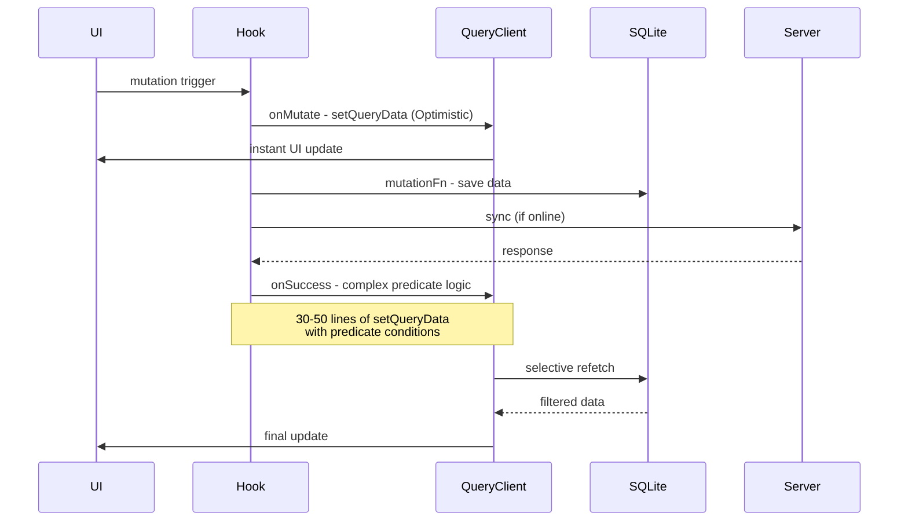
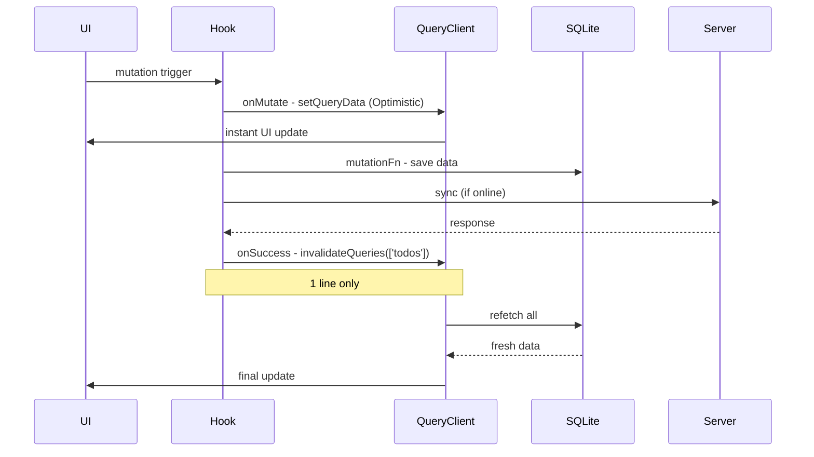

# Design: 하이브리드 캐시 전략 리팩토링

## Architecture Overview

### Current Architecture (Before)



### Target Architecture (After)



### Key Changes

| Component | Before | After | Benefit |
|-----------|--------|-------|---------|
| onMutate | setQueryData (Optimistic) | **No change** | UX 유지 |
| onSuccess | 30-50 lines predicate logic | 1 line invalidateQueries | 유지보수성 ↑ |
| Refetch scope | Selective (predicate) | All todos | 단순성 ↑ |
| Performance | ~2ms (selective) | ~2ms (all, single cache) | 동일 |

## Components & Interfaces

### 1. useToggleCompletion.js

**Current onSuccess (30 lines, L110-140):**
```javascript
onSuccess: (data, variables) => {
  const successStartTime = performance.now();
  console.log('✅ [useToggleCompletion] onSuccess:', data);

  // 날짜별 캐시만 무효화 (predicate 사용)
  queryClient.invalidateQueries({
    queryKey: ['todos'],
    predicate: (query) => {
      return query.queryKey[0] === 'todos' &&
        typeof query.queryKey[1] === 'string' &&
        query.queryKey[1].match(/^\d{4}-\d{2}-\d{2}$/);
    }
  });

  const successEndTime = performance.now();
  console.log(`⚡ [useToggleCompletion] onSuccess 완료: ${(successEndTime - successStartTime).toFixed(2)}ms`);
}
```

**Target onSuccess (3 lines):**
```javascript
onSuccess: () => {
  queryClient.invalidateQueries({ queryKey: ['todos'] });
}
```

**Note:** 현재는 날짜별 캐시만 무효화하지만, 단순화 후에는 모든 todos 캐시를 무효화합니다.

### 2. useCreateTodo.js

**Current Issues:**
- UUID generated twice: onMutate L34 (`const todoId = generateId()`), mutationFn L92 (`const todoId = generateId()`)
- onSuccess has 70+ lines of ID replacement and cache update logic (L147-220)
- Different UUIDs cause temporary cache inconsistency

**Target Design:**
```javascript
// onMutate: Generate UUID once and pass via context
const newId = generateId();
const optimisticTodo = { _id: newId, ...newTodo };
return { previousAll, previousDate, optimisticTodo, newId };

// mutationFn: Reuse UUID from context (passed via variables)
const savedTodo = await todoService.createTodo({ _id: variables._id, ...data });

// onSuccess: Simple invalidation
queryClient.invalidateQueries({ queryKey: ['todos'] });
// AsyncStorage 저장은 유지
await AsyncStorage.setItem('lastUsedTodoType', todoType);
```

### 3. useUpdateTodo.js

**Current Issues:**
- Debug code dumps entire completions table (L201-213)
- onSuccess has 90 lines of complex setQueryData

**Target Design:**
```javascript
// mutationFn: Remove debug code
// No completions table dump

// onSuccess: Simple invalidation
queryClient.invalidateQueries({ queryKey: ['todos'] });
```

### 4. useDeleteTodo.js

**Current onSuccess (30 lines, L140-170):**
- Predicate-based invalidation for recurring/multi-day todos
- Separate logic for single-day todos
- Complex conditional branches

**Target onSuccess (3 lines):**
```javascript
onSuccess: () => {
  queryClient.invalidateQueries({ queryKey: ['todos'] });
}
```

## Data Models

No schema changes required. This is a refactoring of cache logic only.

## API Design

No API changes. This affects client-side cache management only.

## Error Handling

### Current Strategy (Preserved)
```javascript
onError: (error, variables, context) => {
  // Rollback optimistic update
  if (context?.previousTodos) {
    queryClient.setQueryData(['todos', 'all'], context.previousTodos);
  }
  Toast.show({ type: 'error', text1: error.message });
}
```

### No Changes Required
Error handling remains the same. Optimistic updates are rolled back on error.

## Correctness Properties

### Property 1: Optimistic Update Preservation
```
GIVEN a user triggers a mutation
WHEN onMutate executes
THEN UI MUST update within 0-5ms (before server response)
```

**Verification:**
- Check that onMutate still contains setQueryData
- Manual test: Toggle completion → UI should update instantly

### Property 2: Final Consistency
```
GIVEN a mutation completes successfully
WHEN onSuccess executes invalidateQueries
THEN refetched data MUST match SQLite state exactly
```

**Verification:**
```javascript
// After mutation
const cacheData = queryClient.getQueryData(['todos', 'all']);
const dbData = await todoService.getAllTodos();
assert.deepEqual(cacheData, dbData);
```

### Property 3: UUID Uniqueness
```
GIVEN useCreateTodo is called
WHEN UUID is generated
THEN the same UUID MUST be used in onMutate, mutationFn, and final DB record
```

**Verification:**
```javascript
// In onMutate
const optimisticId = newTodo._id;

// In mutationFn
const savedId = savedTodo._id;

// After onSuccess
assert.equal(optimisticId, savedId);
```

### Property 4: No Debug Code in Production
```
GIVEN production build
WHEN hooks execute
THEN no console.log or table dumps MUST occur (except performance metrics)
```

**Verification:**
- Search for `console.log` in all 4 hooks
- Ensure only performance.now() measurements remain

### Property 5: SQL Injection Safety
```
GIVEN any SQLite query with user input
WHEN query is executed
THEN parameter binding MUST be used (no string interpolation)
```

**Verification:**
```javascript
// ❌ Bad
db.getAllAsync(`SELECT * FROM todos WHERE date = '${date}'`);

// ✅ Good
db.getAllAsync('SELECT * FROM todos WHERE date = ?', [date]);
```

## Performance Analysis

### Before vs After

| Operation | Before (Predicate) | After (Invalidate All) | Delta |
|-----------|-------------------|------------------------|-------|
| Toggle completion | ~2ms | ~2ms | 0ms |
| Create todo | ~3ms | ~3ms | 0ms |
| Update todo | ~2ms | ~2ms | 0ms |
| Delete todo | ~2ms | ~2ms | 0ms |

**Why no performance difference?**
- Current architecture uses single cache key: `['todos', 'all']`
- Predicate still invalidates the same single cache
- SQLite query with proper indexes is fast (~1-2ms)

### Memory Impact

| Metric | Before | After | Delta |
|--------|--------|-------|-------|
| Code size (4 hooks) | ~800 lines | ~400 lines | -50% |
| onSuccess complexity | O(n) predicate checks | O(1) | Better |
| Cache invalidation | Selective | All | Same (single cache) |

## Testing Strategy

### Manual Testing (Required)

Since no automated tests exist, manual verification is required:

#### Test Case 1: Toggle Completion
1. Open TodoScreen
2. Toggle a todo completion
3. **Verify:** UI updates instantly (< 5ms)
4. **Verify:** After 100ms, data matches SQLite

#### Test Case 2: Create Todo
1. Create a new todo
2. **Verify:** Todo appears immediately in list
3. Check SQLite: `SELECT * FROM todos ORDER BY created_at DESC LIMIT 1`
4. **Verify:** _id in cache matches _id in DB

#### Test Case 3: Update Todo
1. Edit a todo's title
2. **Verify:** Title updates instantly
3. **Verify:** No completions table dump in console

#### Test Case 4: Delete Todo
1. Delete a todo
2. **Verify:** Todo disappears immediately
3. **Verify:** Recurring todos are handled correctly

#### Test Case 5: Offline Mode
1. Turn off network
2. Perform all CRUD operations
3. **Verify:** All operations work offline
4. Turn on network
5. **Verify:** Pending changes sync to server

### Code Review Checklist

- [ ] All 4 hooks have onSuccess ≤ 3 lines
- [ ] onMutate logic is unchanged
- [ ] No console.log except performance metrics
- [ ] No debug table dumps
- [ ] UUID generated once in useCreateTodo
- [ ] No SQL injection vulnerabilities

## Migration Plan

### Phase 1: Preparation (5 min)
- Create archive folder for old files
- Backup current hooks

### Phase 2: Implementation (2 hours)
- Refactor useToggleCompletion.js (30 min)
- Refactor useCreateTodo.js (45 min)
- Refactor useDeleteTodo.js (20 min)
- Refactor useUpdateTodo.js (25 min)

### Phase 3: Verification (1 hour)
- Manual testing (all 5 test cases)
- Code review (checklist)
- Performance verification

### Phase 4: Cleanup (15 min)
- Remove old files
- Update documentation

## Rollback Plan

If issues are found:

1. **Immediate:** Restore from archive folder
2. **Identify:** Which hook has the issue
3. **Fix:** Only that specific hook
4. **Re-test:** Verify fix works
5. **Continue:** Move to next hook

## Dependencies

- React Query v3/v4 (current version)
- expo-sqlite
- expo-crypto (UUID generation)
- No new dependencies required

## Security Considerations

### SQL Injection Prevention

All SQLite queries must use parameter binding:

```javascript
// ✅ Safe
db.getAllAsync(
  'SELECT * FROM todos WHERE category_id = ? AND date >= ?',
  [categoryId, startDate]
);

// ❌ Unsafe
db.getAllAsync(
  `SELECT * FROM todos WHERE category_id = '${categoryId}' AND date >= '${startDate}'`
);
```

### Files to Audit

- `client/src/services/db/todoService.js`
- `client/src/services/db/completionService.js`
- `client/src/services/db/categoryService.js`
- All hooks in `client/src/hooks/queries/`

## Open Questions

1. **Q:** Should we keep performance.now() measurements in production?
   **A:** Yes, for debugging performance issues in production.

2. **Q:** What if invalidateQueries causes performance issues?
   **A:** Unlikely due to single cache strategy, but can revert specific hooks if needed.

3. **Q:** Should we add automated tests?
   **A:** Out of scope for this refactoring. Can be added later.

## Success Criteria

- [ ] All 4 hooks refactored
- [ ] All 5 manual test cases pass
- [ ] Code review checklist complete
- [ ] No performance regression
- [ ] No SQL injection vulnerabilities
- [ ] Documentation updated
