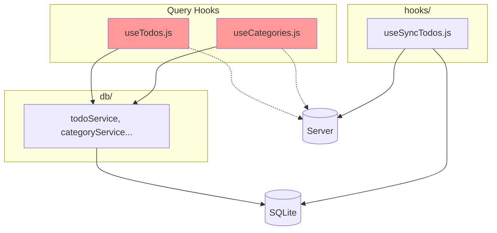
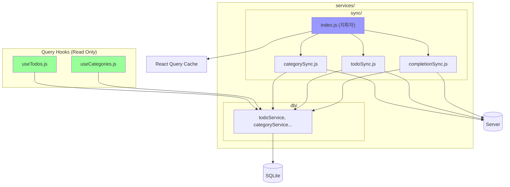

# Design Document: Sync Architecture Refactoring

## Overview

분산된 동기화 로직을 `/services/` 폴더로 모듈화하고, 로그인 후 데이터 동기화 문제를 해결합니다.

**핵심 변경:**
1. Query Hooks (`useTodos`, `useCategories`): 백그라운드 서버 호출 제거
2. **NEW** `/services/` 폴더: DB + Sync 로직 통합
3. Trigger: 디바운스 적용으로 중복 트리거 방지
4. authStore: `isLoggedIn` boolean 상태 추가

## Folder Structure (NEW)

```
client/src/
├── services/                         # ✨ 서비스 레이어 통합
│   ├── db/                           # SQLite 로컬 데이터 (기존 db/ 폴더 이동)
│   │   ├── database.js
│   │   ├── todoService.js
│   │   ├── categoryService.js
│   │   ├── completionService.js
│   │   └── pendingService.js
│   └── sync/                         # 서버 동기화
│       ├── categorySync.js
│       ├── completionSync.js
│       ├── todoSync.js
│       └── index.js                  # ★ useSyncService (지휘자)
├── hooks/
│   ├── useSyncTodos.js               # ❌ 삭제 예정
│   └── queries/
│       ├── useTodos.js               # ✏️ 서버 호출 삭제
│       └── useCategories.js          # ✏️ 서버 호출 삭제
├── store/
│   └── authStore.js                  # ✏️ isLoggedIn 추가
└── db/                               # ❌ 삭제 예정 (→ services/db/)

server/src/
├── controllers/
│   └── completionController.js       # ✏️ getAllCompletions 추가
└── routes/
    └── completions.js                # ✏️ GET /all 라우트 추가
```

## Architecture

### Before (분산)



### After (services 통합)



## Components and Interfaces

### 1. authStore 수정

```javascript
// client/src/store/authStore.js
export const useAuthStore = create((set) => ({
  isLoggedIn: false, // ✅ 추가
  
  setAuth: async (token, user) => {
    const isLoggedIn = !!(user && token && !user._id?.startsWith('guest_'));
    set({ token, user, isLoading: false, isLoggedIn });
  },
}));
```

### 2. services/db/ (기존 db/ 이동)

```javascript
// client/src/services/db/todoService.js
// (기존 코드 그대로, import 경로만 변경)
```

### 3. services/sync/index.js (useSyncService)

```javascript
// client/src/services/sync/index.js
import { syncCategories } from './categorySync';
import { syncTodos } from './todoSync';
import { syncCompletions } from './completionSync';

export const useSyncService = () => {
  const { isLoggedIn } = useAuthStore();
  const queryClient = useQueryClient();
  
  const syncAll = useCallback(async () => {
    await syncCategories();
    await syncTodos();
    await syncCompletions();
    queryClient.invalidateQueries({ queryKey: ['todos'] });
    queryClient.invalidateQueries({ queryKey: ['categories'] });
  }, []);
  
  // 디바운스 트리거 등록
  // ...
  
  return { syncAll, isSyncing, error };
};
```

### 4. 서버 API 추가

```javascript
// server/src/routes/completions.js
router.get('/all', auth, getAllCompletions);
```

## Migration Plan

1. `services/db/` 폴더 생성 및 기존 `db/` 파일 이동
2. 모든 import 경로 업데이트 (`db/` → `services/db/`)
3. `services/sync/` 폴더 생성 및 파일 작성
4. `useSyncTodos` → `useSyncService` import 변경
5. 기존 `db/`, `useSyncTodos.js` 삭제
