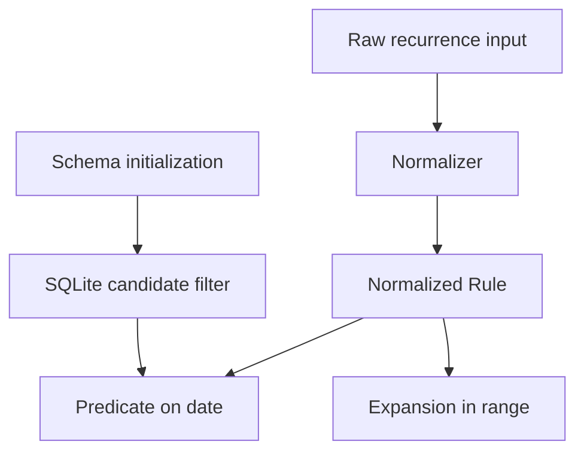

# Design Document: Phase 3 Recurrence Engine Core

## Overview

본 문서는 `requirements.md`의 엔진 확정 범위(R1~R10)를 구현하기 위한 설계다.

설계 목표:

1. recurrence 계산 규칙을 프로젝트 내부 코드로 고정
2. date-only 안전 계약 고정
3. recurrence 관련 DB 계약을 그린필드 기준으로 단순화

범위 외:

1. `useTodos`/`todo-calendar`/`strip-calendar` 연동
2. UI 렌더링/제스처/모드전환 변경

## Design Principles

1. **Single Core Engine**: 반복 규칙 판정은 단일 엔진에서만 수행
2. **Date-only First**: 비교 단위는 항상 `YYYY-MM-DD`
3. **Fail-soft**: 파싱 실패가 UI 크래시로 전파되지 않음
4. **SQL Prefilter + Engine Final Decision**: SQL은 후보군, 최종 판정은 엔진
5. **Greenfield DB Policy**: 최신 스키마 초기화 우선, legacy backfill은 범위 외

## Architecture

핵심 구성:

1. **Normalizer**: 입력 포맷(RRULE/object/array) 통합
2. **Predicate**: 특정 날짜 발생 여부 판정
3. **Expander**: 범위 내 발생일 목록 생성
4. **Schema Layer**: `recurrence_end_date` + 인덱스 보장

## Interface Contract

엔진 계약(이름은 예시이며 구현 단계에서 확정):

1. recurrence 입력 정규화 API
2. 단일 날짜 판정 API
3. 범위 전개 API

공통 입력/출력 계약:

1. 날짜는 `YYYY-MM-DD`
2. 종료일은 nullable date-only
3. 잘못된 입력은 safe invalid 상태로 귀결

## Rule Model Contract

Normalized Rule은 최소 아래 의미를 보존해야 한다.

1. source type
2. frequency
3. weekday/monthday/month constraints
4. start date
5. effective end date

## Semantics Policy

1. Daily/Weekly/Monthly/Yearly는 결정적 규칙으로 동작
2. Weekly는 weekday 제약 유무를 모두 지원
3. Monthly/Yearly는 month/day 제약 우선순위를 명확히 정의
4. Edge 정책:
   - short-month + 31일 반복 처리 규칙 고정
   - leap-year(2/29) 처리 규칙 고정
   - 역범위/종료일 역전 시 empty 처리
   - 범위 가드 기본값 `MAX_EXPANSION_DAYS = 366` 적용
   - 요청 범위가 가드를 넘으면 safe failure(`[]` 또는 guard result) 반환

## Date Safety Policy

금지 패턴:

1. `new Date(...)` 기반 recurrence 비교
2. `Date.parse(...)` 기반 recurrence 비교
3. `toISOString().split('T')[0]` 기반 recurrence 비교

허용 패턴:

1. strict date-only parse
2. day 단위 비교/증감

## Database Contract (Greenfield)

1. 로컬 스키마는 recurrence end-date 필드를 포함해야 한다.
2. 후보군 필터를 위한 recurrence window 인덱스를 포함해야 한다.
3. 초기화 후 필드/인덱스 존재 스모크 검증을 통과해야 한다.
4. legacy row backfill은 본 단계 필수 요구가 아니다.

## Error Handling

1. 파싱 실패: safe fallback + 경고 로그
2. 입력 포맷 불일치: false/empty 반환
3. 스키마 ensure 실패: 초기화 실패로 처리하고 진행 중단

## Validation Strategy

### Engine Validation

1. 입력 포맷별 정규화
2. frequency별 판정 일관성
3. edge/range 가드 검증

### Schema Validation

1. 초기화 후 컬럼/인덱스 존재 검증
2. 후보군 SQL 필터 스모크 검증

### Safety Validation

1. 금지 date-handling 패턴 정적 검사

## Requirement Mapping

1. R1-R3: 엔진 독립성/입력/정규화 계약
2. R4-R7: date-only/종료일/빈도/엣지 정책
3. R8-R9: DB 계약/그린필드 초기화 정책
4. R10: 엔진 검증 기준
