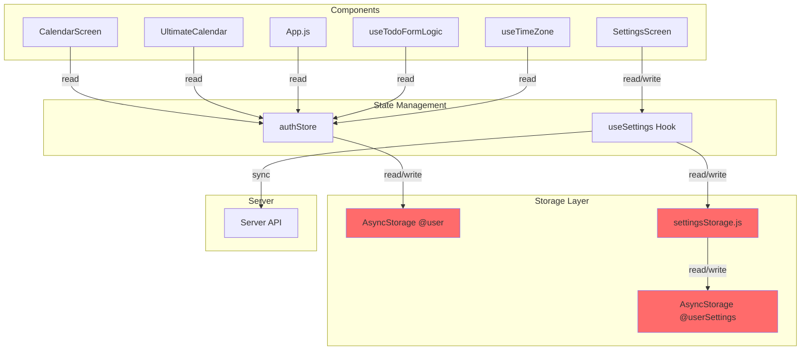
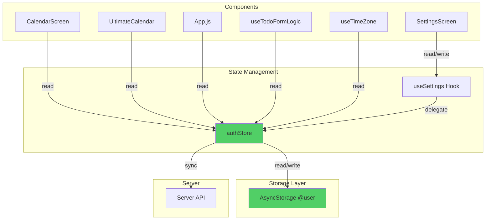
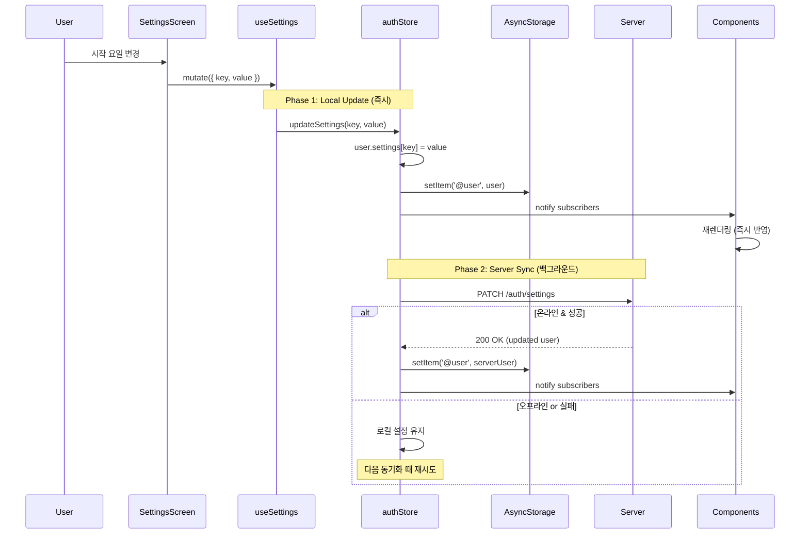
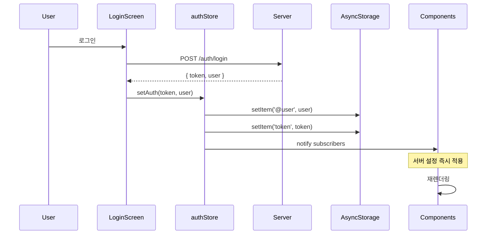
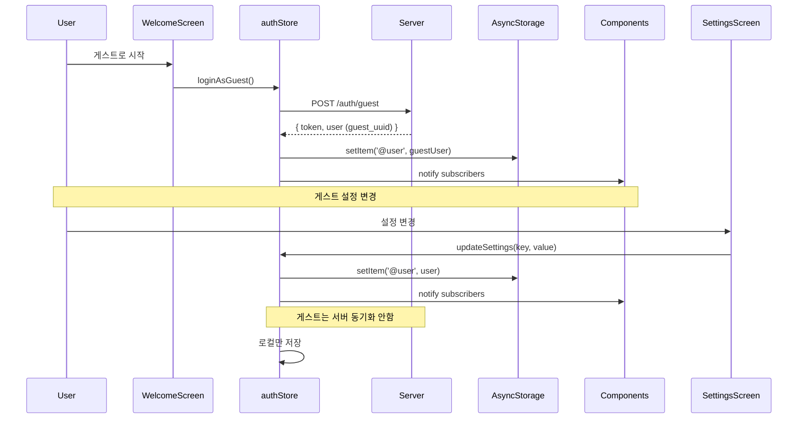

# Design: Settings Storage 통합 리팩토링

**작성일:** 2026-02-10  
**상태:** Draft  
**우선순위:** High

---

## 1. Architecture Overview

### 1.1 Current Architecture (Before)



**문제점:**
- 🔴 2개의 독립적인 저장소 (`@user`, `@userSettings`)
- 🔴 설정 변경이 일부 컴포넌트에 반영 안됨
- 🔴 데이터 동기화 이슈

---

### 1.2 Target Architecture (After)



**개선점:**
- ✅ 단일 저장소 (`@user` only)
- ✅ authStore가 모든 설정 관리
- ✅ useSettings Hook은 authStore의 Wrapper
- ✅ 즉시 반영 (Zustand 구독)

---

## 2. Data Flow

### 2.1 설정 변경 Flow (Offline-First)



---

### 2.2 로그인 Flow



---

### 2.3 게스트 모드 Flow



---

## 3. Components & Interfaces

### 3.1 authStore (Zustand)

**파일:** `client/src/store/authStore.js`

#### 3.1.1 State

```typescript
interface AuthState {
  user: User | null;
  token: string | null;
  isLoading: boolean;
  isLoggedIn: boolean;
  shouldShowLogin: boolean;
}

interface User {
  _id: string;
  email?: string;
  name?: string;
  settings: UserSettings;
}

interface UserSettings {
  theme: 'system' | 'light' | 'dark';
  language: 'system' | 'ko' | 'en' | 'ja';
  startDayOfWeek: 'sunday' | 'monday';
  showCompleted: boolean;
  calendarSyncEnabled: boolean;
  timeZone: string;
  timeZoneAuto: boolean;
  defaultIsAllDay: boolean;
  notification: NotificationSettings;
}
```

#### 3.1.2 New Method: updateSettings

```javascript
/**
 * 설정 업데이트 (Offline-First)
 * @param {string} key - 설정 키
 * @param {any} value - 설정 값
 * @returns {Promise<void>}
 */
updateSettings: async (key, value) => {
  const { user, isLoggedIn } = get();
  if (!user) {
    console.warn('⚠️ [updateSettings] No user found');
    return;
  }
  
  // Phase 1: Local Update (즉시)
  const updatedUser = {
    ...user,
    settings: {
      ...user.settings,
      [key]: value,
    },
  };
  
  await AsyncStorage.setItem('user', JSON.stringify(updatedUser));
  set({ user: updatedUser });
  console.log(`✅ [updateSettings] Local update: ${key} = ${value}`);
  
  // Phase 2: Server Sync (백그라운드, 로그인 사용자만)
  if (isLoggedIn) {
    try {
      const response = await api.patch('/auth/settings', { [key]: value });
      const serverUser = response.data.user;
      
      // ⚠️ 서버 응답 반영 시 변경된 key만 업데이트 (깜빡임 방지)
      const currentUser = get().user;
      if (currentUser.settings[key] === value) {
        // 로컬과 서버가 동일하면 전체 반영
        await AsyncStorage.setItem('user', JSON.stringify(serverUser));
        set({ user: serverUser });
        console.log(`✅ [updateSettings] Server sync: ${key} = ${value}`);
      } else {
        // 로컬이 변경되었으면 서버 응답 무시 (사용자가 다시 변경한 경우)
        console.log(`⚠️ [updateSettings] Local changed during sync, keeping local`);
      }
    } catch (error) {
      console.log(`⚠️ [updateSettings] Server sync failed (offline?): ${error.message}`);
      // 오프라인이면 무시 (로컬 설정 유지)
    }
  } else {
    console.log('📱 [updateSettings] Guest mode - local only');
  }
}
```

**⚠️ 주요 개선사항:**
- **Offline-First**: 로컬 먼저 저장 (실패 불가) → 서버 동기화 (실패해도 로컬 유지)
- **깜빡임 방지**: 서버 응답 반영 시 로컬 변경 여부 확인

#### 3.1.3 Modified Method: setAuth

```javascript
setAuth: async (token, user) => {
  if (token && user) {
    await AsyncStorage.setItem('token', token);
    await AsyncStorage.setItem('user', JSON.stringify(user));
  } else {
    await AsyncStorage.removeItem('token');
    await AsyncStorage.removeItem('user');
  }
  
  const isLoggedIn = !!(user && token && !user._id?.startsWith('guest_'));
  
  set({ token, user, isLoading: false, isLoggedIn });
}
```

---

### 3.2 useSettings Hook

**파일:** `client/src/hooks/queries/useSettings.js`

#### 3.2.1 useSettings (Read)

```javascript
/**
 * 설정 조회 (authStore 기반)
 * @returns {Object} { data: UserSettings, isLoading, isError }
 */
export const useSettings = () => {
  const user = useAuthStore(state => state.user);
  
  return {
    data: user?.settings || getDefaultSettings(),
    isLoading: false,
    isError: false,
  };
};

/**
 * 기본 설정 반환
 */
const getDefaultSettings = () => ({
  theme: 'system',
  language: 'system',
  startDayOfWeek: 'sunday',
  showCompleted: true,
  calendarSyncEnabled: false,
  timeZone: 'Asia/Seoul',
  timeZoneAuto: true,
  defaultIsAllDay: true,
  notification: {
    enabled: false,
    time: '09:00',
  },
});
```

#### 3.2.2 useUpdateSetting (Write)

```javascript
/**
 * 설정 업데이트 (authStore 위임)
 * @returns {Object} { mutate, mutateAsync, isPending }
 */
export const useUpdateSetting = () => {
  const updateSettings = useAuthStore(state => state.updateSettings);
  const [isPending, setIsPending] = useState(false);
  
  return {
    mutate: ({ key, value }) => {
      setIsPending(true);
      updateSettings(key, value).finally(() => setIsPending(false));
    },
    mutateAsync: async ({ key, value }) => {
      setIsPending(true);
      try {
        await updateSettings(key, value);
      } finally {
        setIsPending(false);
      }
    },
    isPending,
  };
};
```

---

### 3.3 Migration Logic

**파일:** `client/src/store/authStore.js` (loadAuth 메서드 수정)

```javascript
loadAuth: async () => {
  try {
    const token = await AsyncStorage.getItem('token');
    const userStr = await AsyncStorage.getItem('user'); // ⚠️ 'user' 키 사용 (@user 아님)
    let user = userStr ? JSON.parse(userStr) : null;
    
    // 🔄 Migration: @userSettings → user.settings
    const oldSettingsStr = await AsyncStorage.getItem('@userSettings');
    if (oldSettingsStr) {
      console.log('🔄 [Migration] Found old settings, merging...');
      const parsedOldSettings = JSON.parse(oldSettingsStr);
      
      if (user) {
        // Case 1: user 존재 - 병합 (로컬 최신 변경 우선)
        user.settings = {
          ...user.settings,        // 서버 기본값 (베이스)
          ...parsedOldSettings,    // 로컬 최신 변경 (우선) ✅
        };
        
        await AsyncStorage.setItem('user', JSON.stringify(user));
      } else {
        // Case 2: user 없음 (게스트가 설정만 변경한 경우)
        // 기본 user 객체 생성 후 oldSettings 적용
        user = {
          _id: 'guest_temp',
          settings: parsedOldSettings,
        };
        await AsyncStorage.setItem('user', JSON.stringify(user));
        console.log('🔄 [Migration] Created user from old settings (guest case)');
      }
      
      // 마이그레이션 완료 후 삭제
      await AsyncStorage.removeItem('@userSettings');
      console.log('✅ [Migration] Old settings migrated and removed');
    }
    
    const isLoggedIn = !!(user && token && !user._id?.startsWith('guest_'));
    set({ token, user, isLoading: false, isLoggedIn, shouldShowLogin: false });
  } catch (error) {
    console.error('❌ [loadAuth] Failed:', error);
    set({ isLoading: false });
  }
}
```

**⚠️ 주요 수정사항:**
1. **AsyncStorage 키**: `'user'` 사용 (`'@user'` 아님)
2. **병합 우선순위**: `parsedOldSettings`를 뒤에 배치 (로컬 최신 변경 우선)
3. **user 없는 경우**: 기본 user 객체 생성 후 oldSettings 적용

---

## 4. API Design

### 4.1 Server API (기존 유지)

**Endpoint:** `PATCH /auth/settings`

**Request:**
```json
{
  "theme": "dark"
}
```

**Response:**
```json
{
  "message": "설정 업데이트 완료",
  "settings": {
    "theme": "dark",
    "language": "ko",
    "startDayOfWeek": "monday",
    ...
  }
}
```

**⚠️ 중요:** 서버는 `settings` 객체만 반환합니다 (`user` 전체가 아님).

**Note:** 서버 API는 변경 없음. 클라이언트만 수정.

---

## 5. Data Models

### 5.1 AsyncStorage Schema

#### Before (2개 키)

```javascript
// user (⚠️ @접두사 없음 - 실제 코드 기준)
{
  "_id": "user-uuid",
  "email": "user@example.com",
  "name": "User Name",
  "settings": { ... }
}

// @userSettings (중복!)
{
  "theme": "system",
  "language": "ko",
  ...
}
```

#### After (1개 키)

```javascript
// user (단일 저장소, @접두사 없음)
{
  "_id": "user-uuid",
  "email": "user@example.com",
  "name": "User Name",
  "settings": {
    "theme": "system",
    "language": "ko",
    "startDayOfWeek": "sunday",
    "showCompleted": true,
    "calendarSyncEnabled": false,
    "timeZone": "Asia/Seoul",
    "timeZoneAuto": true,
    "defaultIsAllDay": true,
    "notification": {
      "enabled": false,
      "time": "09:00"
    }
  }
}
```

**⚠️ 중요:** 실제 authStore.js는 `'user'` 키를 사용합니다 (`'@user'`가 아님).

---

## 6. Error Handling

### 6.1 오프라인 처리

```javascript
try {
  const response = await api.patch('/auth/settings', { [key]: value });
  // 성공 시 서버 데이터로 업데이트
} catch (error) {
  if (error.message.includes('Network')) {
    console.log('⚠️ Offline - local settings kept');
    // 로컬 설정 유지 (이미 저장됨)
  } else {
    console.error('❌ Server error:', error);
    // 로컬 설정 유지
  }
}
```

### 6.2 게스트 모드 처리

```javascript
if (isLoggedIn) {
  // 서버 동기화
  await api.patch('/auth/settings', { [key]: value });
} else {
  // 게스트는 로컬만 저장
  console.log('📱 Guest mode - local only');
}
```

### 6.3 마이그레이션 실패 처리

```javascript
try {
  const oldSettings = await AsyncStorage.getItem('@userSettings');
  if (oldSettings) {
    // 마이그레이션 로직
  }
} catch (error) {
  console.error('⚠️ Migration failed, using current settings:', error);
  // 기존 user.settings 유지
}
```

---

## 7. Correctness Properties (Property-Based Testing)

### Property 1: 단일 저장소 원칙
```
∀ settings change:
  AsyncStorage.getItem('@userSettings') === null
  AsyncStorage.getItem('@user').settings !== null
```

### Property 2: 즉시 반영
```
∀ key, value:
  updateSettings(key, value)
  →
  useAuthStore.getState().user.settings[key] === value (within 100ms)
```

### Property 3: Offline-First
```
∀ key, value, network_status:
  updateSettings(key, value)
  →
  AsyncStorage.getItem('@user').settings[key] === value
  (regardless of network_status)
```

### Property 4: 서버 동기화 (로그인 사용자만)
```
∀ key, value:
  isLoggedIn === true
  →
  updateSettings(key, value)
  →
  eventually: server.user.settings[key] === value
```

### Property 5: 게스트 모드 (서버 호출 안함)
```
∀ key, value:
  isLoggedIn === false
  →
  updateSettings(key, value)
  →
  no server API call
```

### Property 6: 마이그레이션 멱등성
```
∀ user:
  loadAuth()
  →
  AsyncStorage.getItem('@userSettings') === null
  (after first run)
```

### Property 7: Zustand 구독 알림
```
∀ key, value:
  updateSettings(key, value)
  →
  all subscribers notified
  →
  components re-render
```

---

## 8. Testing Strategy

### 8.1 Unit Tests (선택사항)

**authStore.updateSettings**
- ✅ 로컬 즉시 업데이트
- ✅ AsyncStorage 저장
- ✅ Zustand state 업데이트
- ✅ 서버 동기화 (로그인 사용자)
- ✅ 게스트 모드 (서버 호출 안함)
- ✅ 오프라인 처리

**useSettings Hook**
- ✅ authStore.user.settings 반환
- ✅ user 없을 때 기본값 반환

**Migration Logic**
- ✅ @userSettings 존재 시 병합
- ✅ 병합 후 @userSettings 삭제
- ✅ 멱등성 (재실행 시 에러 없음)

---

### 8.2 Integration Tests (Manual)

**Test 1: 설정 변경 즉시 반영**
```
1. SettingsScreen에서 시작 요일 변경
2. CalendarScreen 열기
3. ✅ 즉시 반영 확인
```

**Test 2: 오프라인 설정 변경**
```
1. 네트워크 끄기
2. 설정 변경
3. ✅ 로컬 즉시 반영
4. 네트워크 켜기
5. ✅ 서버 동기화 확인
```

**Test 3: 게스트 모드**
```
1. 게스트로 로그인
2. 설정 변경
3. ✅ 로컬만 저장 (서버 호출 안함)
```

**Test 4: 마이그레이션**
```
1. 기존 @userSettings 데이터 준비
2. 앱 시작
3. ✅ @user.settings로 병합
4. ✅ @userSettings 삭제
```

---

## 9. Performance Considerations

### 9.1 Zustand Selector 최적화

**Before (전체 user 구독)**
```javascript
const user = useAuthStore(state => state.user);
const theme = user?.settings?.theme;
```

**After (필요한 값만 구독)**
```javascript
const theme = useAuthStore(state => state.user?.settings?.theme);
```

**이유:** 불필요한 재렌더링 방지

---

### 9.2 AsyncStorage 쓰기 최적화

**현재 방식 (즉시 쓰기)**
```javascript
await AsyncStorage.setItem('user', JSON.stringify(user));
```

**Note:** AsyncStorage는 충분히 빠름 (<50ms). 추가 최적화 불필요.

---

## 10. Migration Plan

### 10.1 Phase 1: authStore 수정 (30분)

1. `updateSettings` 메서드 추가
2. `loadAuth` 메서드에 마이그레이션 로직 추가

### 10.2 Phase 2: useSettings Hook 수정 (30분)

1. `useSettings` → authStore 기반으로 변경
2. `useUpdateSetting` → authStore.updateSettings 위임

### 10.3 Phase 3: settingsStorage.js 삭제 (5분)

1. 파일 삭제
2. import 제거

### 10.4 Phase 4: 테스트 (1시간)

1. Manual Test Cases 실행
2. Regression Test (모든 설정 항목)

---

## 11. Rollback Plan

### 11.1 문제 발생 시

1. Git revert
2. 기존 코드 복원
3. @userSettings 데이터 복구 (백업 필요)

### 11.2 데이터 백업

```javascript
// 마이그레이션 전 백업
const oldSettings = await AsyncStorage.getItem('@userSettings');
await AsyncStorage.setItem('@userSettings_backup', oldSettings);
```

---

## 12. Security Considerations

### 12.1 AsyncStorage 보안

- ✅ AsyncStorage는 앱 샌드박스 내 저장
- ✅ 다른 앱 접근 불가
- ✅ 민감 정보 없음 (설정만 저장)

### 12.2 서버 동기화 보안

- ✅ JWT 토큰 인증
- ✅ HTTPS 통신
- ✅ 서버 검증

---

## 13. Future Enhancements (Out of Scope)

- ❌ SQLite로 설정 저장
- ❌ 설정 동기화 큐 구현
- ❌ 설정 변경 히스토리
- ❌ 다중 기기 실시간 동기화

---

**작성자:** Kiro AI Assistant  
**검토자:** (개발자님 검토 필요)  
**승인자:** (개발자님 승인 필요)
