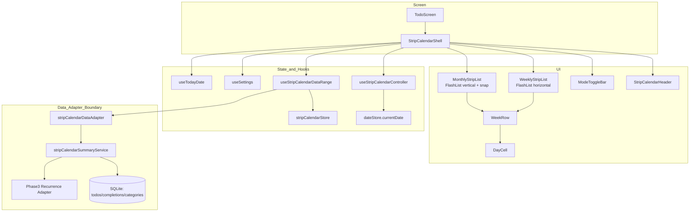

# Design Document: Strip Calendar (Main Screen)

## Overview

Strip Calendar is a lightweight date selector for `TodoScreen`.  
This feature must keep main-screen performance stable while supporting:

- Weekly mode: 1 visible week, horizontal navigation
- Monthly mode: 5 visible weeks, vertical infinite navigation with week snap
- Mode transition with anchor preservation (`Anchor_Week_Start`)
- Day-level category dot summary (unique categories only)
- Today/currentDate differentiated visuals (today=bold, currentDate=circle)
- Header today-jump behavior when today is outside viewport

This design follows `requirements.md` (R1-R25) and keeps data integration aligned with the Phase 3 recurrence single-path strategy.

## Decision Summary

### Options Considered

1. Single list with runtime axis switch (horizontal <-> vertical)
2. Two lists mounted at all times (keep-alive)
3. Two dedicated lists with mode-based conditional rendering

### Final Choice

Use **two dedicated FlashList components** (`WeeklyStripList`, `MonthlyStripList`) with **mode-based conditional rendering** in the shell.

Reasons:

- Weekly and Monthly have different scroll physics and axis semantics
- Runtime axis switching on one list increases re-init complexity and gesture risk
- Keep-alive is fast for toggles but keeps inactive UI memory on the main screen
- Conditional rendering keeps baseline memory lower and matches "main screen lightweight" priority

Animation policy:

- Optional, short, lightweight transitions only (transform/opacity oriented)
- No heavy JS per-frame layout work during transitions
- Avoid per-frame height interpolation; commit final layout height once at transition end
- Use Reanimated UI-thread driven transition path

## Architecture



## Component Design

### 1. `StripCalendarShell`

Responsibilities:

- Own view mode (`weekly`/`monthly`) and transition orchestration
- Keep and pass `Anchor_Week_Start`
- Connect to `dateStore.currentDate`, `useSettings`, `useTodayDate`
- Render header, list area, toggle bar

Key rules:

- Render only one active list component by mode
- On mode switch, compute and pass anchor to target mode

### 2. `StripCalendarHeader`

Responsibilities:

- Left: previous/next navigation arrows
- Right: current `YYYY + MMM` label and mode toggle arrow
- Labels follow user language setting
- Conditionally render `Today_Jump_Button` when `Today_Date` is outside current viewport
- Handle today-jump click action (navigate/scroll + `setCurrentDate(todayDate)`)

### 3. `ModeToggleBar`

Responsibilities:

- In `Weekly_Mode`, swipe-down => monthly
- In `Monthly_Mode`, swipe-up => weekly
- No click/tap toggle action on bottom bar (swipe-only)
- No drag-to-resize interpolation

### 4. `WeeklyStripList` (FlashList, horizontal)

Responsibilities:

- Display exactly one week row in viewport
- Handle left/right week navigation
- Keep list horizontal layout for deterministic index-based positioning, but disable direct free user horizontal scrolling
- Use `snapToInterval={viewportWidth}` + `snapToAlignment="start"` (no `pagingEnabled`)
- Derive `viewportWidth` from list container `onLayout`
- Use non-animated one-shot `scrollToOffset(index * viewportWidth)` for initial alignment after width is ready
- Report settled visible week to controller via quantized settle path (`onMomentumScrollEnd` + web programmatic fallback)
- Detect horizontal swipe intent by threshold and route to the same navigation actions as header arrows
- Use PanResponder-based swipe intent only (no web wheel/trackpad mapping)

### 5. `MonthlyStripList` (FlashList, vertical)

Responsibilities:

- Display week rows vertically with free-scroll and week snap
- Enforce:
  - `pagingEnabled={false}`
  - `snapToInterval={WEEK_ROW_HEIGHT}`
  - `decelerationRate="fast"`
- Use `initialScrollIndex` based on top target week for first mount alignment
- Keep 5-row visible window and infinite semantics
- Settle flow must be controlled by phase state machine to avoid re-entrant corrections
  - phases: `idle`, `dragging`, `momentum`, `settling`, `programmatic`
- Report top visible settled week through shared settle quantization path
  - primary: `onMomentumScrollEnd`
  - web fallback: idle timer settle on `onScroll` with guard/cooldown/re-arm controls
  - idle/web settle must be skipped while phase is active (`dragging`, `momentum`, `programmatic`)
  - quantize correction must arm a short programmatic guard before correction scroll
  - near-snapped + same-week case should skip redundant idle settle scheduling

### 6. `WeekRow`

Responsibilities:

- Render 7 `DayCell`s
- Apply week-start rule from settings (`sunday`/`monday`)
- Provide month-boundary label per cell when month changes in same row
- Ensure month label is also shown when day-number is `1` (including week-first cell)

### 7. `DayCell`

Responsibilities:

- Render day number, selection state, today marker
- Visual rule:
  - `Today_Marker`: bold text only
  - `currentDate`: circular indicator
  - composed state (`todayDate === currentDate`): selected circle + bold text
- Apply subtle month-parity background tint for readability:
  - odd month: neutral base
  - even month: lightly tinted base
  - tint must stay below selection/today/dot visual priority
- Render dot summary:
  - max 3 unique category dots
  - overflow `+` indicator when unique categories >= 4

## Data and Interface Contracts

## Domain Models

```js
/**
 * @typedef {Object} DaySummary
 * @property {string} date                  // YYYY-MM-DD
 * @property {boolean} hasTodo
 * @property {string[]} uniqueCategoryColors
 * @property {number} dotCount
 */

/**
 * @typedef {Object} DateRange
 * @property {string} startDate             // YYYY-MM-DD (inclusive)
 * @property {string} endDate               // YYYY-MM-DD (inclusive)
 */
```

## Adapter Contract

```js
/**
 * Ensure date range summary exists in local cache.
 * Must dedupe overlapping requests and avoid repeated SQLite fetch.
 */
async function ensureRangeLoaded({ startDate, endDate, reason }) {}

/**
 * Select cached day summaries for a range.
 */
function selectDaySummaries({ startDate, endDate }) {}

/**
 * Optional invalidation hook for todo/completion/category mutations.
 */
function invalidateRanges(ranges) {}
```

Notes:

- Strip Calendar never reads SQLite directly
- Strip Calendar never computes recurrence independently
- Recurrence-aware inclusion is delegated to adapter boundary for Phase 3 compatibility

## State Model

### Shared Global State

- `dateStore.currentDate: string (YYYY-MM-DD)` (selection source of truth)
- `useSettings().data` for `language`, `startDayOfWeek`, `timeZone`

### Strip Calendar Local/Feature State

```js
{
  mode: 'weekly' | 'monthly',
  anchorWeekStart: string,       // YYYY-MM-DD
  weeklyVisibleWeekStart: string,
  monthlyTopWeekStart: string,
  isTodayVisibleInWeekly: boolean,
  isTodayVisibleInMonthlyViewport: boolean,
  showTodayJumpButton: boolean,
  cachedRanges: Array<DateRange>, // merge-ready normalized ranges
  summariesByDate: Record<string, DaySummary>
}
```

## Navigation and Transition Algorithms

### Weekly -> Monthly

1. Resolve `anchorWeekStart` from weekly visible row
2. Switch mode to monthly
3. Mount monthly list with initial anchor alignment
4. Ensure monthly visible range (5 weeks + prefetch buffer) is loaded

Result:

- Anchor week appears at top row
- Next 4 weeks visible below

### Monthly -> Weekly

1. Resolve base anchor:
   - `baseTopWeekStart = monthlyTopWeekStart || currentWeekStart`
2. Clear stale weekly transition target in shell before switching mode
3. Resolve weekly target once at mode-switch time:
   - if `currentDate` week is inside monthly 5-row viewport from `baseTopWeekStart`, use `currentWeekStart`
   - otherwise use `baseTopWeekStart`
4. Switch mode to weekly
5. Mount weekly list aligned to resolved target week
6. Ensure weekly range (target week + prefetch buffer) is loaded

Result:

- Monthly top context is preserved unless current week is already visible in monthly viewport
- Stale weekly target must not override mode-switch decision

### Positioning Timing Policy

1. On first render, shell bootstraps navigation anchor to `todayWeekStart`
2. Initial list alignment and mode-switch alignment use **non-animated** programmatic positioning
3. Explicit week navigation (`<`, `>`) uses animated programmatic scroll
4. Final visible anchor is still committed through settled callbacks (`onMomentumScrollEnd`)

### Today Jump Button Evaluation and Action

1. Resolve `todayDate` from shared hook (`useTodayDate`)
2. Evaluate initial today visibility from first-render viewport snapshot
3. On weekly/monthly momentum settle, re-evaluate whether `todayDate` is currently visible
4. Show `Today_Jump_Button` only when today is outside current viewport
5. On today-jump click:
   - set `currentDate = todayDate`
   - in weekly mode: navigate to week containing `todayDate`
   - in monthly mode: scroll so week containing `todayDate` is aligned to top row

## Range Loading Strategy

### Trigger Points

- Weekly:
  - Horizontal momentum settle (`onMomentumScrollEnd`)
  - Web programmatic fallback settle after target sync
- Monthly:
  - Vertical momentum settle (`onMomentumScrollEnd`, snap settled)
  - Web idle fallback settle from `onScroll` timer (guarded)
- Mode switch:
  - Single target-range ensure call (skip on cache hit) after anchor settle

### Explicitly Forbidden

- Data fetch on every `onScroll` frame
- Raw todo-array based dot computation inside `DayCell`

## Current Runtime Flag Status

- `ENABLE_STRIP_CALENDAR_SUMMARY = false` (in `useStripCalendarDataRange`)
- Current strip-calendar UI validates navigation/selection/snap behavior first.
- Dot summary DB path remains implemented but intentionally disabled until recurrence integration stage.

## Storage and DB Considerations

Strip Calendar introduces no new server schema.

SQLite dependencies (read-only for this feature):

- `todos`
- `completions`
- `categories`

The adapter summary path should remain compatible with existing date-string contracts (`YYYY-MM-DD`) and recurrence data fields introduced by Phase 2.5/Phase 3.

## Error Handling Strategy

1. Adapter fetch failure:
   - Log warning
   - Return empty summaries for requested range
   - Keep UI interactive (no hard crash)

2. Invalid date or anchor mismatch:
   - Fallback to current week derived from `currentDate`

3. `scrollToIndex` failure:
   - Fallback to `scrollToOffset` using deterministic week height

4. Missing settings:
   - Use defaults from settings layer
   - `language='system'`, `startDayOfWeek='sunday'`, timezone fallback from utility

## Correctness Properties (Property-Based Testing Targets)

- **P1 Week Cell Count**: Every rendered `WeekRow` has exactly 7 day cells
- **P2 Weekly Visibility**: Weekly mode shows exactly 1 visible row
- **P3 Monthly Visibility Cap**: Monthly viewport height equals 5 row heights
- **P4 Axis Separation**: Weekly list remains horizontal, Monthly list remains vertical
- **P5 Anchor Preservation W->M**: Weekly anchor week equals monthly top week after switch
- **P6 Anchor Preservation M->W**: Monthly top week equals weekly visible week after switch
- **P7 Dot Deduplication**: Dot colors are unique by category color for a date
- **P8 Dot Overflow Rule**: Dot render count <= 3 and overflow marker shown when unique count >= 4
- **P9 Today Independence**: Today marker is correct regardless of selected date
- **P10 Settings Reactivity**: Language/startDayOfWeek changes update labels and layout without restart
- **P11 Range Dedupe**: Overlapping range requests do not produce duplicate SQLite fetches
- **P12 No Per-Frame Fetch**: `onScroll` frame events do not trigger adapter fetch calls
- **P13 Adapter Boundary**: Recurrence inclusion is consumed from adapter output, not recomputed in UI
- **P14 Date Contract**: All calendar internal date keys and selection values are `YYYY-MM-DD` strings
- **P15 Today Visual Rule**: Today-only cell uses bold text and does not render selected circle
- **P16 Selected Visual Rule**: Selected-only cell renders circle indicator
- **P17 Today Jump Visibility**: Today button is visible iff today is outside current mode viewport
- **P18 Today Jump Action**: Today button sets `currentDate=todayDate` and navigates to today week according to mode rule
- **P19 M->W Stale Target Reset**: Stale weekly target state is cleared before monthly->weekly rendering path
- **P20 M->W Single-Pass Resolution**: Monthly->weekly target is resolved once per toggle and never on per-frame `onScroll`
- **P21 Monthly Active-Phase Guard**: Idle/web settle is blocked while phase is `dragging`, `momentum`, or `programmatic`
- **P22 Monthly Redundant-Settle Skip**: Near-snapped and same-week offsets do not schedule redundant idle settle
- **P23 Weekly No-Free-Scroll UX**: Weekly mode does not expose free inertial horizontal scrolling behavior to users
- **P24 Weekly Swipe-Intent Mapping**: PanResponder threshold-crossing horizontal intent triggers at most one prev/next navigation action, and web wheel/trackpad is not used for weekly navigation

## Testing Strategy

Because this project currently has no mandatory automated runner, testing is split:

1. Manual checkpoint tests (required)
2. Optional automated unit/property tests (recommended when runner is enabled)

### Manual Test Matrix

1. Weekly swipe and header arrows update week correctly
2. Weekly mode does not allow free inertial horizontal drag scrolling
3. Weekly swipe intent triggers exactly one week move per gesture
4. Weekly web trackpad/wheel horizontal movement does not trigger week navigation
5. Monthly free scroll snaps to week boundaries without partial resting
6. Weekly <-> Monthly preserves anchor week
7. Bottom toggle bar mode switch direction is fixed:
   - `Weekly_Mode` + swipe-down => `Monthly_Mode`
   - `Monthly_Mode` + swipe-up => `Weekly_Mode`
   - bottom toggle click/tap does not toggle mode
8. Monthly -> Weekly target rule:
   - if current week is visible in monthly viewport, weekly shows current week
   - else weekly shows monthly top week
   - stale weekly target does not override resolved target
9. Dot rules:
   - Same category many todos => one dot
   - 4+ unique categories => 3 dots + `+`
10. Month label rule:
   - month label appears when day-number is `1`, including week-first cell
11. Month parity tint rule:
   - odd/even month backgrounds are visually distinguishable but subtle
   - selected circle, today bold text, and dot visibility remain readable over tint
12. Language/startDayOfWeek/timezone changes reflect immediately
13. Today marker updates on timezone changes and app foreground return
14. Offline mode still shows cached summaries and remains interactive
15. Perf Monitor check: mode transition does not trigger repeated lower todo-list reflow/layout thrash
16. Weekly mode: if today week is off-screen, header today button appears; click returns to today week and selects today
17. Monthly mode: if today is outside visible 5-row window, header today button appears; click aligns today week to top and selects today
18. Monthly settle guard behavior:
   - while dragging/momentum/programmatic, idle settle does not fire
   - near-snapped + same-week state does not trigger redundant settle

### Optional Automated Tests

Unit tests:

- Date range helper functions
- Week generation and month-boundary labeling
- Dot normalization logic
- Anchor mapping logic

Property tests:

- P1-P24 repeated randomized validation
- Tag format: `Feature: strip-calendar, Property Px`

## Debug Observability (Anchor Drift / Glide)

For intermittent "wrong week appears then glides" issues, use temporary debug logging:

1. Enable `DEBUG_STRIP_CALENDAR=true` in `stripCalendarConstants`
2. Reproduce from:
   - first app entry to strip-calendar screen
   - weekly -> monthly switch
   - monthly -> weekly switch
3. Verify event order:
   - shell action (`action:*`) -> list sync (`sync:scrollToIndex`) -> settle (`momentum:settleByOffset`, `settled:*`)
4. Compare target and settled values:
   - target week (`targetWeekStart` / `targetTopWeekStart`)
   - settled week (`weekStart` from momentum)
   - store snapshot (`anchorWeekStart`, `weeklyVisibleWeekStart`, `monthlyTopWeekStart`)
5. Disable debug flag after diagnosis to avoid console overhead in normal development.

## Performance Targets

- Weekly interaction (swipe settle): no visible stutter on standard devices
- Mode switch (including mount + anchor align): perceived stable transition
- Monthly scrolling: no blank area under normal fast scrolling
- Adapter fetch: batch range requests only, no per-frame fetch pattern
- Transition rendering: no continuous lower-content reflow caused by per-frame height updates

## Non-Goals (This Phase)

- Building a second recurrence engine inside strip-calendar
- Server API/schema changes for strip-calendar
- Drag-resize calendar height interaction
