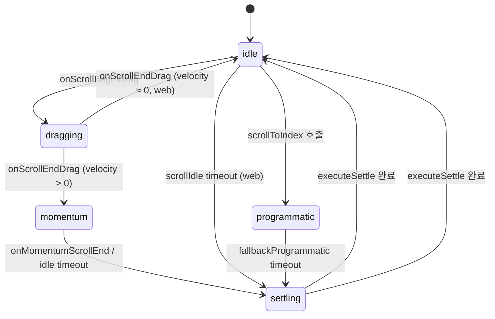

# Monthly Settle 리팩터링 — 해결 방안

> **진단 문서**: [monthly_settle_diagnosis.md](file:///Users/admin/.gemini/antigravity/brain/2742ef6b-a44c-4453-ad24-233d0e182545/monthly_settle_diagnosis.md)  
> **대상**: [MonthlyStripList.js](file:///Users/admin/Documents/github/todo/client/src/features/strip-calendar/ui/MonthlyStripList.js)

---

## 핵심 전략: "단일 settle 게이트" 패턴

현행 3개 진입점(momentumEnd, scrollIdleWeb, fallbackWebProgrammatic)이 독립적으로 `settleByOffset`을 호출하는 구조를 **단일 게이트 함수로 통합**한다.


---

## 변경 개요

### 문제 → 해결 매핑

| # | 진단 문제 | 해결 방안 | 변경 파일 |
|---|----------|----------|----------|
| 9-1 | onScroll 책임 과집중 (7개) | `useMonthlyScrollTracker` 훅으로 분리 | [NEW] `useMonthlyScrollTracker.js` |
| 9-2 | 정착 경로 경쟁 | `requestSettle` 게이트 — debounce + mutual exclusion | [MODIFY] [MonthlyStripList.js](file:///Users/admin/Documents/github/todo/client/src/features/strip-calendar/ui/MonthlyStripList.js) |
| 9-3 | 시간/거리 혼합 가드 | 시간 가드를 `isProgrammaticScroll` 단일 boolean으로 단순화 | [MODIFY] 상수 축소 |
| 9-4 | Ref 분산 (13개) | `scrollStateRef` 단일 객체로 통합 | [MODIFY] [MonthlyStripList.js](file:///Users/admin/Documents/github/todo/client/src/features/strip-calendar/ui/MonthlyStripList.js) |
| 9-5 | 파급 증폭 | settle emit에 debounce 적용, 동일 weekStart 연속 emit 차단 강화 | [MODIFY] [MonthlyStripList.js](file:///Users/admin/Documents/github/todo/client/src/features/strip-calendar/ui/MonthlyStripList.js) |

---

## Proposed Changes

### 1. Scroll State 통합 (`scrollStateRef`)

현행 13개 ref를 **단일 ref 객체**로 통합한다.

```diff
- const lastSettledOffsetRef = useRef(null);
- const settleHardCooldownUntilRef = useRef(0);
- const correctionCooldownUntilRef = useRef(0);
- const programmaticScrollGuardUntilRef = useRef(0);
- const initialIdleGuardUntilRef = useRef(Date.now() + ...);
- const idleSettleLockRef = useRef(false);
- const idleSettleArmedRef = useRef(false);
- const hasUserInteractionRef = useRef(false);
- const lastScrollOffsetRef = useRef(0);
- const isDraggingRef = useRef(false);

+ const scrollStateRef = useRef({
+   phase: 'idle',           // 'idle' | 'dragging' | 'momentum' | 'settling' | 'programmatic'
+   lastOffset: 0,
+   lastSettledOffset: null,
+   lastEmittedWeekStart: null,
+   isProgrammatic: false,
+   settleTimer: null,
+ });
```

**설계 원칙**: 상태 전이를 **명시적 phase 필드 하나**로 추적. `idle → dragging → momentum → settling → idle` 순환만 존재.

---

### 2. `requestSettle` 게이트 함수

3개 진입점이 직접 `settleByOffset`을 호출하는 대신, **`requestSettle`을 통해서만** settle을 요청한다.

```js
const requestSettle = useCallback((offsetY, source) => {
  const state = scrollStateRef.current;

  // 1. Mutual exclusion: settling 중이면 무시
  if (state.phase === 'settling') {
    logStripCalendar('MonthlyStripList', 'settle:rejected:alreadySettling', { source });
    return;
  }

  // 2. Programmatic guard: 코드 스크롤 직후이면 무시
  if (state.isProgrammatic && source !== 'fallbackProgrammatic') {
    logStripCalendar('MonthlyStripList', 'settle:rejected:programmatic', { source });
    return;
  }

  // 3. Debounce: 기존 timer clear + 새로 설정
  if (state.settleTimer) {
    clearTimeout(state.settleTimer);
    state.settleTimer = null;
  }

  // 4. Source에 따라 즉시 settle 또는 debounce
  if (source === 'momentumEnd' || source === 'fallbackProgrammatic') {
    // 즉시 settle (native momentum은 이미 멈춘 상태)
    executeSettle(offsetY, source);
  } else {
    // idle settle은 debounce
    state.settleTimer = setTimeout(() => {
      executeSettle(scrollStateRef.current.lastOffset, source);
    }, MONTHLY_IDLE_SETTLE_DELAY_MS);
  }
}, [executeSettle]);
```

**핵심**: `phase === 'settling'` 체크로 **모든 진입점에 동일한 상호 배제**를 적용. `onMomentumScrollEnd`도 예외 없이 게이트를 통과한다.

---

### 3. `onScroll` 책임 분리

현행 `onScroll`의 7가지 책임을 2개로 축소:

```js
const onScroll = useCallback((event) => {
  const offsetY = event.nativeEvent.contentOffset.y;
  const state = scrollStateRef.current;
  state.lastOffset = offsetY;

  // Web idle detection만 수행
  if (Platform.OS === 'web' && state.phase !== 'programmatic') {
    requestSettle(offsetY, 'scrollIdle');
    // requestSettle 내부의 debounce가 idle 판정을 처리
  }
}, [requestSettle]);
```

기존 lock/unlock/arm/guard 로직 전부 제거. `requestSettle`의 `phase` 체크와 debounce가 이를 대체한다.

---

### 4. Phase 전이 규칙



**native**: `idle → dragging → momentum → settling → idle`
**web**: `idle → (scroll events) → settling → idle` (momentum 이벤트 없이 idle timeout으로 settle)

---

### 5. 튜닝 상수 축소

| 현행 (9개) | 제안 (4개) | 역할 |
|-----------|-----------|------|
| `IDLE_SETTLE_DELAY_MS` (100) | `IDLE_SETTLE_DELAY_MS` (100) | idle 판정 대기 |
| `DRIFT_CORRECTION_THRESHOLD_PX` (18) | `DRIFT_CORRECTION_THRESHOLD_PX` (2) | quantize 보정 기준 |
| `PROGRAMMATIC_SETTLE_DELAY_MS` (220) | `PROGRAMMATIC_SETTLE_DELAY_MS` (220) | 코드 스크롤 후 settle 대기 |
| — (제거 대상 5개 ↓) | `PROGRAMMATIC_GUARD_MS` (320) | 코드 스크롤 후 idle 무시 |
| ~~`CORRECTION_COOLDOWN_MS`~~ (220) | 제거 | `phase === 'settling'`으로 대체 |
| ~~`INITIAL_IDLE_GUARD_MS`~~ (360) | 제거 | `phase === 'programmatic'`으로 대체 |
| ~~`SETTLE_HARD_COOLDOWN_MS`~~ (1200) | 제거 | `phase === 'settling'`으로 대체 |
| ~~`IDLE_REARM_THRESHOLD_PX`~~ (76) | 제거 | debounce reset으로 대체 |
| ~~`MIN_SCROLL_DELTA_PX`~~ (1) | 제거 | debounce가 흡수 |

> [!IMPORTANT]
> **1200ms hardCooldown 제거가 핵심 개선.** Phase 기반 상호 배제가 시간 기반 가드를 대체하므로, 빠른 연속 스크롤 시 정착 지연(1.2초)이 사라진다.

---

### 6. 변경 파일 목록

#### [MODIFY] [MonthlyStripList.js](file:///Users/admin/Documents/github/todo/client/src/features/strip-calendar/ui/MonthlyStripList.js)

- 13개 ref → `scrollStateRef` 단일 객체
- `settleByOffset` → `executeSettle` (내부 전용) + `requestSettle` (게이트)
- `onScroll` 상태 머신(L196-265) → offset 저장 + `requestSettle` 호출만
- `onMomentumScrollEnd` → `requestSettle('momentumEnd')` 위임
- `onScrollBeginDrag`/`onScrollEndDrag`/`onMomentumScrollBegin` → phase 전이만 수행
- programmatic scroll sync effect(L318-384) → phase='programmatic' 설정 + fallback settle 단순화

#### [MODIFY] [stripCalendarConstants.js](file:///Users/admin/Documents/github/todo/client/src/features/strip-calendar/utils/stripCalendarConstants.js)

- 월간 상수 9개 → 4개로 축소
- 제거: `CORRECTION_COOLDOWN`, `INITIAL_IDLE_GUARD`, `SETTLE_HARD_COOLDOWN`, `IDLE_REARM_THRESHOLD`, `MIN_SCROLL_DELTA`

---

## 위험 관리

### 퇴행 위험

| 항목 | 위험도 | 대응 |
|------|-------|------|
| native momentumEnd settle 동작 변경 | 낮음 | requestSettle에서 즉시 settle 경로 유지 |
| web idle settle 타이밍 변경 | 중간 | debounce 100ms 유지, 기존 동작과 동일 |
| programmatic scroll 후 settle 누락 | 중간 | fallbackProgrammatic 타이머 유지 |
| 보정 scrollToOffset → 재진입 루프 | 낮음 | `phase === 'settling'` 가드가 차단 |

### 비변경 범위

- [StripCalendarShell.js](file:///Users/admin/Documents/github/todo/client/src/features/strip-calendar/ui/StripCalendarShell.js) — 변경 없음 (인터페이스 동일: `onTopWeekSettled` prop)
- [useStripCalendarController.js](file:///Users/admin/Documents/github/todo/client/src/features/strip-calendar/hooks/useStripCalendarController.js) — 변경 없음
- [useStripCalendarDataRange.js](file:///Users/admin/Documents/github/todo/client/src/features/strip-calendar/hooks/useStripCalendarDataRange.js) — 변경 없음
- [WeeklyStripList.js](file:///Users/admin/Documents/github/todo/client/src/features/strip-calendar/ui/WeeklyStripList.js) — 변경 없음
- FlashList props (snapToInterval, decelerationRate 등) — 변경 없음

---

## Verification Plan

### Manual Verification (필수)

이 프로젝트에 자동화 테스트 러너가 없으므로 수동 검증만 진행한다.

**테스트 환경**: Expo dev client + 웹 브라우저

#### 테스트 1: Monthly 기본 스크롤 → 정착

1. 앱에서 strip-calendar weekly → monthly 전환
2. 월간 뷰에서 위로 빠르게 스크롤
3. **기대**: 스크롤 정지 후 week row 경계에 정확히 정렬 (partial row 없이)
4. 콘솔에서 `[strip-calendar]` 로그 확인:
   - `settle:` 이벤트가 **스크롤 당 1회만** 발생하는지 확인
   - `settle:rejected:alreadySettling` 로그가 중복 settle 시도를 차단했는지 확인

#### 테스트 2: 연속 settle 반복 확인 (핵심 회귀 테스트)

1. monthly 모드에서 **천천히** 1-2 행만 스크롤 후 손 뗌
2. 콘솔 로그에서 `scrollIdle` source settle이 **반복 발생하지 않는지** 확인
3. **기대**: seq 기준으로 연속 `scrollIdle` settle 로그 없음 (현행 진단: seq=44,50,57... 연속 발생)

#### 테스트 3: 화살표 버튼 → programmatic scroll → settle

1. monthly 모드에서 헤더 `>` 버튼(다음 주) 클릭
2. **기대**: 1주 정확히 이동, settle 1회만 발생
3. 빠르게 연속 클릭 (3-4회)
4. **기대**: 각 클릭마다 1주씩 이동, settle 경쟁 없음

#### 테스트 4: Weekly ↔ Monthly 전환 anchor 보존

1. weekly에서 특정 주 위치 확인
2. monthly 전환 → 해당 주가 상단에 정렬되는지 확인
3. monthly에서 3주 스크롤 후 weekly 전환
4. **기대**: monthly에서 보던 주가 weekly에 유지

#### 테스트 5: 웹 브라우저 트랙패드 스크롤

1. 웹 브라우저에서 monthly 열기
2. 트랙패드로 부드럽게 스크롤
3. **기대**: partial row 없이 week 경계에 정렬, settle 반복 없음

> [!NOTE]
> 모든 테스트에서 `DEBUG_STRIP_CALENDAR = true`를 유지하고, 콘솔 로그의 `source=`, `phase=` 필드로 settle 동작을 추적한다.
