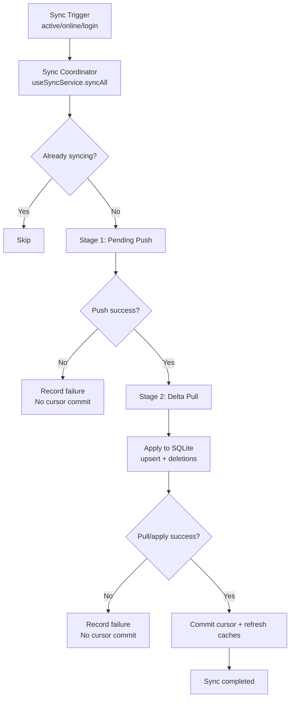

# Design Document: Sync Service Pending Push -> Delta Pull

## Overview

This design converts the current pull-only flow into a reliable two-stage pipeline:
`Pending Push -> Delta Pull`.

Design objectives:

1. Push local pending changes before any pull sync.
2. Use explicit completion create/delete replay (never toggle replay).
3. Commit sync cursor only after full-stage success.
4. Introduce retry/backoff/dead-letter handling for operational safety.

Related requirements: `requirements.md` (R1-R12)

## Current State (As-Built, 2026-02-20)

1. `client/src/services/sync/index.js` runs `ensureDatabase -> Pending Push -> Delta Pull -> Cursor Commit -> Cache Refresh`.
2. `pending_changes` queue auto-flush is wired into sync via `runPendingPush`.
3. Pending v5 state model (`pending|failed|dead_letter`) and retry/backoff metadata are applied.
4. Todo/Completion delta pull is active via `runDeltaPull`.
5. Category sync remains full pull fallback (category delta endpoint still absent).

## Phase 0 Contract Locks (Must Hold Before Pipeline Rollout)

1. Todo delete must be tombstone-based and must cascade tombstone to related completions.
2. Category delete must be tombstone-based and must cascade:
   - category tombstone
   - related todo tombstone
   - related completion tombstone
3. Completion delete must be tombstone-compatible (`deletedAt`) so completion delta pull can track deletions.
4. Completion create duplicate must be idempotent success-equivalent (including restoring soft-deleted rows when applicable).
5. Delete replay policy must be endpoint-explicit (todo/category/completion), including idempotent handling for already-deleted resources.

### Phase 0 Contract Lock Status

Status: ✅ READY (TO-BE re-validation passed on 2026-02-19)

Evidence:
1. `PHASE0_VALIDATION_REPORT.md`
2. `PHASE0_VALIDATION_SUMMARY.md`
3. `phase0-validation-report.md`

Notes:
1. 2026-02-18 검증은 baseline 계약(카테고리 삭제 시 기본 카테고리 이동) 기준으로 완료됨.
2. 2026-02-19 TO-BE 재검증에서 Section 2-1~2-4가 모두 PASS됨.
3. TO-BE 계약(category/todo/completion tombstone cascade)은 구현/검증 기준으로 확정됨.
4. Phase 1 구현은 완료되었고, 운영/성능 검증까지 진행되었다.

## Design Decisions

### D1. Keep Sync Coordinator as the orchestration entry point

- Keep `useSyncService` as the single sync trigger/orchestrator.
- Preserve trigger sources (app active, network online, login).
- Preserve duplicate-run guard behavior.

### D2. Introduce a dedicated Pending Push processor

New module:

- `client/src/services/sync/pendingPush.js`

Responsibilities:

1. Read pending queue in FIFO order.
2. Route each item by type to the correct API.
3. Update pending state for retry/backoff/dead-letter.
4. Return structured stage metrics.

### D3. Introduce a dedicated Delta Pull processor

New module:

- `client/src/services/sync/deltaPull.js`

Responsibilities:

1. Read current sync cursor.
2. Pull category full snapshot (temporary strategy until category delta API exists).
3. Pull todo/completion deltas.
4. Apply upsert/deletion to SQLite.
5. Return structured stage metrics and server sync time.

### D4. Enforce completion replay contract

- Prohibit `POST /completions/toggle` during Pending Push replay.
- Use explicit create/delete completion APIs only.
- Include `isRecurring` in completion pending payload.
- Require completion delete behavior to be delta-compatible (soft-delete/tombstone semantics).

### D5. Enforce cursor commit rule

- Commit cursor only when push + pull + local apply all succeed.
- Keep cursor unchanged on any partial failure.

## Target Architecture



## Component Design

## 1) Sync Coordinator (`client/src/services/sync/index.js`)

Responsibilities:

1. Guard, debounce, trigger handling.
2. Stage ordering and lifecycle.
3. Stage result aggregation.
4. Cache refresh on successful run.

Implemented flow:

```js
async function syncAll() {
  await ensureDatabase();
  const pushResult = await runPendingPush();
  if (!pushResult.ok) return;

  const pullResult = await runDeltaPull({ cursor });
  if (!pullResult.ok) return;

  await commitCursor(pullResult.serverSyncTime);
  await refreshCaches();
}
```

## 2) Pending Push Processor (`client/src/services/sync/pendingPush.js`)

Input:

- FIFO pending rows (filtered by retry eligibility)

Output:

```js
{
  ok: boolean,
  processed: number,
  succeeded: number,
  failed: number,
  deadLetter: number,
  blockingFailure: boolean,
  lastError: string | null
}
```

Routing table:

1. `createTodo` -> `todoAPI.createTodo`
2. `updateTodo` -> `todoAPI.updateTodo`
3. `deleteTodo` -> `todoAPI.deleteTodo`
4. `createCategory` -> `categoryApi.createCategory`
5. `updateCategory` -> `categoryApi.updateCategory`
6. `deleteCategory` -> `categoryApi.deleteCategory`
7. `createCompletion` -> explicit completion create API
8. `deleteCompletion` -> explicit completion delete API

Behavior policy:

1. Stop stage on retryable blocking failure (network/5xx).
2. Handle non-retryable failures by dead-letter policy.
3. Apply max-retry threshold and continue queue progress.
4. Handle delete-not-found (`404`) by explicit policy.
5. Idempotent delete handling follows endpoint policy table; success-equivalent outcomes must remove pending items.
6. If a pending item depends on an earlier unprocessed create for the same entity, defer it instead of dead-lettering.
7. Execute `deleteCategory` replay only after server contract check confirms tombstone cascade for todo/completion.

## 3) Delta Pull Processor (`client/src/services/sync/deltaPull.js`)

Input:

- Cursor (`lastSyncTime`)

Output:

```js
{
  ok: boolean,
  todos: { updated: number, deleted: number },
  completions: { updated: number, deleted: number },
  categories: { pulled: number },
  serverSyncTime: string | null,
  lastError: string | null
}
```

Execution order:

1. Category full pull (`/categories`) - temporary fallback until category delta API is available
2. Todo delta pull (`/todos/delta-sync`)
3. Completion delta pull (`/completions/delta-sync`)
4. Local apply to SQLite

Local apply rules:

1. `updated` -> upsert
2. `deleted` -> local soft-delete/delete apply rule
3. Apply per-entity transactional boundaries
4. Normalize deleted payload shape before apply:
   - todo delta deleted payload: array of todo IDs
   - completion delta deleted payload: array of objects (`_id`, `todoId`, `date`)

## 4) Cursor Store (`metadata`)

Store location:

- `client/src/services/db/database.js` via `getMetadata` / `setMetadata`

Key:

1. `sync.last_success_at`

Commit policy:

1. Commit only after successful Push + Pull + Local Apply.
2. Keep previous value on any partial failure.

## 5) Cache Refresh Policy

After successful sync:

1. Invalidate React Query keys: `['todos']`, `['categories']`.
2. Refresh todo-calendar cache path.
3. Invalidate strip-calendar summary cache path.

On failed sync:

1. Do not force full cache clear.
2. Keep UI backed by local SQLite state.

## Data Model Changes

## Pending schema v5

Target table: `pending_changes`

New columns:

1. `retry_count INTEGER NOT NULL DEFAULT 0`
2. `last_error TEXT NULL`
3. `next_retry_at TEXT NULL`
4. `status TEXT NOT NULL DEFAULT 'pending'` (`pending|failed|dead_letter`)
5. Optional: `error_code TEXT NULL`

Queue state rules:

1. Success -> remove row.
2. Retryable failure -> increment retry counter and schedule `next_retry_at`.
3. Retry overflow -> set `status='dead_letter'`.

## Pending payload contract

Common shape:

```js
{
  id,
  type,
  entityId,
  data,
  createdAt,
  retryCount,
  status,
  nextRetryAt,
  lastError
}
```

Completion payloads:

`createCompletion`:

```js
{ _id, todoId, date, isRecurring }
```

`deleteCompletion`:

```js
{ todoId, date, isRecurring }
```

Note:

- `{ todoId, date }` alone is insufficient for safe idempotent replay.

## API Contract Alignment

## Client API layer

Target file(s):

- `client/src/api/todos.js` or a new `client/src/api/completions.js`

Required methods:

1. `createCompletion({ _id, todoId, date, isRecurring })`
2. `deleteCompletion({ todoId, date, isRecurring })`
3. Keep `toggleCompletion` as UI-only immediate interaction API

## Server contract alignment (must be agreed)

1. Completion create duplicate handling is idempotent (success-equivalent).
2. Completion delete uses tombstone semantics and not-found is treated by explicit idempotent policy.
3. Delete request parameters (`date`, `isRecurring`) must be fixed by contract.
4. Todo delete performs todo tombstone + related completion tombstone cascade.
5. Category delete performs category tombstone + related todo tombstone + related completion tombstone cascade.
6. Todo/category/completion delete replay for already-deleted targets is handled as idempotent success-equivalent.
7. Endpoint-specific 404 policy table:
   - todo delete: `already deleted` -> success-equivalent, `unknown id` -> 404
   - category delete: `already deleted` -> success-equivalent, `unknown id` -> 404
   - completion delete: `already deleted/not found by key` -> success-equivalent

## Error Classification and Backoff

Error classes:

1. `network/offline/timeout` -> retryable
2. `5xx` -> retryable
3. `4xx validation` -> non-retryable (dead-letter)
4. `404 delete` -> follow endpoint policy table; when classified as success-equivalent, remove pending item

Backoff draft:

1. retry 1 -> +30s
2. retry 2 -> +2m
3. retry 3 -> +10m
4. retry >= 4 -> dead-letter

## Idempotency Rules

1. Todo/category replay must converge to the same final state under retries.
2. Completion replay must not use toggle semantics.
3. Completion create/delete replay must converge by key.

## Sequence Scenarios

### Sequence A: Full success

1. Trigger fires.
2. Pending Push succeeds.
3. Delta Pull succeeds.
4. Cursor committed.
5. Caches refreshed.

### Sequence B: Push partial failure

1. Trigger fires.
2. Pending Push hits retryable failure.
3. Stage stops, cursor unchanged.
4. Delta Pull skipped.
5. Retry on next trigger.

Rationale:

1. Push-first ordering is preserved to avoid pulling server state before local pending intent is applied.
2. Tradeoff is accepted: prolonged push failures can delay pull freshness.
3. If this tradeoff is rejected later, a separate policy update is required before implementation.

### Sequence C: Pull failure after push success

1. Pending Push succeeds.
2. Delta Pull fails.
3. Cursor unchanged.
4. Retry pull on next trigger from same cursor.

## Observability

Required log dimensions:

1. `sync.runId`
2. `sync.stage` (`push|pull|cache`)
3. `pending.id`, `pending.type`, `retry_count`, `status`
4. `error.class`, `error.code`
5. `cursor.before`, `cursor.after`

Required counters:

1. `pending_processed_total`
2. `pending_dead_letter_total`
3. `sync_duration_ms`
4. `delta_updated_count`, `delta_deleted_count`

## Rollout Strategy (Result)

1. Phase A (Pending Push): 완료
2. Phase B (Delta Pull + Cursor): 완료
3. Phase C (Operational hardening): 완료

Notes:

1. 본 구현은 feature-flag 게이팅 없이 기본 경로로 적용되었다.
2. 운영 안정성은 `retry/backoff/dead-letter` 상태와 DebugScreen 검증 루틴으로 관리한다.

## Requirement Mapping

1. R1, R2, R8 -> coordinator stage order and commit rule
2. R3, R6, R7, R11 -> pending state model, error policy, observability
3. R4, R5 -> type routing and completion contract hardening
4. R9 -> category full-pull fallback with future delta extension
5. R10 -> cache consistency path
6. R12 -> validation and rollout safety
