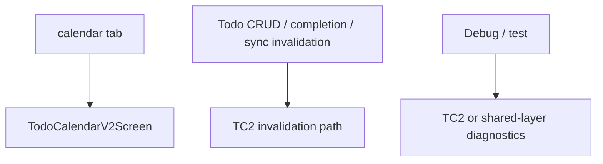

# Design Document: Todo Calendar Legacy Retirement

Last Updated: 2026-03-17
Status: Draft

## Overview

`TC2`가 이미 primary monthly path이기 때문에,
old `todo-calendar`는 이제 “제품 기본 화면”이 아니라
**남아 있는 runtime dependency와 fallback/debug burden**으로 봐야 합니다.

이번 설계의 핵심은 다음과 같습니다.

1. old calendar를 참조하는 active runtime 경로를 먼저 끊는다
2. hidden fallback route와 debug/test 의존을 제거한다
3. import 0 상태를 확인한 뒤 legacy source를 삭제한다

즉 삭제보다 **decoupling이 먼저**입니다.

## Current-State Findings

### 1. Primary tab ownership is already solved

현재 monthly calendar의 사용자 기본 경로는 이미 `TC2`입니다.

- `client/app/(app)/(tabs)/calendar.js` -> `TodoCalendarV2Screen`
- `todo-calendar-v2` tab는 hidden route 상태

따라서 이번 작업은 cutover가 아니라 retirement입니다.

### 2. Runtime invalidation still references the legacy store

old `todoCalendarStore`는 아직 active hook/cache 경로에서 사용됩니다.

대표 경로:

- `useCreateTodo`
- `useUpdateTodo`
- `useDeleteTodo`
- `invalidateAllScreenCaches`
- `invalidateCompletionDependentCaches`

이 상태에서 old feature를 삭제하면,
사용자 눈에 안 보이더라도 runtime import가 깨집니다.

### 3. Hidden fallback route still mounts the legacy screen

`/(app)/todo-calendar`는 아직 old calendar를 직접 렌더합니다.

이 fallback route는 cutover 단계에서는 맞았지만,
retirement 단계에서는 남아 있으면 안 됩니다.

### 4. Debug/Test paths still preserve legacy coupling

`DebugScreen`, `CalendarServiceTestScreen`, 일부 shared diagnostics는
legacy monthly store/service를 기준으로 남아 있습니다.

이들은 제품 기본 기능은 아니지만,
active source tree에서 legacy deletion을 막는 요인이 됩니다.

## Target End State

retirement 이후에는:

- active monthly runtime = `TC2`
- old monthly fallback route = 없음
- old monthly store invalidation = 없음
- legacy feature imports = 0

## Retirement Strategy

### Phase 1: Remove active runtime dependency

먼저 old `todoCalendarStore`를 active runtime correctness path에서 제거합니다.

수행 항목:

1. Todo CRUD hooks에서 old monthly invalidation 제거
2. coarse cache invalidation에서 old monthly store clear 제거
3. completion-only invalidation이 여전히 `TC2` broad redraw를 만들지 않는지 유지

이 단계가 끝나면 primary monthly correctness는 `TC2` + shared lower layer로만 성립해야 합니다.

### Phase 2: Remove fallback surface

수행 항목:

1. hidden fallback route 삭제
2. `LegacyTodoCalendarFallbackScreen` 삭제
3. 관련 route 문서/Playwright 기대값 정리

### Phase 3: Clean debug/test ownership

수행 항목:

1. `DebugScreen`의 legacy monthly diagnostics 제거 또는 `TC2/shared-layer`로 대체
2. `CalendarServiceTestScreen`이 실제 retirement blocker인지 판단
3. legacy-only test helpers가 남아 있다면 archive 또는 removal

중요:

- debug/test가 필요하다는 이유로 legacy runtime feature 전체를 남기지 않는다
- 진짜 필요한 진단은 `TC2`나 shared query layer로 재귀속한다

### Phase 4: Delete source after import-zero check

수행 항목:

1. active code에서 legacy import 0 확인
2. 필요 시 shared helper rehome
3. `client/src/features/todo-calendar/` 삭제
4. legacy screen re-export 제거

## Design Decisions

### 1. TC2 behavior stays frozen during retirement

retirement는 legacy 제거 작업입니다.

따라서 이번 pass에서는:

- completion glyph 추가 안 함
- event tap 추가 안 함
- monthly layout 규칙 변경 안 함

### 2. Shared lower layers are not legacy by default

old monthly feature가 shared query/aggregation를 쓴다고 해서,
shared layer를 같이 retirement 대상으로 보지 않습니다.

삭제 대상은:

- old screen
- old feature store/service/ui path
- old fallback route
- old debug/test dependency

유지 대상은:

- shared query/aggregation
- range cache
- recurrence engine
- `TC2`

### 3. Retirement is blocked by import-zero, not by folder sentiment

“이제 안 쓰는 것 같다”는 판단으로 지우지 않습니다.

삭제 조건은 명확합니다.

1. active runtime imports 0
2. debug/test imports 0 or archived
3. promoted monthly path verification PASS

## Risks

### Risk 1: Hidden runtime dependency survives

가장 큰 리스크는 “사용자 화면에서는 안 보이지만 hook/cache에서 still import” 입니다.

대응:

- 먼저 imports를 끊고,
- 삭제는 마지막에 한다

### Risk 2: Debug cleanup is skipped

debug/test가 남아 있으면 legacy 폴더를 계속 살려두게 됩니다.

대응:

- debug/test ownership을 retirement 범위 안에 넣는다

### Risk 3: Shared helper deletion by accident

legacy folder 안 유틸 일부가 아직 다른 곳에서 필요할 수 있습니다.

대응:

- import-zero 전에 shared helper rehome 여부를 확인한다

## Verification Plan

### Required

1. Static
   - active import 0 확인 (`rg`)
2. Web
   - `calendar` tab still opens `TC2`
   - mutation/coarse invalidate path still works
   - legacy fallback route removed
3. Native
   - promoted `calendar` tab smoke on at least one platform

### Non-goals

- redesigning `TC2`
- adding new monthly interactions
- removing historical docs/spec logs
