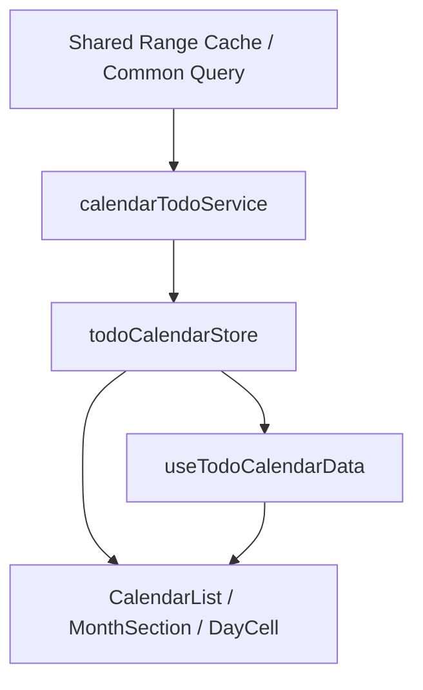

# Todo Calendar Performance Pass Design

Last Updated: 2026-03-14
Status: Draft

## 1. Summary

This design keeps the current month-list shell and fixes the expensive parts
around it.

The optimization pass is split into two layers:

1. Low-risk correctness/perf fixes
2. A contained projection/subscription refinement

Rewrite is explicitly deferred because the current bottlenecks are local to
cache invalidation and projection breadth, not the entire screen architecture.

## 2. Problem Statement

Current confirmed problems:

- completion-driven invalidation churn affects todo-calendar even though cells
  do not render completion state
- `clearAll()` can leave a mounted calendar empty until a later focus/scroll
- viewability changes can enqueue redundant work for equivalent visible ranges
- month cache validity ignores `startDayOfWeek`
- month-level projection is rebuilt broadly inside `MonthSection`

## 3. Target Architecture



The shell stays the same.

Changes are made at three boundaries:

1. invalidation contract
2. fetch scheduling contract
3. projection/subscription contract

## 4. Design Decisions

### 4.1 Completion Decoupling

Because `todo-calendar` does not render completion state today:

- remove completion-driven props/subscriptions from rendered cell path
- stop rebuilding unused completion maps for this screen where possible
- avoid completion-only `clearAll()` fallback for mounted todo-calendar

This is both a correctness and performance change.

### 4.2 Mounted Reensure Token

Introduce a lightweight recovery signal inside `todoCalendarStore`, similar in
spirit to `calendar-day-summaries.requestIdleReensure()`.

Suggested shape:

```js
{
  invalidationSeq: number,
  reensureSeq: number,
  requestReensure(): void
}
```

Behavior:

- `clearAll()` or coarse invalidation increments `reensureSeq`
- `useTodoCalendarData` listens for `reensureSeq`
- if the screen has a last-known visible range, it schedules one bounded fetch

This removes the current “empty until focus/scroll” gap.

### 4.3 Visible Range Dedupe

`useTodoCalendarData` should normalize the effective visible range into a
stable key.

Suggested key:

```text
${firstVisibleMonthId}:${lastVisibleMonthId}:${startDayOfWeek}
```

Rules:

- if the key is unchanged, skip enqueueing new fetch work
- retain the latest pending request while an in-flight request drains
- continue retention pruning independently

This preserves the current queue/drain model while removing no-op churn.

### 4.4 startDayOfWeek Cache Validity

Current cache presence is keyed only by `monthId`.

This is insufficient because fetch range depends on `startDayOfWeek`.

Two valid implementations:

1. Key cache entries by `monthId + startDayOfWeek`
2. Keep `monthId` keys but invalidate/rebuild all cached months when
   `startDayOfWeek` changes

Recommendation:

- use explicit invalidation on `startDayOfWeek` change first
- only move to richer cache keys if that path proves too coarse

This is lower risk than reshaping every store consumer immediately.

### 4.5 Projection / Subscription Refinement

Current path:

1. adapter creates `itemsByDate`
2. service returns `todosByMonth`
3. `MonthSection` rebuilds `todosByDate`
4. `WeekRow` passes arrays to all cells

Target direction:

1. preserve a date-keyed month projection from adapter/service boundary
2. store it in todo-calendar cache alongside or instead of raw month arrays
3. let `MonthSection`/`DayCell` consume precomputed date buckets

Possible store shape:

```js
{
  monthDataById: {
    "2026-03": {
      todos: [],
      itemsByDate: { "2026-03-01": [...] },
      dayMetaByDate: { "2026-03-01": {...} }
    }
  }
}
```

Initial pass does not require a full per-day zustand selector model if
precomputed date buckets already eliminate the worst `MonthSection` rebuild.

Escalation path:

- if month subtree rerenders remain expensive after low-risk fixes, move to
  per-date selector subscriptions next

## 5. Rollout Plan

### Phase A: Low-Risk High-Leverage

1. completion decoupling
2. mounted reensure
3. visible-range dedupe
4. `startDayOfWeek` invalidation fix

### Phase B: Projection Refinement

1. preserve date-keyed projection from service layer
2. stop rebuilding `todosByDate` inside `MonthSection`
3. narrow rerender surface within visible months

## 6. Non-Goals

- adopting week-flow’s shell/navigation model
- changing recurrence engine semantics
- rendering richer event lists or completion markers in cells
- introducing dual calendar implementations during this pass

## 7. Verification Strategy

Must verify:

1. completion toggle no longer empties or thrashes todo-calendar unnecessarily
2. mounted clear/invalidate paths recover without manual navigation
3. repeated viewability churn for the same range is skipped
4. switching `startDayOfWeek` produces a correct month layout/data reload
5. visible month rerender/projection cost is lower after Phase B
