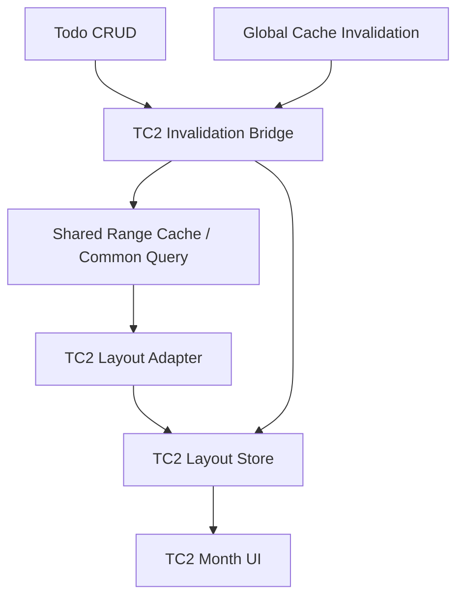

# Design Document: Todo Calendar V2 Cutover Readiness

Last Updated: 2026-03-15
Status: Draft

## Overview

`TC2`는 renderer 기준으로는 이미 old `todo-calendar`보다 더 맞는 구조를 갖고 있습니다.

- old calendar:
  - month array store
  - dot-only output
  - month-wide date regrouping
  - completion 구독이 남아 있음
- `TC2`:
  - render-shape month layout store
  - deterministic span/overflow layout
  - bounded visible loading
  - line-calendar 요구사항과 구조가 맞음

하지만 지금은 renderer 통과와 cutover readiness를 구분해야 합니다.

현재 확인된 상태:

1. `TC2` renderer는 seeded scenario에서 실제 line/span/overflow를 렌더함
2. Android 초기 blank 문제는 initial visible dispatch 보강으로 해결함
3. 아직 `TC2` month layout invalidation은 old calendar처럼 CRUD/sync/category 경로에 연결돼 있지 않음

따라서 readiness 설계의 핵심은 다음입니다.

1. route stability를 고정한다
2. `TC2` invalidation bridge를 추가한다
3. old calendar와 cutover 시점을 분리한다

## Current-State Findings

### 1. Renderer path is viable

`TC2`는 다음을 실제 seeded data로 렌더할 수 있습니다.

- adjacent-month span
- cross-week span
- timed multi-day span
- recurring single-day line
- overflow `...`

즉 renderer 자체를 다시 설계할 단계는 아닙니다.

### 2. Android initial fetch required a guard

Android에서는 `FlashList` 초기 진입 시 `onViewableItemsChanged`가 기대 시점에 오지 않아
첫 달이 blank grid로 보일 수 있었습니다.

이 문제는 `TodoCalendarV2CalendarList`에서 synthetic initial visible dispatch를 넣어 해결했습니다.

이 규칙은 cutover readiness의 일부로 유지되어야 합니다.

### 3. TC2 invalidation path is missing

현재 Todo CRUD / global cache invalidation 경로는 old calendar store나
day-summary path를 알고 있지만, `TC2` month layout store를 canonical target으로 알지 못합니다.

이 상태에서는 다음이 발생할 수 있습니다.

- visible range에서 Todo가 바뀌어도 `TC2`가 stale
- coarse invalidation 후 `TC2`가 restart 전까지 비어 보임
- scenario data를 심은 뒤 app restart가 필요했던 것과 같은 문제가 실제 사용자 플로우에서도 반복될 수 있음

이건 cutover blocker입니다.

### 4. Mounted visible context is currently local-only

현재 `TC2`는 visible month request를 `useTodoCalendarV2Data` 내부 `ref`로만 알고 있습니다.

이 상태에서는 외부 invalidation path가 다음을 직접 알 수 없습니다.

- 지금 어떤 month ids가 보이는지
- current anchor month가 무엇인지
- clear 이후 어떤 범위를 idle reensure 해야 하는지

즉 invalidation bridge를 넣으려면
renderer/store 바깥에서도 읽을 수 있는 최소 visible context contract가 필요합니다.

## Target Readiness Architecture



핵심은 `TC2`가 shared query backbone은 재사용하되,
visible month layout store invalidation만 별도로 canonical contract를 가져야 한다는 점입니다.

## Design Decisions

### 1. Keep old calendar alive during readiness

이번 스펙은 old calendar를 지우는 작업이 아닙니다.

이유:

- 현재는 renderer가 준비된 단계이지, cutover 완료 단계가 아님
- old calendar를 유지해야 side-by-side 비교와 fallback이 가능함

따라서 readiness 완료 전에는:

- old calendar 유지
- `TC2`는 평가 surface 유지
- primary replacement 선언은 별도 cutover 단계에서 수행

### 2. Add a TC2-specific invalidation bridge

필요한 것은 old calendar store 로직을 그대로 복제하는 것이 아닙니다.

필요한 것은 아래 contract입니다.

1. visible `TC2` range가 이미 mount 상태라면
2. Todo/Category/Sync invalidation이 발생했을 때
3. current retained/visible month layouts를 stale로 만들고
4. idle-safe refetch를 다시 걸 수 있어야 함

가능한 구현 형태:

- `useTodoCalendarV2Store.clearMonthLayouts()` 기반 coarse reset
- 또는 month-id / date-range 기반 partial invalidation

초기 readiness 단계에서는 coarse reset도 허용됩니다.
단, 반드시 re-ensure가 같이 예약되어야 합니다.

권장 wiring point:

- `useCreateTodo`
- `useUpdateTodo`
- `useDeleteTodo`
- `invalidateAllScreenCaches`
- sync/category coarse invalidation path

금지:

- clear만 하고 재ensure를 안 하는 구현
- completion-only 변경에도 broad clear를 하는 구현

### 3. Completion-only changes stay out of TC2 layout contract

`TC2` baseline은 completion glyph를 렌더하지 않습니다.

따라서 completion-only 변경은 다음 원칙을 따릅니다.

- `TC2` layout structure를 broad invalidate하지 않음
- 필요하다면 follow-up spec에서 completion-aware layout contract를 따로 정의

즉 readiness 단계에서는
`completion -> TC2 broad redraw`
경로를 추가하지 않는 것이 올바른 설계입니다.

### 4. Route stability is part of product correctness

이번 readiness에서는 “deep link가 dev-client cold start에서 완벽히 동일하게 동작하는가”보다
더 중요한 기준은 다음입니다.

- 탭 진입이 안정적인가
- 첫 visible month가 blank 없이 뜨는가
- warm/cold state에서 실제 진입 경로가 충분히 재현 가능한가

Expo dev-client 제약 때문에 deep link behavior가 완전히 동일하지 않을 수 있으므로,
cutover readiness 검증은 아래 우선순위를 따릅니다.

1. active tab entry
2. warm route entry
3. cold entry where feasible

### 5. Validation scenario remains first-class

`Scenario 7`은 ad-hoc seed가 아니라 readiness fixture 역할을 합니다.

이 시나리오는 다음을 한 번에 검증합니다.

- month edge clipping
- row segmentation
- class ordering
- overflow counting
- recurring non-span rule

따라서 이 fixture는 유지하고,
future regression check에서도 계속 사용해야 합니다.

## Implementation Shape

### A. TC2 invalidation API

권장 최소 API:

```js
invalidateTodoCalendarV2Layouts({ reason, affectedDate })
invalidateTodoCalendarV2All({ reason })
requestIdleReensureTodoCalendarV2()
```

초기 버전에서는 아래처럼 단순하게 가도 됩니다.

- Todo create/update/delete:
  - affected month ±1 reset
  - mounted visible range idle reensure
- category/sync coarse invalidation:
  - full TC2 layout clear
  - mounted visible range idle reensure
- completion-only:
  - no-op for TC2

### B. Mounted visible context

`TC2`는 현재 visible months를 이미 알고 있으므로,
이 값을 invalidation bridge에서 재사용할 수 있어야 합니다.

중요:

- global singleton state를 크게 늘릴 필요는 없음
- visible month ids / current anchor month 정도만 있으면 충분함

권장 최소 shape:

```js
{
  visibleMonthIds: ['2026-02', '2026-03', '2026-04'],
  anchorMonthId: '2026-03',
  requestKey: '2026-03:2026-03:0',
}
```

이 값은 아래 조건에서만 갱신하면 충분합니다.

- initial visible-month dispatch
- actual visible-month change

금지:

- active scroll 중 per-frame write
- layout store 전체 구독을 invalidation 용도로 재사용

### C. Logging policy

이번 readiness 과정에서 추가되는 `TC2` 진단 로그는 허용되지만,
최종 상태에서는 쉽게 끌 수 있어야 합니다.

권장:

- `__DEV__` guard
- 또는 local constant flag

## Readiness Boundary

이 스펙 완료는 아래와 동일하지 않습니다.

- old calendar 삭제
- primary tab 교체
- completion-aware line layout 추가

즉 readiness 통과 후에도 별도 cutover decision 문서나 짧은 cutover task pass가 필요합니다.

## Verification Plan

### Required

1. Seed `Scenario 7`
2. Web:
   - `TC2` open
   - month list render
   - span/overflow visible
3. Native:
   - Android tab entry
   - iOS route/tab entry
   - line renderer visible
4. Mutation:
   - create/update/delete at least one visible-range Todo
   - confirm `TC2` refreshes without app restart
5. Coarse invalidation:
   - category or sync-style clear
   - confirm `TC2` recovers visible layout
6. Completion-only:
   - confirm no broad `TC2` redraw path is introduced

### Non-goals for readiness

- completion glyph UI
- event tap interactions
- final design polish
- legacy calendar removal

## Out of Scope

- full old calendar deletion
- primary navigation replacement
- completion-aware line layout
- event detail/edit interactions
