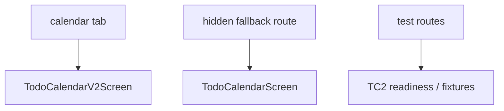

# Design Document: Todo Calendar V2 Cutover

Last Updated: 2026-03-15
Status: Draft

## Overview

`TC2`는 이제 baseline monthly line-calendar candidate로는 readiness를 통과했습니다.

남은 문제는 renderer가 아니라 navigation ownership입니다.

현재 구조는 다음과 같습니다.

- `calendar` tab -> old `todo-calendar`
- `todo-calendar-v2` tab -> `TC2`

즉 사용자는 primary monthly calendar와 replacement candidate를 동시에 보고 있습니다.
이 상태는 evaluation에는 좋지만 product surface로는 길게 유지할 구조가 아닙니다.

이번 설계의 핵심은 단순합니다.

1. `calendar` tab를 `TC2`로 바꾼다
2. 임시 `TC2` 탭은 active tab bar에서 내린다
3. old calendar는 fallback 확인용 hidden route로만 남긴다

## Current-State Findings

### 1. Readiness is no longer the blocker

`TC2`는 아래를 이미 통과했습니다.

- initial month render stability
- mounted create/update/delete refresh
- coarse invalidate recovery
- completion-only no-op redraw policy

따라서 “아직 line renderer가 준비되지 않았다”는 단계는 지났습니다.

### 2. Navigation is still duplicated

현재 탭 기준으로 active monthly calendar entry가 2개입니다.

- `calendar`
- `todo-calendar-v2`

이 구조는 아래 문제를 만듭니다.

- 사용자 입장에서 어떤 캘린더가 기준인지 애매함
- QA/버그 리포트에서 route 기준이 흔들림
- future monthly work ownership이 다시 흐려짐

### 3. Immediate legacy deletion is still unnecessary

지금 필요한 것은 old calendar 삭제가 아니라 primary ownership 교체입니다.

old calendar를 바로 삭제하지 않아도:

- primary tab promotion은 가능
- rollback safety는 더 좋아짐
- fallback comparison도 가능

따라서 이번 cutover는 `promotion + fallback retention`으로 제한합니다.

## Target Navigation Shape

cutover 이후 active tab bar에서는 monthly calendar가 하나만 보여야 합니다.

## Cutover Strategy

### Phase 1: Primary Route Promotion

수행 항목:

1. `client/app/(app)/(tabs)/calendar.js`를 `TC2`로 바인딩
2. `todo-calendar-v2` temporary tab를 active tabs에서 제거
3. 사용자 기준 monthly calendar entry를 `calendar` 하나로 고정

이 단계가 끝나면 `TC2`가 실제 primary monthly surface가 됩니다.

### Phase 2: Legacy Fallback Retention

수행 항목:

1. old `TodoCalendarScreen`을 hidden test/debug route로 노출
2. tab bar에서는 보이지 않게 유지
3. rollback 필요 시 route binding만 되돌릴 수 있게 유지

권장 route 예:

- `/(app)/test/legacy-todo-calendar`

이 fallback route는 제품 기능이 아니라 운영/QA 안전장치입니다.

### Phase 3: Verification and Decision Note

수행 항목:

1. web에서 promoted `calendar` tab 확인
2. live mutation / coarse invalidate 흐름 재검증
3. native smoke 1회 이상 확인
4. fallback route 정상 열림 확인
5. residual risk를 decision note로 남김

## Detailed Design

### 1. Route Binding Policy

primary tab label은 유지하고, 구현만 바꿉니다.

즉:

- user-facing `calendar` tab label/title는 그대로 둘 수 있음
- underlying screen export만 `TC2`로 바꿈

이 방식의 장점:

- 사용자 혼란 최소화
- deeplink/tab ownership 단순화
- rollback도 단일 binding 변경으로 해결 가능

### 2. Temporary TC2 Tab Policy

`todo-calendar-v2` tab는 readiness 단계에서는 유효했지만,
cutover 이후에는 중복 primary surface가 됩니다.

따라서:

- active tab bar에서는 제거
- 별도 hidden route는 유지 가능
- readiness harness / fixture routes는 계속 test 경로에 남길 수 있음

### 3. Legacy Fallback Policy

old calendar는 아직 삭제하지 않습니다.

이유:

- rollback safety
- side-by-side defect check
- immediate hard deletion 리스크 회피

단, 아래는 금지합니다.

- old calendar를 active bottom tab에 남기는 것
- old calendar를 primary route와 동급으로 노출하는 것

### 4. Data Freshness Contract

이번 cutover에서 새로 만드는 데이터 로직은 없습니다.

승격 후에도 그대로 유지해야 할 contract는 이미 readiness에서 검증된 이것입니다.

- Todo CRUD -> bounded `TC2` invalidation + idle reensure
- coarse invalidate -> `TC2` clear + mounted recovery
- completion-only -> no broad `TC2` redraw

즉 cutover는 navigation change이지 data-flow redesign이 아닙니다.

### 5. Rollback Policy

rollback은 아래 수준이어야 합니다.

- `calendar` route export를 old screen으로 되돌림
- hidden fallback route 유지
- `TC2` code/state를 파괴하지 않음

즉 rollback cost는 “route binding diff” 수준으로 유지하는 것이 목표입니다.

## Risks

### Risk 1: Hidden duplicate exposure

`calendar`를 `TC2`로 바꾸고도 `todo-calendar-v2` tab를 그대로 두면,
실질적으론 duplicate primary monthly surface가 남습니다.

대응:

- 같은 cutover에서 temporary TC2 tab 제거

### Risk 2: Fallback route omission

legacy를 primary에서 내리기만 하고 hidden fallback route를 안 두면,
cutover 직후 defect triage가 불편해집니다.

대응:

- hidden fallback route를 함께 둠

### Risk 3: Over-scoping into retirement

navigation cutover 중 old calendar 폴더 삭제까지 한 번에 가면 범위가 커집니다.

대응:

- 이번 스펙은 promotion/fallback만 다룸
- retirement는 별도 승인 시 진행

## Verification Plan

### Required

1. Web
   - `calendar` tab opens `TC2`
   - duplicate primary monthly tab removed
   - readiness harness or equivalent live flow still passes
2. Native
   - promoted `calendar` tab opens on at least one platform
3. Fallback
   - hidden legacy route still opens old calendar

### Non-goals

- legacy deletion
- completion glyph experiments
- design polish

## Out of Scope

- removing `Legacy_Todo_Calendar` source files
- redesigning bottom navigation beyond calendar ownership
- adding new interactions to `TC2`
