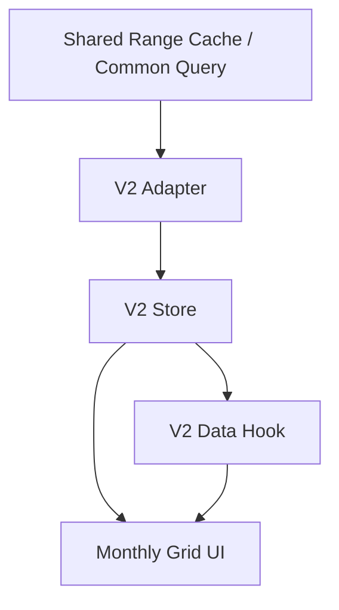

# Todo Calendar V2 Line Monthly Design

Last Updated: 2026-03-15
Status: Draft

## 1. Summary

`todo-calendar-v2` is a new monthly calendar renderer with inline event lines.

It does not replace the existing calendar immediately.
It is built as a separate module and isolated route surface so behavior,
performance, and visual layout can be validated before and during cutover.

## 2. Architecture Direction

### 2.1 New Module Boundary

Create a new feature boundary:

```text
client/src/features/todo-calendar-v2/
```

Suggested structure:

```text
todo-calendar-v2/
  adapters/
  hooks/
  services/
  store/
  ui/
  utils/
  index.js
```

Principle:

- old `todo-calendar` UI/store/service files are not edited for v2 behavior
- only shared lower layers may be reused:
  - common query/aggregation
  - shared range cache
  - recurrence engine
  - settings (`startDayOfWeek`, timezone, language)

### 2.2 Route / Entry

Expose TC2 through a route that does not depend on DebugScreen.

During the evaluation phase, a temporary bottom-tab entry is acceptable for
direct access.

After cutover, the primary `calendar` tab may bind to TC2 while the temporary
`todo-calendar-v2` route remains hidden but addressable for QA.

The baseline navigation model is a vertically scrollable month list.

## 3. Data Flow



V2 should not reuse the old `todo-calendar` L1 month store directly.

Instead it should create a v2-specific projection store whose output is already
close to render shape:

```js
{
  monthLayoutsById: {
    "2026-03": {
      weeks: [...],
      dayCellsByDate: {
        "2026-03-01": {
          date: "2026-03-01",
          visibleLines: [...],
          hiddenCount: 0
        }
      }
    }
  }
}
```

This minimizes UI-side recomputation.

Additional constraints:

- visible loading window: current visible month + `±1 month`
- retention window: anchor month `±6 months`
- projection/store writes: initial load + visible-month changes only
- no per-frame store writes during active scroll
- subscriptions must be scoped to visible month layouts or day cells, never the whole UI root

Renderer boundary rule:

- canonical `YYYY-MM-DD` strings from the shared query layer are authoritative
- v2 render code must not re-interpret day boundaries with local `Date` math

## 4. Layout Model

### 4.1 Month Container

- one month = fixed 6 week rows
- one week row = 7 day cells
- one day cell height = `88px`
- the date label is anchored top-left
- leading/trailing adjacent-month days remain structural cells inside the same 42-day grid

### 4.2 Day Cell Interior

Suggested internal model:

1. Date label row near the top-left
2. Event area below the date
3. Up to 3 visible lanes of `14px`
4. A compact `...` overflow indicator if `hiddenCount > 0`

Important:

- overflow indicator must not change month height
- line clipping must be deterministic
- hidden items are summarized only, not expanded
- adjacent-month cells keep the same physical grid slots, but baseline UI hides their date labels, line content, and overflow indicators

### 4.3 Event Line Visual

Each line is a compact bar:

- category color as the line fill or dominant accent
- title only
- single line, clipped/truncated
- no completion check marker in the frozen baseline

No tap behavior is required in the first release.

## 5. Event Classification

### 5.1 Single-Day Items

Render as single-day lines when:

- recurring occurrence
- non-recurring event where `startDate === endDate`

### 5.2 Span Items

Render as spanning lines when:

- non-recurring event
- `startDate < endDate`
- time fields may be present or absent

Recurring events are explicitly excluded from span rendering in v2.

## 6. Span Segmentation Model

Span layout should be computed by week-row segments, not as one absolute bar
across the full month surface.

For each non-recurring multi-day event:

1. intersect event range with the visible 42-day month grid
2. split the visible range by week rows using `user.settings.startDayOfWeek`
3. produce one segment per intersecting row
4. mark continuation flags:
   - `continuesFromPrevious`
   - `continuesToNext`

Suggested shape:

```js
{
  todoId: "...",
  weekIndex: 2,
  lane: 1,
  startDate: "2026-03-10",
  endDate: "2026-03-13",
  visibleStartDate: "2026-03-10",
  visibleEndDate: "2026-03-13",
  continuesFromPrevious: false,
  continuesToNext: true,
  title: "Trip",
  color: "#4F46E5",
  isCompleted: false
}
```

This keeps week wrapping simple and compatible with a month-grid renderer.

Cross-row continuity rule:

- lane allocation is row-local
- v2 does not guarantee that a multi-week event keeps the same lane across successive week rows
- continuity is represented by visual continuation cues, not by cross-row lane identity

Continuation cue rule for the frozen baseline:

- if `continuesFromPrevious === true`, the leading edge is flat/clipped
- if `continuesToNext === true`, the trailing edge is flat/clipped
- only true segment start/end edges use the normal end-cap shape
- no chevrons, fades, or platform-specific variants in the frozen baseline

## 7. Ordering and Lane Placement

### 7.1 Placement Classes

Deterministic ordering:

1. all-day span items
2. timed span items
3. all-day single-day items
4. timed single-day items

Exact final sort key:

```text
classRank(allDaySpan, timedSpan, allDaySingle, timedSingle) ASC
-> startDate ASC
-> startTime ASC (null before non-null inside all-day classes)
-> category.order_index ASC (null/missing after numeric values)
-> title ASC
-> _id ASC
```

### 7.2 Lane Allocation

Use greedy lane placement with only 3 renderable lanes:

1. process candidates independently per week row
2. iterate the deterministically sorted candidates
3. place each candidate in the first non-conflicting lane in `0..2`
4. a conflict exists when two visible candidates occupy at least one common date in the same week row
5. once placed, a span segment keeps that lane value across every covered day in that row
6. if no lane is available, the candidate is hidden for that row and `hiddenCount += 1` for every covered day in that candidate segment

Overflow accounting is therefore day-based, even when the hidden candidate is a span.

## 8. Completion Marker Strategy

Completion markers are excluded from the frozen baseline.

If the team wants completion check glyphs later, that must be handled by a
follow-up spec after baseline performance validation.

## 9. Interaction Model

Initial release is display-only:

- tap on date: no-op
- tap on line: no-op
- tap on `...`: no-op

This keeps the first validation focused on rendering, layout, and performance.

## 10. Why This Is a New Renderer

Google-calendar-style span lines are not a small tweak to the current
dot-based monthly renderer.

Required new behavior:

- lane allocation
- span segmentation by week row
- overflow accounting
- title-bearing line layout

Therefore v2 should be treated as a new monthly renderer built beside the old
calendar, not as a small patch on top of the old one.

## 11. Freeze Readiness

No blocking product questions remain for the first freeze candidate.

Already fixed by decision:

- `...` does nothing
- title only, no time text
- recurring events do not span
- non-recurring multi-day events span even with time
- if visible capacity is exceeded, hidden items collapse behind `...`
- month height stays fixed at 6 weeks
- completion glyphs are excluded from the frozen baseline
