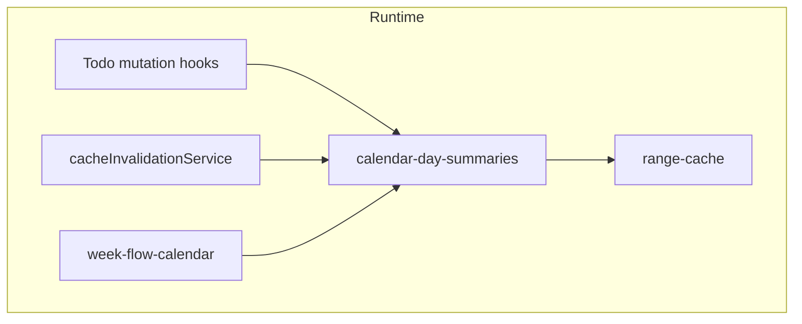

# Design Document: Week Flow Calendar Cutover

## Overview

이 설계는 `strip-calendar` 레거시 구현을 런타임 경로에서 제거하고,
`week-flow-calendar`를 유일한 활성 대체 경로로 확정하기 위한 컷오버 설계를 다룹니다.

핵심 포인트는 단순합니다.

- `week-flow-calendar`는 이미 동작한다.
- 하지만 앱 런타임의 일부가 아직 strip store / strip invalidation / strip route를 참조한다.
- 따라서 “삭제”보다 먼저 해야 할 일은 **의존성 분리**다.

이번 설계는 이를 두 단계로 나눕니다.

1. `Runtime_Cutover`
2. `Legacy_Retirement`

## Current-State Findings

현재 코드 기준으로 strip가 남아 있는 주요 지점은 다음과 같습니다.

### Runtime-critical references

- Todo mutation hooks
  - `useCreateTodo`
  - `useUpdateTodo`
  - `useDeleteTodo`
- Sync/cache invalidation
  - `cacheInvalidationService`
- Active tab navigation
  - `client/app/(app)/(tabs)/strip.js`
  - `client/app/(app)/(tabs)/_layout.js`

이 지점들은 strip 코드가 없으면 바로 깨질 수 있으므로 cutover 1차 대상입니다.

### Debug / tooling / legacy-only references

- `DebugScreen` 내부 strip diagnostics
- `StripCalendarTestScreen`
- strip-specific adapter/types exports
- strip feature folder 내부 UI/debug/perf logging helpers

이 지점들은 제품 런타임보다 우선순위가 낮지만,
strip 완전 삭제를 하려면 결국 정리되어야 합니다.

## Target Architecture

컷오버 이후 목표 구조는 다음과 같습니다.

`strip-calendar`는 이 runtime graph에 등장하지 않아야 합니다.

## Cutover Strategy

### Phase 1: Runtime Cutover

목표:

- 앱이 strip 없이도 정상 부팅/탐색/CRUD invalidation을 수행하게 만든다.

수행 항목:

1. Todo mutation hooks에서 strip invalidation import 제거
2. `cacheInvalidationService`에서 strip store clear 제거
3. 활성 탭에서 `strip` route 제거
4. `week-flow` route는 유지

이 단계가 끝나면:

- strip 코드가 남아 있어도 런타임 필수 의존성은 아니게 됩니다.

### Phase 2: Legacy Retirement

목표:

- debug/test/adapter 수준까지 strip reference를 정리해 실제 삭제 가능한 상태로 만든다.

수행 항목:

1. `StripCalendarTestScreen` 제거 또는 archive 이동
2. `DebugScreen`의 strip-specific diagnostics 제거/대체
3. strip-specific adapter/export 정리
4. `client/src/features/strip-calendar/` 폴더 삭제 또는 `_archive` 이동

이 단계는 Phase 1이 끝난 뒤에만 안전합니다.

## Detailed Design

### 1. Mutation invalidation path

현재 mutation hooks는 다음 두 경로를 동시에 호출합니다.

- `strip-calendar/services/stripCalendarDataAdapter.invalidateTodoSummary`
- `calendar-day-summaries.invalidateTodoSummary`

컷오버 후에는 strip 경로를 제거하고,
marker 갱신은 `calendar-day-summaries`만 사용합니다.

이유:

- week-flow marker path는 이미 `calendar-day-summaries`가 canonical contract입니다.
- 동일 mutation에서 strip/weekly 둘 다 invalidate하는 것은 의미가 없어집니다.
- 중복 invalidation은 불필요한 bookkeeping/maintenance cost를 만듭니다.

### 2. Sync / cache invalidation path

현재 `invalidateAllScreenCaches`는 세 가지를 비웁니다.

- `todo-calendar` store
- `strip-calendar` store
- `calendar-day-summaries` store

컷오버 후에는 strip store clear를 제거합니다.

필수 동작은 다음 두 가지입니다.

- `calendar-day-summaries.clear()`
- `calendar-day-summaries.requestIdleReensure()`

이렇게 하면 sync/category invalidation 이후 현재 보이는 week-flow 범위는 다시 회복됩니다.

### 3. Navigation surface

현재 탭에 `strip`과 `week-flow`가 동시에 보입니다.

컷오버 설계:

- `strip` 탭 제거
- `week-flow` 탭 유지

주의:

- 이번 컷오버는 “main Todo screen embedding” 자체를 포함하지 않습니다.
- 즉, canonical replacement route를 하나로 줄이는 작업입니다.
- 메인 화면 완전 통합이 필요하면 별도 후속 스펙으로 다룹니다.

### 4. Debug policy

`DebugScreen`은 strip 관련 진단 기능을 많이 포함하고 있습니다.
이 경로는 제품 런타임보다 우선순위가 낮으므로,
다음 둘 중 하나를 선택합니다.

1. strip diagnostics 제거
2. `_archive` 또는 legacy-only section으로 이동

중요한 원칙:

- debug 코드가 runtime import graph에 strip를 다시 끌어오면 안 됩니다.

### 5. Legacy folder deletion criteria

`client/src/features/strip-calendar/` 폴더는 아래 조건이 모두 충족될 때만 삭제 가능합니다.

1. `rg "strip-calendar|StripCalendar|useStripCalendarStore"` 결과가 runtime 경로에서 제거됨
2. 활성 탭/화면 export가 제거됨
3. mutation / sync invalidation이 week-flow 경로만으로 정상 동작 확인됨
4. debug-only 참조도 제거되거나 archive로 이동됨

그 전에는 “삭제”가 아니라 “비활성 legacy” 상태입니다.

## Risks

### Risk 1: Hidden runtime imports

탭/화면은 지웠는데 hooks/service에서 strip import가 남아 있을 수 있습니다.

대응:

- `rg` 기반 참조 분류를 먼저 수행
- runtime 경로부터 순서대로 제거

### Risk 2: Marker refresh regression

strip invalidation을 제거한 뒤 marker 갱신이 끊길 수 있습니다.

대응:

- CRUD 후 visible marker refresh 확인
- category/sync invalidation 후 idle re-ensure 확인

### Risk 3: Over-scoping

컷오버 작업 중 week-flow 디자인/기능 자체를 다시 손대면 일정이 커집니다.

대응:

- 이번 스펙은 replacement/cutover만 다룸
- 새로운 UI/interaction 요구는 별도 스펙으로 분리

## Verification Plan

### Required verification

1. Web smoke
   - app shell
   - login/basic navigation
2. Week-flow route check
   - weekly render
   - monthly render
3. Mutation/invalidation
   - create/update/delete one Todo
   - visible marker refresh
4. Sync invalidation
   - login sync / cache clear 이후 week-flow가 정상 회복

### Optional verification

- iOS simulator smoke
- Android emulator smoke
- legacy route removal 후 no-import audit

## Out of Scope

- week-flow visual redesign
- main Todo screen full embedding
- new event-list-in-cell rendering
- strip legacy behavior parity at every debug detail
