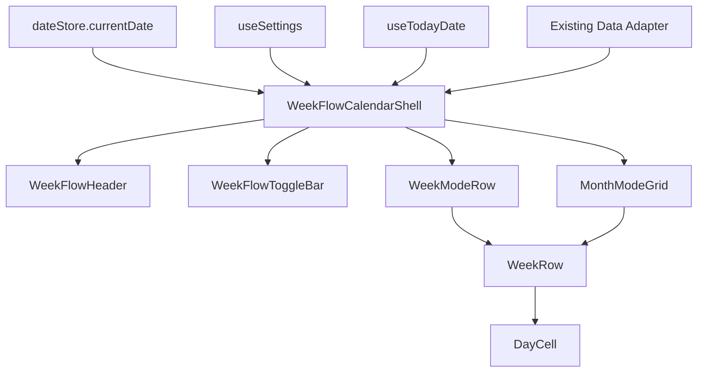

# Design Document: Week Flow Calendar

## Overview

`Week Flow Calendar` is a bounded, deterministic replacement for `Strip Calendar Legacy`.

The design goal is to preserve the existing data layer while removing the unstable UI behavior caused by:

- giant week windows
- duplicated navigation state
- list-settle races
- platform-specific scroll differences

The new calendar intentionally trades away infinite internal scrolling complexity in favor of:

- explicit weekly mode
- explicit monthly mode
- selected-date-based transitions
- bounded rendering
- shared week-row/day-cell visual language

## Legacy Problems to Avoid

### 1. Multi-anchor navigation state

Legacy state mixed:

- `anchorWeekStart`
- `weeklyVisibleWeekStart`
- `monthlyTopWeekStart`
- `weeklyTargetWeekStart`
- `monthlyTargetWeekStart`

This made transitions depend on stale internal state instead of current user intent.

### 2. Giant week windows

Legacy design created a large week window and then re-centered it near edges.
That made a single index-sync error look like a year-level or decade-level jump.

### 3. Scroll-settle race conditions

Legacy monthly mode relied on:

- `initialScrollIndex`
- settle callbacks
- fallback settle
- programmatic guard
- quantize correction
- hidden alignment state

This created platform-specific timing issues.

## New Architecture



## Naming Plan

Planned feature/module names:

- `WeekFlowCalendarShell`
- `WeekFlowHeader`
- `WeekFlowToggleBar`
- `WeekModeRow`
- `MonthModeGrid`
- `WeekRow`
- `DayCell`

Planned feature path:

- `client/src/features/week-flow-calendar/`

Legacy path remains:

- `client/src/features/strip-calendar/` as reference only until migration completes

## Core State Model

### Global state reused

- `Selected_Date = dateStore.currentDate`
- `todayDate = useTodayDate()`
- settings from `useSettings()`

### New local state

```js
{
  mode: 'weekly' | 'monthly',
  visibleWeekStart: 'YYYY-MM-DD',
  visibleMonthStart: 'YYYY-MM-01',
}
```

`visibleWeekStart` = requirements의 `Visible_Week_Start`

`visibleMonthStart` = requirements의 `Visible_Month_Start`

### State rules

- `Selected_Date` remains the only source of truth for which day is selected
- `visibleWeekStart` controls only weekly mode viewport
- `visibleMonthStart` controls only monthly mode viewport
- No extra target/anchor state unless an implementation detail proves unavoidable

### Day Selection Side Effects

- In `Monthly_Mode`, tapping a leading/trailing day SHALL:
  - update `Selected_Date`
  - keep `visibleMonthStart` unchanged
  - keep the current month grid visible
  - render the selected leading/trailing day with both its out-of-month styling and selected styling
- In `Weekly_Mode`, tapping a day SHALL:
  - update `Selected_Date`
  - keep `visibleWeekStart` unchanged
  - only allow taps on days already rendered in the current visible week row

## Rendering Model

## Weekly Mode

- Render one week row only
- Build days from `visibleWeekStart`
- No virtualized horizontal list required
- Navigation:
  - prev/next buttons move `visibleWeekStart` by `-1/+1 week`
  - left/right swipe MAY call the same handlers

## Monthly Mode

- Render a bounded month grid (5 or 6 rows)
- Build month grid from `visibleMonthStart`
- Include leading/trailing days to fill full weeks
- Keep a stable 5-row or 6-row layout; do not collapse to a 4-row layout
- No long vertical list
- No internal multi-year scroll container
- Navigation:
  - prev/next buttons move `visibleMonthStart` by `-1/+1 month`

## Gesture/Swipe Model

- Weekly mode:
  - left/right swipe: prev/next week
  - toggle bar up/down swipe: mode switch
- Monthly mode:
  - month grid itself does not own mode-switch correctness
  - toggle bar up/down swipe: mode switch
  - prev/next month is handled by header controls
- Core correctness must not depend on scroll momentum, settle timing, or hidden gesture state

## Transition Rules

### Weekly -> Monthly

1. Read `Selected_Date`
2. Compute `visibleMonthStart = startOfMonth(Selected_Date)`
3. Build month grid for that month
4. Keep selected date highlighted in the month grid

This transition is selected-date-driven, not scroll-state-driven.

### Monthly -> Weekly

1. Read `Selected_Date`
2. Compute `visibleWeekStart = weekStart(Selected_Date, startDayOfWeek)`
3. Render the week row for that week

This guarantees that toggling never jumps away from the selected date.

### Today Jump

1. Set `Selected_Date = todayDate`
2. If `Weekly_Mode`, set `visibleWeekStart = weekStart(todayDate, startDayOfWeek)`
3. If `Monthly_Mode`, set `visibleMonthStart = startOfMonth(todayDate)`
4. Re-render with today selected and visible in the active mode

## Visual Rules

### Day Cell

- Selected date: primary selection indicator
- Today: separate today marker
- Selected + today: composed visual state

### Month boundary label

Show a small month label above the day number when:

- the day is the first visible day of a new month within the row, or
- the day number is `1`

### Odd/Even month tint

- Odd month: neutral surface
- Even month: slightly tinted surface
- The tint must stay subtle enough not to fight selected/today/dot states

## Data Loading Plan

The new UI keeps the existing adapter path:

- `ensureRangeLoaded({ startDate, endDate, reason })`
- `selectDaySummaries(...)`

### Adapter Hook Strategy

The legacy `useStripCalendarDataRange` hook depends on legacy navigation state shape and is not
the source of truth for the new calendar.

The new calendar should introduce a dedicated hook such as:

- `useWeekFlowDataRange({ mode, visibleWeekStart, visibleMonthStart })`

That hook should:

- call the existing `ensureRangeLoaded` path
- read summaries via existing select/store semantics
- keep retention/prune behavior compatible with the current summary cache
- remain independent from legacy target/anchor state

### Weekly range

Recommended initial range:

- active week
- plus a small prefetch window around it (for example ±2 weeks)

### Monthly range

Recommended initial range:

- the visible month grid start/end
- plus a small leading/trailing buffer only if needed

This is intentionally smaller than the legacy multi-month scrolling model.

## Logging Plan

Default behavior:

- no high-volume perf logging
- no per-scroll spam

Debug mode should focus on:

- mode transition input/output
- selected date
- visible week/month state
- adapter range requests

## Platform Strategy

The new design should minimize platform-specific behavior by avoiding list/settle-heavy interaction for correctness.

That means:

- weekly mode should not depend on large horizontal virtualization
- monthly mode should not depend on long vertical snap physics
- the same rendering logic should work on iOS, Android, and Web

## Migration Strategy

### Keep

- existing date store contract
- existing today/settings hooks
- existing strip calendar summary/data adapter
- existing strip calendar summary cache store
- existing day summary semantics

### Replace

- strip calendar shell
- controller/navigation state model
- weekly list UI
- monthly list UI
- toggle transition behavior

### Rollout

1. Build `Week Flow Calendar` beside the legacy implementation
2. Add dedicated test screen
3. Validate iOS/Android/Web
4. Swap test tab to new calendar
5. Move `TodoScreen` integration after test validation
6. Keep legacy implementation only until rollback window closes
